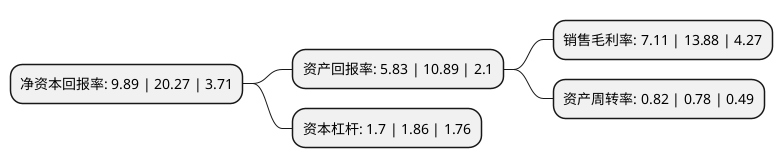

> 本页面由自动化程序生成于 2022年5月20日 01:17
> 内容可能存在错误，如有bug请提交issue至：https://github.com/Eroleice/doc-pi/issues
{.is-warning}

# 上市公司基本情况

## 基本资料

深圳市劲拓自动化设备股份有限公司（以下简称“劲拓股份”）成立于2004年07月27日，深圳市。于2014年10月10日在深交所创业板上市。

劲拓股份注册资本24,262.58万元，主营业务:公司主营业务为电子整机装联设备的研发，生产和销售，主要产品为焊接设备，AOI检测设备，高温烧结炉设备和SMT周边设备，其中焊接设备，AOI检测设备和高温烧结炉设备为公司的核心产品。公司产品广泛应用于通讯电子产品，国防电子产品，航空航天电子产品，汽车电子及日常的消费电子产品的制造。以下是详细信息：

- 公司名称: 深圳市劲拓自动化设备股份有限公司
- 股票代码: 300400.SZ
- 所在地: 广东 - 深圳市
- 成立日期: 2004年07月27日
- 注册资本: 24,262.58万元
- 法定代表人: 徐德勇
- 主营业务: 主营业务:公司主营业务为电子整机装联设备的研发，生产和销售，主要产品为焊接设备，AOI检测设备，高温烧结炉设备和SMT周边设备，其中焊接设备，AOI检测设备和高温烧结炉设备为公司的核心产品公司产品广泛应用于通讯电子产品，国防电子产品，航空航天电子产品，汽车电子及日常的消费电子产品的制造
- 公司官网: www.jt-ele.com
- 公司介绍: 公司是集研发、生产及销售为一体的智能装备系统和先进制造系统供应商，主要产品包括波峰焊、回流焊、智能机器视觉类产品(含智能机器视觉检测设备、智能生物识别模组贴合设备等)、高速点胶机以及智能全向重载移动平台等产品，产品主要应用于3C类消费电子制造业、汽车电子制造业、通信设备制造业以及航空航天制造业等领域。公司研发的SM无铅波峰焊锡机上的电磁推动式波峰炉胆曾获得欧盟的专利荣誉，完全自主研发的新一代“全节能环保型双曲线回流焊”技术及“全模组化的选择性波峰焊”技术达到了国际先进水平。公司回流焊、波峰焊产品获“中国国际专利技术与产品交易会金奖”和“第七届中国国际高新技术成果交易会优秀产品奖”等奖项。此外，公司还取得电磁推进技术等38项专利技术，软件著作权15项，同时拥有高效热传导、液态金属的泵送技术、矢量图像识别和等离子控制技术等17项非专利技术。

## 股东及高管情况

上市公司第一大股东为吴限，持股79,729,018股，占比32.86%，为上市公司实际控制人。

截至2022年03月31日，上市公司的前十大股东中，共有7名自然人股东，3个产品账户，其中5%以上大股东共有1名。上市公司前十大股东明细如下：

> 截至2022年03月31日，上市公司前十大股东信息如下：

| 股东名称 | 持股数量（股） | 持股比例 |
| --- | --- | --- |
| 吴限 | 79,729,018 | 32.86% |
| 兴业银行股份有限公司-博时汇兴回报一年持有期灵活配置混合型证券投资基金 | 7,699,880 | 3.17% |
| 麦旺球 | 5,314,749 | 2.19% |
| 主逵 | 5,084,935 | 2.1% |
| 中国工商银行股份有限公司-博时信用债券投资基金 | 4,079,450 | 1.68% |
| 麦容章 | 3,814,571 | 1.57% |
| 邱子聪 | 3,735,000 | 1.54% |
| 孙见清 | 3,700,000 | 1.52% |
| 深圳市劲拓自动化设备股份有限公司-第一期员工持股计划 | 2,960,820 | 1.22% |
| 邱佩娜 | 2,687,000 | 1.11% |

## 利润表分析

上市公司2021年总收入为9.89亿元，净利润为0.7亿元，实现盈利。

## 杜邦分析

> 数据列示周期：2021年 | 2020年 | 2019年
{.is-info}

上市公司的净资产收益率在近一年有所下降，下降幅度为-51.21%，其变化情况分解如下：
- 上市公司的销售毛利率在近一年下降了-48.78%，可能是生产效率的下降、商品原材料价格上涨或商品价格的下跌所致。
- 上市公司的资产周转率在近一年上升了5.13%，可能是源自于更快的销售回款或库存管理效果提升。
- 上市公司的财务杠杆比率在近一年下降了-8.6%，可能是减少负债降低财务费用。

