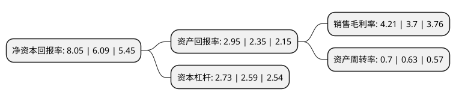

> 本页面由自动化程序生成于 2022年5月20日 01:17
> 内容可能存在错误，如有bug请提交issue至：https://github.com/Eroleice/doc-pi/issues
{.is-warning}

# 上市公司基本情况

## 基本资料

南京宝色股份公司（以下简称“宝色股份”）成立于1994年05月05日，南京市。于2014年10月10日在深交所创业板上市。

宝色股份注册资本20,200万元，主要从事钛，镍，锆，钽，铜等有色金属及其合金，高级不锈钢和金属复合材料等特种材料非标设备的研发，设计，制造，安装，以及有色金属焊接压力管道，管件的制造和安装。公司主要产品包括塔器，反应器，换热器等压力容器及管道管件，应用领域涵盖了化工，冶金，电力，海洋工程，船舶及环保等行业。以下是详细信息：

- 公司名称: 南京宝色股份公司
- 股票代码: 300402.SZ
- 所在地: 江苏 - 南京市
- 成立日期: 1994年05月05日
- 注册资本: 20,200万元
- 法定代表人: 吴丕杰
- 主营业务: 主要从事钛，镍，锆，钽，铜等有色金属及其合金，高级不锈钢和金属复合材料等特种材料非标设备的研发，设计，制造，安装，以及有色金属焊接压力管道，管件的制造和安装公司主要产品包括塔器，反应器，换热器等压力容器及管道管件，应用领域涵盖了化工，冶金，电力，海洋工程，船舶及环保等行业
- 公司官网: www.baose.com
- 公司介绍: 公司是非标特材装备专业供应商，主要从事钛、镍、锆、钽、铜等有色金属及其合金、高级不锈钢和金属复合材料等特种材料非标设备的研发、设计、制造、安装，以及有色金属焊接压力管道、管件的制造和安装。公司是现行行业标准JB/T4745-2002《钛制焊接容器》和NB/T47011-2010《锆制压力容器》的主要起草单位。公司参与我国第一台钛合金太阳望远镜及除光学仪器外的主体框架的制作，我国第一台自行设计、研制的“蛟龙号”载人潜水器多项配套零部件的制造等。公司产品荣获“高新技术产品”“2010年江苏省自主创新产品”等荣誉称号。公司为江苏省科学技术厅、江苏省财政厅、江苏省国税局、江苏省地税局共同认定的高新技术企业，公司技术中心为江苏省认定企业技术中心。公司“BAOSE”商标被认定为中国驰名商标。

## 股东及高管情况

上市公司第一大股东为宝钛集团有限公司，持股116,200,000股，占比57.52%，为上市公司实际控制人。

截至2022年03月31日，上市公司的前十大股东中，共有8名自然人股东，2名机构股东，其中5%以上大股东共有2名。上市公司前十大股东明细如下：

> 截至2022年03月31日，上市公司前十大股东信息如下：

| 股东名称 | 持股数量（股） | 持股比例 |
| --- | --- | --- |
| 宝钛集团有限公司 | 116,200,000 | 57.52% |
| 山西华鑫海贸易有限公司 | 20,650,000 | 10.22% |
| 牛辉亮 | 684,000 | 0.34% |
| 江亚清 | 577,500 | 0.29% |
| 王正先 | 539,400 | 0.27% |
| 逄方 | 427,500 | 0.21% |
| 陈文珞 | 422,000 | 0.21% |
| 郭广征 | 400,000 | 0.2% |
| 张明显 | 360,000 | 0.18% |
| 刘旺社 | 325,600 | 0.16% |

## 利润表分析

上市公司2021年总收入为12.56亿元，净利润为0.52亿元，实现盈利。

## 杜邦分析

> 数据列示周期：2021年 | 2020年 | 2019年
{.is-info}

上市公司的净资产收益率在近一年有所上升，上升幅度为32.18%，其变化情况分解如下：
- 上市公司的销售毛利率在近一年上升了13.78%，可能是生产效率的提升、商品原材料价格下跌或商品价格的上涨所致。
- 上市公司的资产周转率在近一年上升了11.11%，可能是源自于更快的销售回款或库存管理效果提升。
- 上市公司的财务杠杆比率在近一年上升了5.41%，可能是增加负债扩大生产规模。

