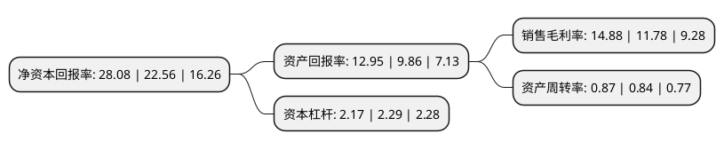

> 本页面由自动化程序生成于 2022年5月20日 01:17
> 内容可能存在错误，如有bug请提交issue至：https://github.com/Eroleice/doc-pi/issues
{.is-warning}

# 上市公司基本情况

## 基本资料

广东伊之密精密机械股份有限公司（以下简称“伊之密”）成立于2004年02月06日，佛山市。于2015年01月23日在深交所创业板上市。

伊之密注册资本46,914.568万元，主要产品:高分子材料模压注射成型设备和轻合金模压成型设备。按照用途，高分子材料模压注射成型设备包括注塑机和橡胶注射机;轻合金模压成型设备指压铸机。发行人所在行业属于国家鼓励和扶持的先进装备制造业，产品广泛应用于家用电器，汽车，医疗器械，包装，3C产品等重要行业和领域。主营业务:专业从事模压成型专用机械设备的设计，研发，生产，销售及服务的高新技术企业。以下是详细信息：

- 公司名称: 广东伊之密精密机械股份有限公司
- 股票代码: 300415.SZ
- 所在地: 广东 - 佛山市
- 成立日期: 2004年02月06日
- 注册资本: 46,914.568万元
- 法定代表人: 陈敬财
- 主营业务: 主要产品:高分子材料模压注射成型设备和轻合金模压成型设备按照用途，高分子材料模压注射成型设备包括注塑机和橡胶注射机;轻合金模压成型设备指压铸机发行人所在行业属于国家鼓励和扶持的先进装备制造业，产品广泛应用于家用电器，汽车，医疗器械，包装，3C产品等重要行业和领域主营业务:专业从事模压成型专用机械设备的设计，研发，生产，销售及服务的高新技术企业
- 公司官网: www.yizumi.com
- 公司介绍: 公司一直专注于模压成型专用机械设备的设计、研发、生产、销售及服务，为客户提供从方案设计、产品制造到维修服务等全方位的个性化解决方案，产品主要用于家用电器、汽车、3C产品、医疗器械、包装及航空航天等领域，属于国家发改委、科技部、工信部、商务部、知识产权局共同发布的《当前优先发展的高新技术产业化重点领域指南》(2011年度)中的“精密高效和成形设备”及“高性能镁、铝、钛合金材料中的大型复杂构件成型技术”，是工业制造领域的重要工作母机。在国内，公司除顺德容桂总部生产基地外，还建有顺德五沙、苏州吴江两大生产基地，在全球，公司建有多个海外办事处和服务点，业务覆盖数十个国家和地区。公司拥有省级企业技术中心、工程中心并设立了博士后科研工作站，是中国最具竞争力和发展潜力的大型装备综合服务商、中国最具规模的装备制造企业之一、国家级高新技术企业及国家级火炬计划项目实施企业单位。

## 股东及高管情况

上市公司第一大股东为佳卓控股有限公司，持股145,800,000股，占比31.08%，为上市公司实际控制人。

截至2022年03月31日，上市公司的前十大股东中，共有4名自然人股东，1名机构股东，5个产品账户，其中5%以上大股东共有1名。上市公司前十大股东明细如下：

> 截至2022年03月31日，上市公司前十大股东信息如下：

| 股东名称 | 持股数量（股） | 持股比例 |
| --- | --- | --- |
| 佳卓控股有限公司 | 145,800,000 | 31.08% |
| 陈敬财 | 17,161,291 | 3.66% |
| 广州市玄元投资管理有限公司-玄元科新53号私募证券投资基金 | 11,000,000 | 2.34% |
| 安信证券资管-廖昌清-安信资管创赢13号单一资产管理计划 | 10,300,000 | 2.2% |
| 兴业银行股份有限公司-天弘永利债券型证券投资基金 | 9,981,047 | 2.13% |
| 梁敬华 | 9,510,396 | 2.03% |
| 甄荣辉 | 7,859,917 | 1.68% |
| 中国农业银行股份有限公司-交银施罗德先进制造混合型证券投资基金 | 7,496,856 | 1.6% |
| 招商银行股份有限公司-交银施罗德均衡成长一年持有期混合型证券投资基金 | 6,651,571 | 1.42% |
| 高潮 | 6,000,000 | 1.28% |

## 利润表分析

上市公司2021年总收入为35.32亿元，净利润为5.25亿元，实现盈利。

## 杜邦分析

> 数据列示周期：2021年 | 2020年 | 2019年
{.is-info}

上市公司的净资产收益率在近一年有所上升，上升幅度为24.47%，其变化情况分解如下：
- 上市公司的销售毛利率在近一年上升了26.32%，可能是生产效率的提升、商品原材料价格下跌或商品价格的上涨所致。
- 上市公司的资产周转率在近一年上升了3.57%，可能是源自于更快的销售回款或库存管理效果提升。
- 上市公司的财务杠杆比率在近一年下降了-5.24%，可能是减少负债降低财务费用。

