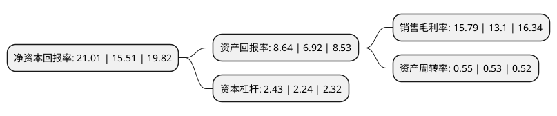

> 本页面由自动化程序生成于 2022年5月20日 01:17
> 内容可能存在错误，如有bug请提交issue至：https://github.com/Eroleice/doc-pi/issues
{.is-warning}

# 上市公司基本情况

## 基本资料

无锡先导智能装备股份有限公司（以下简称“先导智能”）成立于2002年04月30日，无锡市。于2015年05月18日在深交所创业板上市。

先导智能注册资本156,379.413万元，专业从事自动化成套设备的研发，设计，生产与销售以及自动化整体解决方案的供应商，公司主要为薄膜电容器，锂电池，光伏电池/组件等节能环保及新能源产品的生产制造厂商提供设备及解决方案。主要产品:播磨电容器设备，锂电池设备，光伏自动化生产配套设备。以下是详细信息：

- 公司名称: 无锡先导智能装备股份有限公司
- 股票代码: 300450.SZ
- 所在地: 江苏 - 无锡市
- 成立日期: 2002年04月30日
- 注册资本: 156,379.413万元
- 法定代表人: 王燕清
- 主营业务: 专业从事自动化成套设备的研发，设计，生产与销售以及自动化整体解决方案的供应商，公司主要为薄膜电容器，锂电池，光伏电池/组件等节能环保及新能源产品的生产制造厂商提供设备及解决方案主要产品:播磨电容器设备，锂电池设备，光伏自动化生产配套设备
- 公司官网: www.leadchina.cn
- 公司介绍: 公司是国家火炬计划重点高新技术企业、国家两化融合示范企业。公司是全球新能源装备的龙头企业，涵盖锂电池装备、光伏装备、3C检测装备、智能仓储物流系统、汽车智能产线等业务。公司专业从事高端自动化成套装备的研发设计、生产销售，为锂电池、光伏电池/组件、3C、薄膜电容器等节能环保及新能源产品的生产制造商提供高端全自动智能装备及解决方案。公司的产品性能达到国际先进水平，能根据客户要求研发各种个性化智能装备。公司拥有数百项授权专利，多项装备被认定为省高新技术产品、省首台套重大装备、省名牌产品等。

## 股东及高管情况

上市公司第一大股东为香港中央结算有限公司(陆股通)，持股363,109,122股，占比23.22%，**疑似为**上市公司实际控制人。

截至2022年03月31日，上市公司的前十大股东中，共有4名机构股东，5个产品账户，1个海外主体，其中5%以上大股东共有4名。上市公司前十大股东明细如下：

> 未能通过持股比例判定出上市公司实际控制人（持股30%以上）
> 可能存在通过间接持股、联合持股、协议控制等方式拥有实际控制权的主体，具体请参考上市公司定期公告！
{.is-warning}

> 截至2022年03月31日，上市公司前十大股东信息如下：

| 股东名称 | 持股数量（股） | 持股比例 |
| --- | --- | --- |
| 香港中央结算有限公司(陆股通) | 363,109,122 | 23.22% |
| 江苏欣导创业投资合伙企业(有限合伙) | 336,039,506 | 21.49% |
| 宁德时代新能源科技股份有限公司 | 111,856,823 | 7.15% |
| 上海元攀企业管理合伙企业(有限合伙) | 92,041,983 | 5.89% |
| 常州煜玺创业投资合伙企业(有限合伙) | 69,414,157 | 4.44% |
| 招商银行股份有限公司-睿远成长价值混合型证券投资基金 | 19,415,300 | 1.24% |
| 全国社保基金一零七组合 | 15,353,790 | 0.98% |
| 中国银行股份有限公司-华泰柏瑞中证光伏产业交易型开放式指数证券投资基金 | 13,263,628 | 0.85% |
| 中信建投证券股份有限公司-天弘中证光伏产业指数型发起式证券投资基金 | 10,562,047 | 0.68% |
| 全国社保基金一一零组合 | 9,871,934 | 0.63% |

## 利润表分析

上市公司2021年总收入为100.36亿元，净利润为15.84亿元，实现盈利。

## 杜邦分析

> 数据列示周期：2021年 | 2020年 | 2019年
{.is-info}

上市公司的净资产收益率在近一年有所上升，上升幅度为35.46%，其变化情况分解如下：
- 上市公司的销售毛利率在近一年上升了20.53%，可能是生产效率的提升、商品原材料价格下跌或商品价格的上涨所致。
- 上市公司的资产周转率在近一年上升了3.77%，可能是源自于更快的销售回款或库存管理效果提升。
- 上市公司的财务杠杆比率在近一年上升了8.48%，可能是增加负债扩大生产规模。

