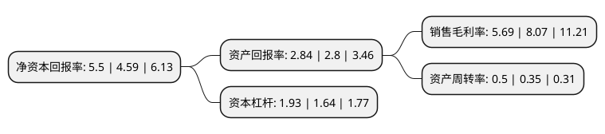

> 本页面由自动化程序生成于 2022年5月20日 01:17
> 内容可能存在错误，如有bug请提交issue至：https://github.com/Eroleice/doc-pi/issues
{.is-warning}

# 上市公司基本情况

## 基本资料

深圳市赢合科技股份有限公司（以下简称“赢合科技”）成立于2006年06月26日，深圳市。于2015年05月14日在深交所创业板上市。

赢合科技注册资本64,953.796万元，主营业务为锂离子电池自动化生产设备的研发，设计，制造，销售与服务，产品主要应用于锂离子电池制作的关键工序，公司产品涵盖锂离子电池自动化生产线上主要设备，包含涂布机，分条机，制片机，卷绕机，模切机，叠片机六大类设备及相应配套的辅助设备以下是详细信息：

- 公司名称: 深圳市赢合科技股份有限公司
- 股票代码: 300457.SZ
- 所在地: 广东 - 深圳市
- 成立日期: 2006年06月26日
- 注册资本: 64,953.796万元
- 法定代表人: 王庆东
- 主营业务: 主营业务为锂离子电池自动化生产设备的研发，设计，制造，销售与服务，产品主要应用于锂离子电池制作的关键工序，公司产品涵盖锂离子电池自动化生产线上主要设备，包含涂布机，分条机，制片机，卷绕机，模切机，叠片机六大类设备及相应配套的辅助设备
- 公司官网: www.yhwins.com
- 公司介绍: 公司是我国动力电池智能自动化设备行业的龙头企业，也是目前全球唯一一家能够提供动力电池智能化数字工厂解决方案的企业。公司是行业内第一家推出锂电池智能生产线整线方案提供商，为客户提供自动化生产工艺实现、动力辅助、环境控制和工业建筑规划设计等全套解决方案，面向客户认可的子公司和合作伙伴定制相应设备，从方案设计、产品出图、设备生产到设备调试、生产运维的各个环节进行全程跟进和服务，充分满足客户自动化、信息化、智能化的生产需求。公司紧贴市场需求，抓住市场机遇，满足客户自动化、信息化、智能化的生产线要求，客户粘性提升，订单量持续增长。

## 股东及高管情况

上市公司第一大股东为上海电气集团股份有限公司，持股184,426,829股，占比28.39%，**疑似为**上市公司实际控制人。

截至2022年03月31日，上市公司的前十大股东中，共有4名自然人股东，1名机构股东，4个产品账户，1个海外主体，其中5%以上大股东共有2名。上市公司前十大股东明细如下：

> 未能通过持股比例判定出上市公司实际控制人（持股30%以上）
> 可能存在通过间接持股、联合持股、协议控制等方式拥有实际控制权的主体，具体请参考上市公司定期公告！
{.is-warning}

> 截至2022年03月31日，上市公司前十大股东信息如下：

| 股东名称 | 持股数量（股） | 持股比例 |
| --- | --- | --- |
| 上海电气集团股份有限公司 | 184,426,829 | 28.39% |
| 王维东 | 111,734,362 | 17.2% |
| 香港中央结算有限公司(陆股通) | 27,675,852 | 4.26% |
| 许小菊 | 11,756,664 | 1.81% |
| 中国工商银行股份有限公司-前海开源新经济灵活配置混合型证券投资基金 | 5,573,436 | 0.86% |
| 范中 | 4,603,600 | 0.71% |
| 李有云 | 3,500,000 | 0.54% |
| 中国建设银行股份有限公司-信达澳银新能源产业股票型证券投资基金 | 3,347,019 | 0.52% |
| 深圳前海华杉投资管理有限公司-华杉永旭私募基金 | 3,324,790 | 0.51% |
| 中国建设银行股份有限公司-前海开源公用事业行业股票型证券投资基金 | 3,092,746 | 0.48% |

## 利润表分析

上市公司2021年总收入为52.01亿元，净利润为2.95亿元，实现盈利。

## 杜邦分析

> 数据列示周期：2021年 | 2020年 | 2019年
{.is-info}

上市公司的净资产收益率在近一年有所上升，上升幅度为19.83%，其变化情况分解如下：
- 上市公司的销售毛利率在近一年下降了-29.49%，可能是生产效率的下降、商品原材料价格上涨或商品价格的下跌所致。
- 上市公司的资产周转率在近一年上升了42.86%，可能是源自于更快的销售回款或库存管理效果提升。
- 上市公司的财务杠杆比率在近一年上升了17.68%，可能是增加负债扩大生产规模。

