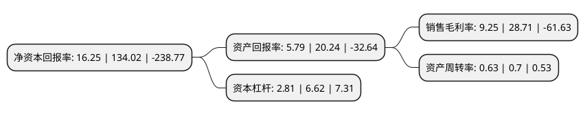

> 本页面由自动化程序生成于 2022年5月20日 01:17
> 内容可能存在错误，如有bug请提交issue至：https://github.com/Eroleice/doc-pi/issues
{.is-warning}

# 上市公司基本情况

## 基本资料

浙江田中精机股份有限公司（以下简称“田中精机”）成立于2003年07月09日，嘉兴市。于2015年05月19日在深交所创业板上市。

田中精机注册资本13,040.4万元，主营业务是为基础电子元件商及其下游厂商提供生产电子线圈所需的成套数控自动化设备及相关零部件，公司提供包括数控自动化生产设备的设计，生产，安装，检测，售后服务在内的一体化解决方案。主要产品为数控自动化绕线设备以下是详细信息：

- 公司名称: 浙江田中精机股份有限公司
- 股票代码: 300461.SZ
- 所在地: 浙江 - 嘉兴市
- 成立日期: 2003年07月09日
- 注册资本: 13,040.4万元
- 法定代表人: 张玉龙
- 主营业务: 主营业务是为基础电子元件商及其下游厂商提供生产电子线圈所需的成套数控自动化设备及相关零部件，公司提供包括数控自动化生产设备的设计，生产，安装，检测，售后服务在内的一体化解决方案主要产品为数控自动化绕线设备
- 公司官网: www.tanac.com.cn
- 公司介绍: 公司主营业务是为基础电子元件商及其下游厂商提供生产电子线圈所需的成套数控自动化设备及相关零部件，公司提供包括数控自动化生产设备的设计、生产、安装、检测、售后服务在内的一体化解决方案。经过多年经营，公司与下游客户建立了长期、稳定的合作关系，目前与公司合作的客户包括伟创力集团(Flextronics)、美国库柏工业集团(COOPER，该公司已被美国伊顿公司收购)、TDK-爱普科斯公司(TDK-EPC)、日本电产集团(Nidec)、后藤电子株式会社(GOTO)等全球知名企业在内的优质客户。公司先后完成了磁阻尼无摩擦张力技术、伺服张力技术、压轮式/夹持式自动贴绝缘胶带技术等多项配套非专利技术，各项综合技术指标处于国际先进水平；专利技术方面，公司拥有专利数十项。此外，公司承担的“MSC5612数控全自动绕线机”和“RSC全自动焊锡机”项目，获得了科技部火炬高技术产业开发中心颁发的“国家火炬计划项目证书”。

## 股东及高管情况

上市公司第一大股东为竹田享司，持股17,225,262股，占比13.21%，**疑似为**上市公司实际控制人。

截至2022年03月31日，上市公司的前十大股东中，共有8名自然人股东，2名机构股东，其中5%以上大股东共有7名。上市公司前十大股东明细如下：

> 未能通过持股比例判定出上市公司实际控制人（持股30%以上）
> 可能存在通过间接持股、联合持股、协议控制等方式拥有实际控制权的主体，具体请参考上市公司定期公告！
{.is-warning}

> 截至2022年03月31日，上市公司前十大股东信息如下：

| 股东名称 | 持股数量（股） | 持股比例 |
| --- | --- | --- |
| 竹田享司 | 17,225,262 | 13.21% |
| 钱承林 | 14,611,247 | 11.2% |
| 上海翡垚投资管理有限公司 | 10,215,443 | 7.83% |
| 张玉龙 | 10,100,000 | 7.75% |
| 蔷薇资本有限公司 | 9,867,526 | 7.57% |
| 竹田周司 | 9,795,756 | 7.51% |
| 藤野康成 | 7,173,609 | 5.5% |
| 林治洪 | 1,600,000 | 1.23% |
| 龚伦勇 | 1,080,000 | 0.83% |
| 苏丹 | 730,000 | 0.56% |

## 利润表分析

上市公司2021年总收入为3.43亿元，净利润为0.31亿元，实现盈利。

## 杜邦分析

> 数据列示周期：2021年 | 2020年 | 2019年
{.is-info}

上市公司的净资产收益率在近一年有所下降，下降幅度为-87.87%，其变化情况分解如下：
- 上市公司的销售毛利率在近一年下降了-67.78%，可能是生产效率的下降、商品原材料价格上涨或商品价格的下跌所致。
- 上市公司的资产周转率在近一年下降了-10%，可能是源自于更慢的销售回款或库存管理效果下降。
- 上市公司的财务杠杆比率在近一年下降了-57.55%，可能是减少负债降低财务费用。

