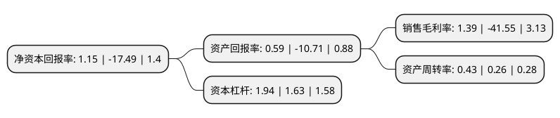

> 本页面由自动化程序生成于 2022年5月20日 01:18
> 内容可能存在错误，如有bug请提交issue至：https://github.com/Eroleice/doc-pi/issues
{.is-warning}

# 上市公司基本情况

## 基本资料

厚普清洁能源股份有限公司（以下简称“厚普股份”）成立于2005年01月07日，成都市。于2015年06月11日在深交所创业板上市。

厚普股份注册资本36,472万元，主营业务为天然气汽车加气站设备及信息化集成监管系统的研发，设计，生产，销售和服务。主要产品包括CNG加气站设备(CNG加气机，加气柱，卸气柱，程序控制盘，加气机检定装置等)，LNG(含L-CNG)加气站成套设备和专项设备及CNG/LNG信息化集成监管系统，同时提供零配件销售和维修服务。以下是详细信息：

- 公司名称: 厚普清洁能源股份有限公司
- 股票代码: 300471.SZ
- 所在地: 四川 - 成都市
- 成立日期: 2005年01月07日
- 注册资本: 36,472万元
- 法定代表人: 王季文
- 主营业务: 主营业务为天然气汽车加气站设备及信息化集成监管系统的研发，设计，生产，销售和服务主要产品包括CNG加气站设备(CNG加气机，加气柱，卸气柱，程序控制盘，加气机检定装置等)，LNG(含L-CNG)加气站成套设备和专项设备及CNG/LNG信息化集成监管系统，同时提供零配件销售和维修服务
- 公司官网: www.hqhop.com
- 公司介绍: 公司主营业务立足于清洁能源的高端设备制造及相应的能源工程咨询、设计、施工，包括但不限于CNG/LNG车用加气站成套设备、船用天然气供气设备、系统及其核心零部件的研发、生产和集成，井口天然气净化及液化处理装备的研发、生产和集成，加氢站成套设备、核心部件及系统、充电装置及分布式能源相关装备，同时具备了“清洁能源+互联网+云计算+大数据分析”一体化智慧能源系统开发及能源互联网运营维护的业务能力。公司CNG加气机通过了欧盟ATEX防爆体系认证，LNG集装箱橇装通过欧盟PED(G模式)承压设备安全认证及MD机械指令认证，LNG加气机通过欧盟ATEX防爆认证。公司“基于网络化管理的高安全性CNG加气机”获得国家科技部科技型中小企业技术创新基金并通过验收；LNG加气机及LNG加气站成套设备通过四川省科技厅科技成果鉴定，总体上处于国内领先水平；公司LNG/L-CNG全橇装加气装置通过四川省科技厅科技成果鉴定，处于国际领先水平；双泵橇智能LNG加气站成套设备通过四川省科技厅科技成果鉴定，总体技术处于国内领先水平。

## 股东及高管情况

上市公司第一大股东为北京星凯投资有限公司，持股52,920,900股，占比14.51%，**疑似为**上市公司实际控制人。

截至2022年04月26日，上市公司的前十大股东中，共有5名自然人股东，3名机构股东，1个产品账户，1个海外主体，其中5%以上大股东共有8名。上市公司前十大股东明细如下：

> 未能通过持股比例判定出上市公司实际控制人（持股30%以上）
> 可能存在通过间接持股、联合持股、协议控制等方式拥有实际控制权的主体，具体请参考上市公司定期公告！
{.is-warning}

> 截至2022年04月26日，上市公司前十大股东信息如下：

| 股东名称 | 持股数量（股） | 持股比例 |
| --- | --- | --- |
| 北京星凯投资有限公司 | 52,920,900 | 14.51% |
| 北京星凯投资有限公司 | 52,920,900 | 14.51% |
| 王季文 | 36,472,000 | 10% |
| 王季文 | 36,472,000 | 10% |
| 唐新潮 | 21,070,384 | 5.78% |
| 唐新潮 | 21,070,384 | 5.78% |
| 华油天然气股份有限公司 | 21,000,000 | 5.76% |
| 江涛 | 19,491,823 | 5.3443% |
| 华福证券-江涛-华福证券-兴源24号单一资产管理计划 | 2,530,000 | 0.69% |
| MORGAN STANLEY & CO. INTERNATIONAL PLC. | 1,626,462 | 0.45% |

## 利润表分析

上市公司2021年总收入为8.74亿元，净利润为0.12亿元，实现盈利。

## 杜邦分析

> 数据列示周期：2021年 | 2020年 | 2019年
{.is-info}

上市公司的净资产收益率在近一年有所下降，下降幅度为-106.58%，其变化情况分解如下：
- 上市公司的销售毛利率在近一年下降了-103.35%，可能是生产效率的下降、商品原材料价格上涨或商品价格的下跌所致。
- 上市公司的资产周转率在近一年上升了65.38%，可能是源自于更快的销售回款或库存管理效果提升。
- 上市公司的财务杠杆比率在近一年上升了19.02%，可能是增加负债扩大生产规模。

