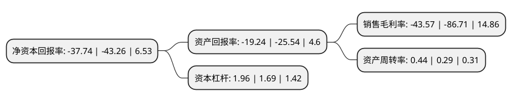

> 本页面由自动化程序生成于 2022年5月20日 01:18
> 内容可能存在错误，如有bug请提交issue至：https://github.com/Eroleice/doc-pi/issues
{.is-warning}

# 上市公司基本情况

## 基本资料

万向新元科技股份有限公司（以下简称“新元科技”）成立于2003年09月24日，抚州市。于2015年06月11日在深交所创业板上市。

新元科技注册资本26,657.112万元，主营业务:公司以提供工业智能化输送，配料成套解决方案为主业，集方案设计，技术研发，设备制造，系统集成，销售服务于一体，主要产品:包括智能环保型密炼机上辅机系统，气力物料输送系统和小料自动配料称量系统等。以下是详细信息：

- 公司名称: 万向新元科技股份有限公司
- 股票代码: 300472.SZ
- 所在地: 江西 - 抚州市
- 成立日期: 2003年09月24日
- 注册资本: 26,657.112万元
- 法定代表人: 朱业胜
- 主营业务: 主营业务:公司以提供工业智能化输送，配料成套解决方案为主业，集方案设计，技术研发，设备制造，系统集成，销售服务于一体，主要产品:包括智能环保型密炼机上辅机系统，气力物料输送系统和小料自动配料称量系统等
- 公司官网: www.newu.com.cn
- 公司介绍: 公司是一家集研发、设计、智能制造、系统集成、运维服务于一体的一流创新型高科技企业，产品涵盖环境治理、高端智能制造、智能控制、云计算大数据信息技术四个方面。公司坚持“纵深发展、精品战略”的理念，追求以工业4.0为目标，助力中国制造2025。以环境治理、绿色智能制造(人工智能)为主业,为客户提供成套解决方案，具备工程EPC总承包经验和实力。公司以提供工业智能化输送、配料成套解决方案为主业，集方案设计、技术研发、设备制造、系统集成、销售服务于一体，主要产品包括上辅机系统、小料配料称量系统、气力输送系统、环保系统、电镀系统等。公司通过ISO9001:2008质量管理体系认证，产品通过欧洲CE安全认证、美国UL认证、俄罗斯GOST认证。参与“橡胶工厂节能设计规范”“橡胶工厂环境保护设计规范”、“橡胶工厂职业安全与卫生设计标准”、《GB/T25939-2010密闭式炼胶机上辅机系统》和《GB/T25938-2010炼胶工序中小料自动配料称量系统》等多项国家标准的制定。

## 股东及高管情况

上市公司第一大股东为江西国联大成实业有限公司，持股23,008,820股，占比8.63%，**疑似为**上市公司实际控制人。

截至2022年03月31日，上市公司的前十大股东中，共有6名自然人股东，3名机构股东，1个产品账户，其中5%以上大股东共有2名。上市公司前十大股东明细如下：

> 未能通过持股比例判定出上市公司实际控制人（持股30%以上）
> 可能存在通过间接持股、联合持股、协议控制等方式拥有实际控制权的主体，具体请参考上市公司定期公告！
{.is-warning}

> 上市公司第一大股东持股不超过10%，请检查是否存在公司控制权风险！
{.is-danger}

> 截至2022年03月31日，上市公司前十大股东信息如下：

| 股东名称 | 持股数量（股） | 持股比例 |
| --- | --- | --- |
| 江西国联大成实业有限公司 | 23,008,820 | 8.63% |
| 朱业胜 | 17,880,043 | 6.71% |
| 曾维斌 | 8,303,618 | 3.11% |
| 姜承法 | 7,815,618 | 2.93% |
| 张玉生 | 5,469,166 | 2.05% |
| 农银国际投资(苏州)有限公司 | 5,284,878 | 1.98% |
| 宁波世纪万向企业管理合伙企业(有限合伙) | 4,410,900 | 1.65% |
| 王展 | 3,730,286 | 1.4% |
| 李薇 | 3,593,541 | 1.35% |
| 上海一村投资管理有限公司-一村基石13号私募证券投资基金 | 2,424,200 | 0.9% |

## 利润表分析

上市公司2021年总收入为6.84亿元，净利润为-2.99亿元，**未实现盈利**。

## 杜邦分析

> 数据列示周期：2021年 | 2020年 | 2019年
{.is-info}

上市公司的净资产收益率在近一年有所下降，下降幅度为-12.76%，其变化情况分解如下：
- 上市公司的销售毛利率在近一年下降了-49.75%，可能是生产效率的下降、商品原材料价格上涨或商品价格的下跌所致。
- 上市公司的资产周转率在近一年上升了51.72%，可能是源自于更快的销售回款或库存管理效果提升。
- 上市公司的财务杠杆比率在近一年上升了15.98%，可能是增加负债扩大生产规模。

