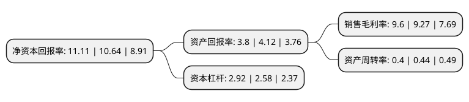

> 本页面由自动化程序生成于 2022年5月20日 01:18
> 内容可能存在错误，如有bug请提交issue至：https://github.com/Eroleice/doc-pi/issues
{.is-warning}

# 上市公司基本情况

## 基本资料

江苏新美星包装机械股份有限公司（以下简称“新美星”）成立于2003年10月28日，苏州市。于2016年04月25日在深交所创业板上市。

新美星注册资本29,640万元，主营业务为液态食品包装机械的研发，生产与销售，目前主要产品为流体系列设备，灌装系列设备，二次包装系列设备以及全自动高速PET瓶吹瓶设备。以下是详细信息：

- 公司名称: 江苏新美星包装机械股份有限公司
- 股票代码: 300509.SZ
- 所在地: 江苏 - 苏州市
- 成立日期: 2003年10月28日
- 注册资本: 29,640万元
- 法定代表人: 何云涛
- 主营业务: 主营业务为液态食品包装机械的研发，生产与销售，目前主要产品为流体系列设备，灌装系列设备，二次包装系列设备以及全自动高速PET瓶吹瓶设备
- 公司官网: www.newamstar.com
- 公司介绍: 公司是中国高端液体(饮料)包装机械研发与制造基地，致力于为液态产品智能工厂提供产存一体化整体解决方案的总集成总承包服务。公司主营业务为液体包装机械的研发、生产与销售，目前主要产品为流体系列设备、灌装系列设备、二次包装系列设备以及全自动高速PET瓶吹瓶设备。公司是江苏省科技厅、江苏省财政厅、江苏省国税局与江苏省地税局联合认定的高新技术企业，中国饮料业灌装设备优秀供应商，江苏省创新型企业，国家火炬计划项目承担单位，国家发改委无菌灌装产业化项目实施单位；建有“江苏省企业技术中心”等高规格、高水平研发平台；多年来，公司作为行业领先企业，主持或参与了《液态食品包装设备验收规范》、《液态食品超高温瞬时灭菌设备(UHT)验收规范》、《PET瓶无菌冷灌装生产线》、《聚酯PET瓶装饮料冲瓶灌装拧(旋)盖机》、《碳酸饮料、啤酒灌装压盖机技术条件》等多项国家或行业标准的制订。

## 股东及高管情况

上市公司第一大股东为何德平，持股93,989,399股，占比31.71%，为上市公司实际控制人。

截至2022年03月31日，上市公司的前十大股东中，共有8名自然人股东，1名机构股东，1个海外主体，其中5%以上大股东共有3名。上市公司前十大股东明细如下：

> 截至2022年03月31日，上市公司前十大股东信息如下：

| 股东名称 | 持股数量（股） | 持股比例 |
| --- | --- | --- |
| 何德平 | 93,989,399 | 31.71% |
| 何云涛 | 68,687,520 | 23.17% |
| 建水县德运企业管理有限公司 | 15,376,400 | 5.19% |
| 刘先立 | 2,089,894 | 0.71% |
| 李剑东 | 1,238,527 | 0.42% |
| 陈峰 | 920,000 | 0.31% |
| JPMORGANCHASEBANK,NATIONALASSOCIATION | 809,622 | 0.27% |
| 李胜军 | 784,802 | 0.26% |
| 张庆生 | 719,788 | 0.24% |
| 庞华军 | 700,000 | 0.24% |

## 利润表分析

上市公司2021年总收入为7.1亿元，净利润为0.68亿元，实现盈利。

## 杜邦分析

> 数据列示周期：2021年 | 2020年 | 2019年
{.is-info}

上市公司的净资产收益率在近一年有所上升，上升幅度为4.42%，其变化情况分解如下：
- 上市公司的销售毛利率在近一年上升了3.56%，可能是生产效率的提升、商品原材料价格下跌或商品价格的上涨所致。
- 上市公司的资产周转率在近一年下降了-9.09%，可能是源自于更慢的销售回款或库存管理效果下降。
- 上市公司的财务杠杆比率在近一年上升了13.18%，可能是增加负债扩大生产规模。

