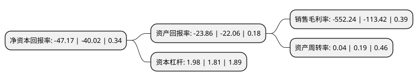

> 本页面由自动化程序生成于 2022年5月20日 01:18
> 内容可能存在错误，如有bug请提交issue至：https://github.com/Eroleice/doc-pi/issues
{.is-warning}

# 上市公司基本情况

## 基本资料

中潜股份有限公司（以下简称“*ST中潜”）成立于2003年04月10日，惠州市。于2016年08月02日在深交所创业板上市。

*ST中潜注册资本20,424.897万元，主要业务:主要从事适宜各类人群，各种水域潜水，渔猎等涉水活动防护装备的研发，生产及销售;产品所需新型复合橡胶材料的研发，生产;以及自主品牌推广及休闲潜水运动的推广等，核心产品为潜水服和潜水服的衍生品渔猎服。以下是详细信息：

- 公司名称: 中潜股份有限公司
- 股票代码: 300526.SZ
- 所在地: 广东 - 惠州市
- 成立日期: 2003年04月10日
- 注册资本: 20,424.897万元
- 法定代表人: 韩正海
- 主营业务: 主要从事适宜各类人群，各种水域潜水，渔猎等涉水活动防护装备的研发，生产及销售;产品所需新型复合橡胶材料的研发，生产;以及自主品牌推广及休闲潜水运动的推广等，核心产品为潜水服和潜水服的衍生品渔猎服
- 公司官网: www.china-dive.com
- 公司介绍: 公司是一家专业生产海洋潜水装备的公司。公司主要产品为：海洋潜水装备和高性能复合材料，其中海洋潜水装备包括：干式潜水衣、半干式潜水衣、湿式潜水衣、渔猎服以及其它配套装备。可广泛应用于各类水下作业及活动，包括海洋资源勘探、采样及深海观察、运载、海洋石油开发、海洋施工、海洋搜救、海洋打捞、海洋考古、海洋休闲潜水等海洋活动。公司一直以来坚持以生产为基础，以质量为保证，以市场为导向，不断的科技创新，将充分利用上市平台，做强做大海洋潜水装备相关业务领域，向大众、科研机构、国防军工提供更安全更便捷探索海底世界的途径。展望未来，中潜将秉承“向大众提供发现世界的另一种途径”的企业使命，强势保持在全球范围内海洋潜水装备领域少数具有提供高端综合服务能力的供应商优势，力争成为拥有国际著名自主品牌的品牌运营商及国内休闲潜水运动的领航者。

## 股东及高管情况

上市公司第一大股东为深圳市爵盟管理咨询有限公司，持股64,793,060股，占比31.72%，为上市公司实际控制人。

截至2022年03月31日，上市公司的前十大股东中，共有3名自然人股东，4名机构股东，2个海外主体，1名其他股东，其中5%以上大股东共有2名。上市公司前十大股东明细如下：

> 截至2022年03月31日，上市公司前十大股东信息如下：

| 股东名称 | 持股数量（股） | 持股比例 |
| --- | --- | --- |
| 深圳市爵盟管理咨询有限公司 | 64,793,060 | 31.72% |
| 爵盟投资(香港)有限公司 | 50,126,699 | 24.54% |
| MORGAN STANLEY & CO. INTERNATIONAL PLC. | 1,430,560 | 0.7% |
| JPMORGAN CHASE BANK,NATIONAL ASSOCIATION | 996,932 | 0.49% |
| 惠州市祥佳科技有限公司 | 648,442 | 0.32% |
| 何楚华 | 634,801 | 0.31% |
| 徐锋 | 526,400 | 0.26% |
| 任正平 | 515,420 | 0.25% |
| 法国兴业银行 | 502,655 | 0.25% |
| 华泰证券股份有限公司 | 472,736 | 0.23% |

## 利润表分析

上市公司2021年总收入为0.25亿元，净利润为-1.43亿元，**未实现盈利**。

## 杜邦分析

> 数据列示周期：2021年 | 2020年 | 2019年
{.is-info}

上市公司的净资产收益率在近一年有所上升，上升幅度为17.87%，其变化情况分解如下：
- 上市公司的销售毛利率在近一年上升了386.9%，可能是生产效率的提升、商品原材料价格下跌或商品价格的上涨所致。
- 上市公司的资产周转率在近一年下降了-78.95%，可能是源自于更慢的销售回款或库存管理效果下降。
- 上市公司的财务杠杆比率在近一年上升了9.39%，可能是增加负债扩大生产规模。

