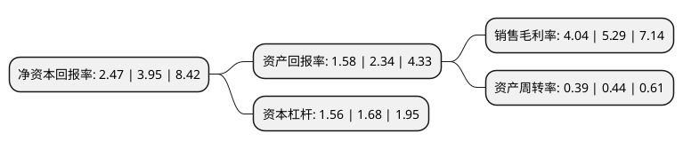

> 本页面由自动化程序生成于 2022年5月20日 01:18
> 内容可能存在错误，如有bug请提交issue至：https://github.com/Eroleice/doc-pi/issues
{.is-warning}

# 上市公司基本情况

## 基本资料

中国船舶重工集团应急预警与救援装备股份有限公司（以下简称“中船应急”）成立于2007年12月27日，武汉市。于2016年08月05日在深交所创业板上市。

中船应急注册资本96,321.116万元，主要从事应急交通工程装备的研发，生产和销售。主要产品为应急交通工程装备，能提供用于公路，水路，铁路和航空的四类应急交通工程装备产品。以下是详细信息：

- 公司名称: 中国船舶重工集团应急预警与救援装备股份有限公司
- 股票代码: 300527.SZ
- 所在地: 湖北 - 武汉市
- 成立日期: 2007年12月27日
- 注册资本: 96,321.116万元
- 法定代表人: 唐勇
- 主营业务: 主要从事应急交通工程装备的研发，生产和销售主要产品为应急交通工程装备，能提供用于公路，水路，铁路和航空的四类应急交通工程装备产品
- 公司官网: www.china-huazhou.com
- 公司介绍: 公司自设立以来主要从事应急交通工程装备的研发、生产和销售，是国内军用应急交通工程装备领域中规模领先、产品线齐全和研发实力突出的专业制造商之一，也是军方应急交通工程装备的重要供应商和总装单位。公司的民用应急交通工程装备主要用户为政府部门、大型工程建设企业和机械制造企业。公司先后获得多项国家级科技进步奖、部级科技进步奖、军方科技进步奖等。同时公司还取得了多项国防发明专利及非国防专利。公司将适应国内外形势新变化，抓住国家应急保障体系建设和军队执行多样化军事任务的发展机遇，逐步发展成为中国应急交通工程装备产业研制基地。

## 股东及高管情况

上市公司第一大股东为中国船舶重工集团有限公司，持股435,328,835股，占比45.2%，为上市公司实际控制人。

截至2022年03月31日，上市公司的前十大股东中，共有4名自然人股东，4名机构股东，1个产品账户，1个海外主体，其中5%以上大股东共有2名。上市公司前十大股东明细如下：

> 截至2022年03月31日，上市公司前十大股东信息如下：

| 股东名称 | 持股数量（股） | 持股比例 |
| --- | --- | --- |
| 中国船舶重工集团有限公司 | 435,328,835 | 45.2% |
| 中国船舶重工集团武汉船舶工业有限公司 | 129,983,472 | 13.49% |
| 西安精密机械研究所(中国船舶重工集团公司第七0五研究所) | 19,477,282 | 2.02% |
| 夏琼 | 11,257,700 | 1.17% |
| 中船重工科技投资发展有限公司 | 11,077,928 | 1.15% |
| 阎宝国 | 6,133,966 | 0.64% |
| 夏信根 | 5,766,232 | 0.6% |
| 中国建设银行股份有限公司-国泰中证军工交易型开放式指数证券投资基金 | 4,745,759 | 0.49% |
| 解向坡 | 3,410,000 | 0.35% |
| 香港中央结算有限公司(陆股通) | 3,368,212 | 0.35% |

## 利润表分析

上市公司2021年总收入为16.98亿元，净利润为0.68亿元，实现盈利。

## 杜邦分析

> 数据列示周期：2021年 | 2020年 | 2019年
{.is-info}

上市公司的净资产收益率在近一年有所下降，下降幅度为-37.47%，其变化情况分解如下：
- 上市公司的销售毛利率在近一年下降了-23.63%，可能是生产效率的下降、商品原材料价格上涨或商品价格的下跌所致。
- 上市公司的资产周转率在近一年下降了-11.36%，可能是源自于更慢的销售回款或库存管理效果下降。
- 上市公司的财务杠杆比率在近一年下降了-7.14%，可能是减少负债降低财务费用。

