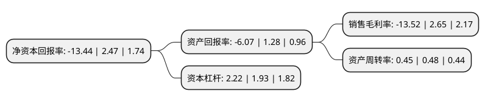

> 本页面由自动化程序生成于 2022年5月20日 01:18
> 内容可能存在错误，如有bug请提交issue至：https://github.com/Eroleice/doc-pi/issues
{.is-warning}

# 上市公司基本情况

## 基本资料

四川蜀道装备科技股份有限公司（以下简称“蜀道装备”）成立于2008年04月28日，成都市。于2016年08月23日在深交所创业板上市。

蜀道装备注册资本16,069.199万元，主营业务是为客户提供天然气液化与液体空分工艺包及处理装置。公司主要产品有1，天然气液化工艺包及装置，2，液体空分工艺包及装置。以下是详细信息：

- 公司名称: 四川蜀道装备科技股份有限公司
- 股票代码: 300540.SZ
- 所在地: 四川 - 成都市
- 成立日期: 2008年04月28日
- 注册资本: 16,069.199万元
- 法定代表人: 罗晓勇
- 主营业务: 主营业务是为客户提供天然气液化与液体空分工艺包及处理装置公司主要产品有1，天然气液化工艺包及装置，2，液体空分工艺包及装置
- 公司官网: www.chengduair.com
- 公司介绍: 公司长期致力于深冷气体分离与液化装置和特种气体提纯装置的技术研究和产品开发，拥有一支从设计、制造、项目管理、安全调试、技术培训等方面技术精湛、经验丰富的高素质专业团队，在国内深冷液化技术领域内，拥有多项专利和专有技术。公司建立了完善的质量管理体系，取得了A级压力容器设计，ISO9001:2000质量体系证书。公司是国内主要的深冷液体设备供应商，产品不仅满足国内需求还按不同国家的标准设计、制造出口到美国、英国、埃及、印度、印度尼西亚等国家和地区。公司立足于“精益求精、贡献价值”的企业方针，不断开拓创新，为客户创造价值，确保客户工程建设的质量、周期和投资成本。深冷股份愿与社会各界携手并进，开展广泛的合作，为顾客提供优良的产品和一流的服务。

## 股东及高管情况

上市公司第一大股东为蜀道交通服务集团有限责任公司，持股48,133,561股，占比29.95%，**疑似为**上市公司实际控制人。

截至2022年03月31日，上市公司的前十大股东中，共有6名自然人股东，4名机构股东，其中5%以上大股东共有4名。上市公司前十大股东明细如下：

> 未能通过持股比例判定出上市公司实际控制人（持股30%以上）
> 可能存在通过间接持股、联合持股、协议控制等方式拥有实际控制权的主体，具体请参考上市公司定期公告！
{.is-warning}

> 截至2022年03月31日，上市公司前十大股东信息如下：

| 股东名称 | 持股数量（股） | 持股比例 |
| --- | --- | --- |
| 蜀道交通服务集团有限责任公司 | 48,133,561 | 29.95% |
| 射乐敏 | 12,057,836 | 7.5% |
| 川川简阳港通经济技术开发有限公司 | 11,767,894 | 7.32% |
| 徐州楚祥嘉信投资企业(有限合伙) | 8,789,000 | 5.47% |
| 淮安市楚业信文化创意策划中心(有限合伙) | 5,542,331 | 3.45% |
| 程源 | 3,617,395 | 2.25% |
| 文向南 | 3,567,145 | 2.22% |
| 黄肃 | 3,172,065 | 1.97% |
| 张武 | 3,100,000 | 1.93% |
| 肖辉和 | 2,864,515 | 1.78% |

## 利润表分析

上市公司2021年总收入为5.33亿元，净利润为-0.73亿元，**未实现盈利**。

## 杜邦分析

> 数据列示周期：2021年 | 2020年 | 2019年
{.is-info}

上市公司的净资产收益率在近一年有所下降，下降幅度为-644.13%，其变化情况分解如下：
- 上市公司的销售毛利率在近一年下降了-610.19%，可能是生产效率的下降、商品原材料价格上涨或商品价格的下跌所致。
- 上市公司的资产周转率在近一年下降了-6.25%，可能是源自于更慢的销售回款或库存管理效果下降。
- 上市公司的财务杠杆比率在近一年上升了15.03%，可能是增加负债扩大生产规模。

