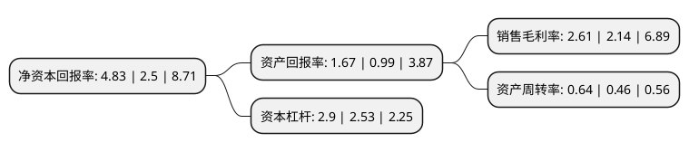

> 本页面由自动化程序生成于 2022年5月20日 01:19
> 内容可能存在错误，如有bug请提交issue至：https://github.com/Eroleice/doc-pi/issues
{.is-warning}

# 上市公司基本情况

## 基本资料

佛山市金银河智能装备股份有限公司（以下简称“金银河”）成立于2002年01月29日，佛山市。于2017年03月01日在深交所创业板上市。

金银河注册资本8,865.504万元，主要从事输送计量，混合反应，灌装包装等自动化生产设备的研发，设计，制造，销售和服务。主要产品包括双螺杆全自动连续生产线和自动化单体设备，可广泛应用于有机硅，锂电池，胶粘剂等多个领域。以下是详细信息：

- 公司名称: 佛山市金银河智能装备股份有限公司
- 股票代码: 300619.SZ
- 所在地: 广东 - 佛山市
- 成立日期: 2002年01月29日
- 注册资本: 8,865.504万元
- 法定代表人: 张启发
- 主营业务: 主要从事输送计量，混合反应，灌装包装等自动化生产设备的研发，设计，制造，销售和服务主要产品包括双螺杆全自动连续生产线和自动化单体设备，可广泛应用于有机硅，锂电池，胶粘剂等多个领域
- 公司官网: www.goldenyh.com
- 公司介绍: 公司是一家专业从事输送计量、混合、分散、反应、灌装、包装、在线检测、中央控制等智能化系统研发、设计、生产的全球制造及服务供应商，主要产品有双螺杆全自动连续法生产线和自动化单体设备等，产品应用于有机硅及高分子化合物、锂电池行业、生物化学等领域。公司一直是引领行业技术创新的领跑者，已被认定为国家火炬计划重点高新技术企业、广东省战略性新兴产业骨干企业、广东省知识产权示范企业、中国石油和化工优秀民营企业、佛山市“中国制造2025”试点示范企业，并组建了广东省省级工程技术中心以及广东省省级企业技术中心，并通过德国TüVISO9001:2015、IATF16949:2016。公司承担过国家火炬计划项目、广东省应用型科技研发及重大科技成果转化专项、广东省前沿与关键技术创新专项、广东省省级工业与信息化发展专项、广东省数控一代机械产品创新应用示范工程、广东省省级企业转型升级专项等重大科研项目。公司商标已被认定为广东省著名商标。

## 股东及高管情况

上市公司第一大股东为张启发，持股21,633,837股，占比24.4%，**疑似为**上市公司实际控制人。

截至2022年03月31日，上市公司的前十大股东中，共有8名自然人股东，2名机构股东，其中5%以上大股东共有3名。上市公司前十大股东明细如下：

> 未能通过持股比例判定出上市公司实际控制人（持股30%以上）
> 可能存在通过间接持股、联合持股、协议控制等方式拥有实际控制权的主体，具体请参考上市公司定期公告！
{.is-warning}

> 截至2022年03月31日，上市公司前十大股东信息如下：

| 股东名称 | 持股数量（股） | 持股比例 |
| --- | --- | --- |
| 张启发 | 21,633,837 | 24.4% |
| 广州海汇财富创业投资企业(有限合伙) | 9,553,035 | 10.78% |
| 梁可 | 6,226,438 | 7.02% |
| 北京中田科技有限公司 | 2,077,379 | 2.34% |
| 付为 | 1,681,779 | 1.9% |
| 张志岗 | 1,650,200 | 1.86% |
| 高卫国 | 1,000,000 | 1.13% |
| 黄旭耀 | 849,516 | 0.96% |
| 刘洪齐 | 815,000 | 0.92% |
| 陆连锁 | 640,038 | 0.72% |

## 利润表分析

上市公司2021年总收入为11.49亿元，净利润为0.3亿元，实现盈利。

## 杜邦分析

> 数据列示周期：2021年 | 2020年 | 2019年
{.is-info}

上市公司的净资产收益率在近一年有所上升，上升幅度为93.2%，其变化情况分解如下：
- 上市公司的销售毛利率在近一年上升了21.96%，可能是生产效率的提升、商品原材料价格下跌或商品价格的上涨所致。
- 上市公司的资产周转率在近一年上升了39.13%，可能是源自于更快的销售回款或库存管理效果提升。
- 上市公司的财务杠杆比率在近一年上升了14.62%，可能是增加负债扩大生产规模。

