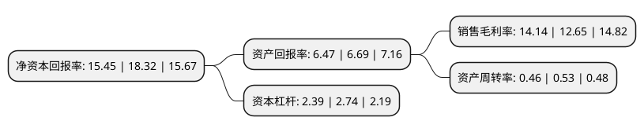

> 本页面由自动化程序生成于 2022年5月20日 01:20
> 内容可能存在错误，如有bug请提交issue至：https://github.com/Eroleice/doc-pi/issues
{.is-warning}

# 上市公司基本情况

## 基本资料

深圳市捷佳伟创新能源装备股份有限公司（以下简称“捷佳伟创”）成立于2007年06月18日，深圳市。于2018年08月10日在深交所创业板上市。

捷佳伟创注册资本34,827.76万元，PECVD设备，扩散炉，制绒设备，刻蚀设备，清洗设备，自动化配套设备等太阳能电池片生产工艺流程中的主要设备的研发，制造和销售以下是详细信息：

- 公司名称: 深圳市捷佳伟创新能源装备股份有限公司
- 股票代码: 300724.SZ
- 所在地: 广东 - 深圳市
- 成立日期: 2007年06月18日
- 注册资本: 34,827.76万元
- 法定代表人: 余仲
- 主营业务: PECVD设备，扩散炉，制绒设备，刻蚀设备，清洗设备，自动化配套设备等太阳能电池片生产工艺流程中的主要设备的研发，制造和销售
- 公司官网: www.chinasc.com.cn
- 公司介绍: 公司是一家高速发展的光伏设备及绿色能源产业专用设备制造商，2007年创立于深圳市宝安区，并于2010年与深圳市捷佳创精密设备有限公司成功实现业务整合，产品涵盖原生多晶硅料生产设备、硅片加工设备、晶体硅电池生产设备等;公司系国内领先的晶体硅太阳能电池生产设备制造商，主营PECVD设备、扩散炉、制绒设备、刻蚀设备、清洗设备、自动化配套设备等太阳能电池片生产工艺流程中的主要设备的研发、制造和销售。

## 股东及高管情况

上市公司第一大股东为余仲，持股29,336,432股，占比8.42%，**疑似为**上市公司实际控制人。

截至2022年03月31日，上市公司的前十大股东中，共有8名自然人股东，1个产品账户，1个海外主体，其中5%以上大股东共有3名。上市公司前十大股东明细如下：

> 未能通过持股比例判定出上市公司实际控制人（持股30%以上）
> 可能存在通过间接持股、联合持股、协议控制等方式拥有实际控制权的主体，具体请参考上市公司定期公告！
{.is-warning}

> 上市公司第一大股东持股不超过10%，请检查是否存在公司控制权风险！
{.is-danger}

> 截至2022年03月31日，上市公司前十大股东信息如下：

| 股东名称 | 持股数量（股） | 持股比例 |
| --- | --- | --- |
| 余仲 | 29,336,432 | 8.42% |
| 左国军 | 26,162,715 | 7.51% |
| 梁美珍 | 25,228,149 | 7.24% |
| 香港中央结算有限公司(陆股通) | 14,686,446 | 4.22% |
| 蒋泽宇 | 14,225,326 | 4.08% |
| 李时俊 | 12,831,102 | 3.68% |
| 蒋婉同 | 10,675,325 | 3.07% |
| 张勇 | 10,009,815 | 2.87% |
| 伍波 | 9,800,015 | 2.81% |
| 珠海横琴富海银涛叁号股权投资基金合伙企业(有限合伙) | 8,536,900 | 2.45% |

## 利润表分析

上市公司2021年总收入为50.47亿元，净利润为7.13亿元，实现盈利。

## 杜邦分析

> 数据列示周期：2021年 | 2020年 | 2019年
{.is-info}

上市公司的净资产收益率在近一年有所下降，下降幅度为-15.67%，其变化情况分解如下：
- 上市公司的销售毛利率在近一年上升了11.78%，可能是生产效率的提升、商品原材料价格下跌或商品价格的上涨所致。
- 上市公司的资产周转率在近一年下降了-13.21%，可能是源自于更慢的销售回款或库存管理效果下降。
- 上市公司的财务杠杆比率在近一年下降了-12.77%，可能是减少负债降低财务费用。

