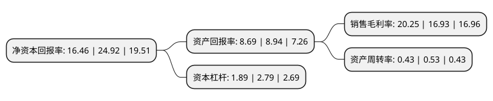

> 本页面由自动化程序生成于 2022年5月20日 01:20
> 内容可能存在错误，如有bug请提交issue至：https://github.com/Eroleice/doc-pi/issues
{.is-warning}

# 上市公司基本情况

## 基本资料

苏州迈为科技股份有限公司（以下简称“迈为股份”）成立于2010年09月08日，苏州市。于2018年11月09日在深交所创业板上市。

迈为股份注册资本10,811.806万元，主营业务是智能制造装备的设计，研发，生产与销售。主营产品为太阳能电池丝网印刷生产线成套设备，包括核心设备全自动太阳能电池丝网印刷机和自动上片机，红外线干燥炉等生产线配套设备。以下是详细信息：

- 公司名称: 苏州迈为科技股份有限公司
- 股票代码: 300751.SZ
- 所在地: 江苏 - 苏州市
- 成立日期: 2010年09月08日
- 注册资本: 10,811.806万元
- 法定代表人: 周剑
- 主营业务: 主营业务是智能制造装备的设计，研发，生产与销售主营产品为太阳能电池丝网印刷生产线成套设备，包括核心设备全自动太阳能电池丝网印刷机和自动上片机，红外线干燥炉等生产线配套设备
- 公司官网: www.maxwell-gp.com
- 公司介绍: 公司是一家集机械设计、电气研制、软件算法开发、精密制造装备于一体的高端智能装备制造商，涉足太阳能电池生产设备，是光伏行业全球领先的设备供应商及服务提供商。公司主营生产太阳能电池丝网印刷生产线成套设备。经过多年的技术积累与市场验证，公司在国内太阳能电池丝网印刷设备领域已处于领先地位，与众多集团等建立了长期合作关系，打破了丝网印刷设备领域进口垄断的格局。

## 股东及高管情况

上市公司第一大股东为周剑，持股24,145,184股，占比22.33%，**疑似为**上市公司实际控制人。

截至2022年03月31日，上市公司的前十大股东中，共有4名自然人股东，4名机构股东，1个产品账户，1个海外主体，其中5%以上大股东共有4名。上市公司前十大股东明细如下：

> 未能通过持股比例判定出上市公司实际控制人（持股30%以上）
> 可能存在通过间接持股、联合持股、协议控制等方式拥有实际控制权的主体，具体请参考上市公司定期公告！
{.is-warning}

> 截至2022年03月31日，上市公司前十大股东信息如下：

| 股东名称 | 持股数量（股） | 持股比例 |
| --- | --- | --- |
| 周剑 | 24,145,184 | 22.33% |
| 王正根 | 18,643,030 | 17.24% |
| 香港中央结算有限公司(陆股通) | 6,006,771 | 5.56% |
| 上海浩视仪器科技有限公司 | 5,564,212 | 5.15% |
| 吴江东运创业投资有限公司 | 5,331,247 | 4.93% |
| 苏州迈拓投资中心(有限合伙) | 4,592,524 | 4.25% |
| 施政辉 | 2,639,500 | 2.44% |
| 招商银行股份有限公司-睿远成长价值混合型证券投资基金 | 1,483,841 | 1.37% |
| 董敏 | 1,268,000 | 1.17% |
| 泰康人寿保险有限责任公司-投连-行业配置 | 915,903 | 0.85% |

## 利润表分析

上市公司2021年总收入为30.95亿元，净利润为6.26亿元，实现盈利。

## 杜邦分析

> 数据列示周期：2021年 | 2020年 | 2019年
{.is-info}

上市公司的净资产收益率在近一年有所下降，下降幅度为-33.95%，其变化情况分解如下：
- 上市公司的销售毛利率在近一年上升了19.61%，可能是生产效率的提升、商品原材料价格下跌或商品价格的上涨所致。
- 上市公司的资产周转率在近一年下降了-18.87%，可能是源自于更慢的销售回款或库存管理效果下降。
- 上市公司的财务杠杆比率在近一年下降了-32.26%，可能是减少负债降低财务费用。

