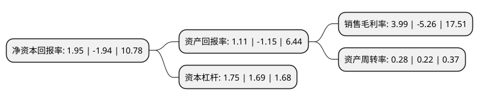

> 本页面由自动化程序生成于 2022年5月20日 01:20
> 内容可能存在错误，如有bug请提交issue至：https://github.com/Eroleice/doc-pi/issues
{.is-warning}

# 上市公司基本情况

## 基本资料

广东金马游乐股份有限公司（以下简称“金马游乐”）成立于2007年11月20日，中山市。于2018年12月28日在深交所创业板上市。

金马游乐注册资本10,160.424万元，主要产品:主要应用于传统游乐园，主题公园及城市综合体等文化，旅游领域，为我国文化，旅游行业的发展提供游乐设施。主营业务:本公司是一家专业从事游乐设施开发，生产和销售的高新技术企业。以下是详细信息：

- 公司名称: 广东金马游乐股份有限公司
- 股票代码: 300756.SZ
- 所在地: 广东 - 中山市
- 成立日期: 2007年11月20日
- 注册资本: 10,160.424万元
- 法定代表人: 邓志毅
- 主营业务: 主要产品:主要应用于传统游乐园，主题公园及城市综合体等文化，旅游领域，为我国文化，旅游行业的发展提供游乐设施主营业务:本公司是一家专业从事游乐设施开发，生产和销售的高新技术企业
- 公司官网: www.jinmabrand.com
- 公司介绍: 公司是一家专业从事游乐设施开发、生产和销售的高新技术企业。公司主要产品为大型游乐设施，具体包括滑行车类游乐设施、飞行塔类游乐设施、观览车类游乐设施、转马类游乐设施、自控飞机类游乐设施及其他各类游乐设施；而且公司凭借持续地创新和研发，将动漫元素融入游乐设施的创意、策划、研发和生产之中，形成了公司融入动漫元素的游乐设施。公司下游客户范围涵盖欢乐谷、方特乐园、万达乐园、恒大海花岛、乐华欢乐世界、大连海昌旅游、宋城旅游等国内大型主题公园及用户，并远销泰国、马来西亚、印度尼西亚、坦桑尼亚、乌兹别克斯坦、韩国、俄罗斯等多个国家和地区，同时公司是中国游艺机游乐园协会副会长单位、全国索道及游艺机标准化技术委员会副主任单位、广东省特种行业协会副会长单位、广东省文化产业促进会副会长单位、广东省机械工程学会理事单位、中山市机械工程学会理事长单位等，同时获得了广东省高新技术企业、广东省企业技术中心、广东省工程技术研究中心、中山市内资百强企业、中山市守合同重信用企业、中山市百佳雇主单位等荣誉和称号。

## 股东及高管情况

上市公司第一大股东为邓志毅，持股18,806,197股，占比18.51%，**疑似为**上市公司实际控制人。

截至2022年03月31日，上市公司的前十大股东中，共有10名自然人股东，其中5%以上大股东共有3名。上市公司前十大股东明细如下：

> 未能通过持股比例判定出上市公司实际控制人（持股30%以上）
> 可能存在通过间接持股、联合持股、协议控制等方式拥有实际控制权的主体，具体请参考上市公司定期公告！
{.is-warning}

> 截至2022年03月31日，上市公司前十大股东信息如下：

| 股东名称 | 持股数量（股） | 持股比例 |
| --- | --- | --- |
| 邓志毅 | 18,806,197 | 18.51% |
| 李勇 | 7,683,848 | 7.56% |
| 刘喜旺 | 7,371,248 | 7.25% |
| 何锐田 | 3,147,848 | 3.1% |
| 邝展宏 | 3,147,848 | 3.1% |
| 杨焯彬 | 3,027,848 | 2.98% |
| 李玉成 | 2,330,950 | 2.29% |
| 邓国权 | 2,330,950 | 2.29% |
| 林泽钊 | 2,330,949 | 2.29% |
| 贾辽川 | 2,154,143 | 2.12% |

## 利润表分析

上市公司2021年总收入为5.03亿元，净利润为0.2亿元，实现盈利。

## 杜邦分析

> 数据列示周期：2021年 | 2020年 | 2019年
{.is-info}

上市公司的净资产收益率在近一年有所下降，下降幅度为-200.52%，其变化情况分解如下：
- 上市公司的销售毛利率在近一年下降了-175.86%，可能是生产效率的下降、商品原材料价格上涨或商品价格的下跌所致。
- 上市公司的资产周转率在近一年上升了27.27%，可能是源自于更快的销售回款或库存管理效果提升。
- 上市公司的财务杠杆比率在近一年上升了3.55%，可能是增加负债扩大生产规模。

