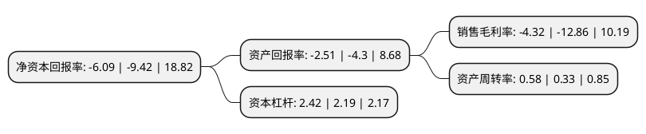

> 本页面由自动化程序生成于 2022年5月20日 01:20
> 内容可能存在错误，如有bug请提交issue至：https://github.com/Eroleice/doc-pi/issues
{.is-warning}

# 上市公司基本情况

## 基本资料

罗博特科智能科技股份有限公司（以下简称“罗博特科”）成立于2011年04月14日，苏州市。于2019年01月08日在深交所创业板上市。

罗博特科注册资本11,053.094万元，研制高端自动化装备和基于工业互联网技术的智能制造执行系统软件，为光伏电池，电子及半导体，汽车精密零部件，食品药品等领域提供柔性，智能，高效的高端自动化装备及制造执行系统软件。以下是详细信息：

- 公司名称: 罗博特科智能科技股份有限公司
- 股票代码: 300757.SZ
- 所在地: 江苏 - 苏州市
- 成立日期: 2011年04月14日
- 注册资本: 11,053.094万元
- 法定代表人: 戴军
- 主营业务: 研制高端自动化装备和基于工业互联网技术的智能制造执行系统软件，为光伏电池，电子及半导体，汽车精密零部件，食品药品等领域提供柔性，智能，高效的高端自动化装备及制造执行系统软件
- 公司官网: www.robo-technik.com
- 公司介绍: 公司是一家研制高端自动化装备和基于工业互联网技术的智能制造执行系统软件(MES)的高新技术企业,公司拥有完整的研发、设计、装配、测试、销售和服务体系，为光伏电池、电子及半导体、汽车精密零部件、食品药品等领域提供柔性、智能、高效的高端自动化装备及制造MES执行系统软件。公司高端自动化装备主要应用于工业生产过程，具体产品包括智能自动化设备、智能检测设备、智能仓储及物料转运系统，通过上述装备可以帮助客户提高生产效率，降低人力成本，为未来智能工厂打下硬件基础。经过多年的研究开发和技术沉淀，公司已获得与生产经营相关的多项授权专利,及MES软件著作权，掌握多项核心技术。

## 股东及高管情况

上市公司第一大股东为苏州元颉昇企业管理咨询有限公司，持股31,590,000股，占比28.58%，**疑似为**上市公司实际控制人。

截至2022年03月31日，上市公司的前十大股东中，共有5名自然人股东，3名机构股东，2个产品账户，其中5%以上大股东共有4名。上市公司前十大股东明细如下：

> 未能通过持股比例判定出上市公司实际控制人（持股30%以上）
> 可能存在通过间接持股、联合持股、协议控制等方式拥有实际控制权的主体，具体请参考上市公司定期公告！
{.is-warning}

> 截至2022年03月31日，上市公司前十大股东信息如下：

| 股东名称 | 持股数量（股） | 持股比例 |
| --- | --- | --- |
| 苏州元颉昇企业管理咨询有限公司 | 31,590,000 | 28.58% |
| 上海科骏投资管理中心(有限合伙) | 8,806,200 | 7.97% |
| 李洁 | 8,717,292 | 7.89% |
| 夏承周 | 8,456,000 | 7.65% |
| 戴军 | 4,709,577 | 4.26% |
| 徐龙 | 3,392,700 | 3.07% |
| 中国工商银行股份有限公司-易方达新经济灵活配置混合型证券投资基金 | 2,775,700 | 2.51% |
| 上海能骏创业投资中心(有限合伙) | 2,502,720 | 2.26% |
| 中国工商银行股份有限公司-易方达科翔混合型证券投资基金 | 2,256,124 | 2.04% |
| 王宏军 | 1,569,859 | 1.42% |

## 利润表分析

上市公司2021年总收入为10.85亿元，净利润为-0.47亿元，**未实现盈利**。

## 杜邦分析

> 数据列示周期：2021年 | 2020年 | 2019年
{.is-info}

上市公司的净资产收益率在近一年有所下降，下降幅度为-35.35%，其变化情况分解如下：
- 上市公司的销售毛利率在近一年下降了-66.41%，可能是生产效率的下降、商品原材料价格上涨或商品价格的下跌所致。
- 上市公司的资产周转率在近一年上升了75.76%，可能是源自于更快的销售回款或库存管理效果提升。
- 上市公司的财务杠杆比率在近一年上升了10.5%，可能是增加负债扩大生产规模。

