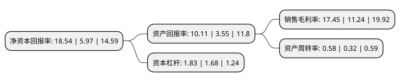

> 本页面由自动化程序生成于 2022年5月20日 01:20
> 内容可能存在错误，如有bug请提交issue至：https://github.com/Eroleice/doc-pi/issues
{.is-warning}

# 上市公司基本情况

## 基本资料

江西耐普矿机股份有限公司（以下简称“耐普矿机”）成立于2005年10月14日，上饶市。于2020年02月12日在深交所创业板上市。

耐普矿机注册资本7,000万元，主营业务:公司主要从事重型矿山选矿装备及其新材料耐磨备件的研发，生产，销售及服务等业务。，产品主要应用于有色金属，黑色金属矿山企业。以下是详细信息：

- 公司名称: 江西耐普矿机股份有限公司
- 股票代码: 300818.SZ
- 所在地: 江西 - 上饶市
- 成立日期: 2005年10月14日
- 注册资本: 7,000万元
- 法定代表人: 郑昊
- 主营业务: 主营业务:公司主要从事重型矿山选矿装备及其新材料耐磨备件的研发，生产，销售及服务等业务，产品主要应用于有色金属，黑色金属矿山企业
- 公司官网: www.naipu.com.cn
- 公司介绍: 公司是一家集研发、生产、销售和服务于一体的重型矿山选矿装备及其新材料耐磨备件专业制造企业，为客户提供重型选矿装备优化，选矿工艺流程设计、咨询和优化等增值服务。公司致力于高性能橡胶耐磨材料及橡胶复合材料的研发应用以提升重型选矿装备性能、可靠性与寿命，有效节约减排，全面提高矿山重型选矿设备的运转率、作业效率。公司研发的高分子复合橡胶新材料具有耐磨、耐腐、经济、环保等诸多优势，实现了对传统金属材料的部分有效替代，在降低矿山作业的耗材成本、节能和环境保护等方面效果显著。公司的耐磨新材料重型选矿装备及备件已应用于国内多座大型有色金属、黑色金属矿山，并远销蒙古国、俄罗斯、哈萨克斯坦、澳大利亚、墨西哥、美国和秘鲁等多个国家。公司已与江铜集团、铜陵有色、中信重工、紫金矿业、北矿院、KAZ Minerals LLC、Oyu Tolgoi LLC、美伊电钢、Compania Minera Antamina S.A.、Erdenet Mining Corporation等国内外知名矿业公司或矿业设备制造商建立了稳定的合作关系。

## 股东及高管情况

上市公司第一大股东为郑昊，持股37,357,000股，占比53.37%，为上市公司实际控制人。

截至2022年03月31日，上市公司的前十大股东中，共有9名自然人股东，1名机构股东，其中5%以上大股东共有2名。上市公司前十大股东明细如下：

> 截至2022年03月31日，上市公司前十大股东信息如下：

| 股东名称 | 持股数量（股） | 持股比例 |
| --- | --- | --- |
| 郑昊 | 37,357,000 | 53.37% |
| 曲治国 | 4,000,000 | 5.71% |
| 赵伟国 | 900,000 | 1.29% |
| 黄雄 | 800,000 | 1.14% |
| 邱海燕 | 630,000 | 0.9% |
| 蔡飞 | 522,000 | 0.75% |
| 陈莉 | 430,000 | 0.61% |
| 程胜 | 383,500 | 0.55% |
| 胡金生 | 382,500 | 0.55% |
| 申万宏源证券有限公司 | 260,400 | 0.37% |

## 利润表分析

上市公司2021年总收入为10.53亿元，净利润为1.83亿元，实现盈利。

## 杜邦分析

> 数据列示周期：2021年 | 2020年 | 2019年
{.is-info}

上市公司的净资产收益率在近一年有所上升，上升幅度为210.55%，其变化情况分解如下：
- 上市公司的销售毛利率在近一年上升了55.25%，可能是生产效率的提升、商品原材料价格下跌或商品价格的上涨所致。
- 上市公司的资产周转率在近一年上升了81.25%，可能是源自于更快的销售回款或库存管理效果提升。
- 上市公司的财务杠杆比率在近一年上升了8.93%，可能是增加负债扩大生产规模。

