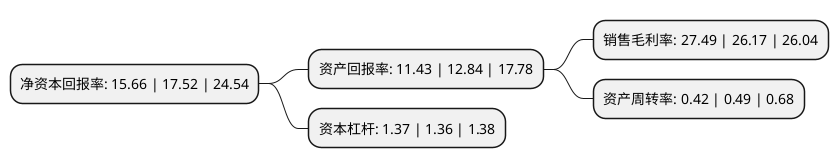

> 本页面由自动化程序生成于 2022年5月20日 01:20
> 内容可能存在错误，如有bug请提交issue至：https://github.com/Eroleice/doc-pi/issues
{.is-warning}

# 上市公司基本情况

## 基本资料

浙矿重工股份有限公司（以下简称“浙矿股份”）成立于2003年09月04日，湖州市。于2020年06月05日在深交所创业板上市。

浙矿股份注册资本10,000万元，主营业务为矿山破碎，筛分设备的研发，设计，生产和销售，主要产品为矿山破碎，筛分设备及相关配件，用于生产，加工各类矿石等脆性物料及相关产品以下是详细信息：

- 公司名称: 浙矿重工股份有限公司
- 股票代码: 300837.SZ
- 所在地: 浙江 - 湖州市
- 成立日期: 2003年09月04日
- 注册资本: 10,000万元
- 法定代表人: 陈利华
- 主营业务: 主营业务为矿山破碎，筛分设备的研发，设计，生产和销售，主要产品为矿山破碎，筛分设备及相关配件，用于生产，加工各类矿石等脆性物料及相关产品
- 公司官网: www.cnzkzg.com
- 公司介绍: 公司是国内技术领先的中高端矿机装备供应商之一,主营业务为破碎、筛选成套设备的研发、设计、生产和销售，公司以“高效智能化专用设备省级高新技术企业研究开发中心”和“院士专家工作站”为依托，先后承担了国家科技型中小企业技术创新基金项目、国家火炬计划产业化示范项目、浙江省重大科技专项、浙江省云工程与云服务项目等工作，成功开发了RC系列单缸液压滚动轴承圆锥破碎机、MRC系列多缸液压滚动轴承圆锥破碎机、CJ系列颚式破碎机、CH-PL系列立轴式冲击破碎机等多个系列新产品，获得国家级重点新产品、浙江省首台(套)产品、浙江省科学技术奖、浙江省制造精品等多项荣誉。随着国内互联网和智能化技术的快速发展，发行人在产品中植入智能化和信息化元素，首创单机设备的智能化运行和成套设备的远程控制、故障诊断和信息化管理，通过数据分析优化破碎筛选设备的制造工艺及售后服务响应速度，初步实现了设备的机械化换人和自动化减人目的，在国内中高端设备领域具有很强的市场竞争力。

## 股东及高管情况

上市公司第一大股东为陈利华，持股32,550,000股，占比32.55%，为上市公司实际控制人。

截至2022年03月31日，上市公司的前十大股东中，共有5名自然人股东，2名机构股东，3个产品账户，其中5%以上大股东共有6名。上市公司前十大股东明细如下：

> 截至2022年03月31日，上市公司前十大股东信息如下：

| 股东名称 | 持股数量（股） | 持股比例 |
| --- | --- | --- |
| 陈利华 | 32,550,000 | 32.55% |
| 湖州君渡投资管理有限公司 | 7,500,000 | 7.5% |
| 段尹文 | 6,675,000 | 6.68% |
| 陈利刚 | 6,675,000 | 6.68% |
| 陈连方 | 6,675,000 | 6.68% |
| 陈利群 | 6,675,000 | 6.68% |
| 浙江省创业投资集团有限公司 | 2,679,534 | 2.68% |
| 招商银行股份有限公司-工银瑞信战略远见混合型证券投资基金 | 2,561,397 | 2.56% |
| 中国农业银行股份有限公司-工银瑞信战略转型主题股票型证券投资基金 | 2,255,400 | 2.26% |
| 中国工商银行股份有限公司-中欧时代先锋股票型发起式证券投资基金 | 1,403,836 | 1.4% |

## 利润表分析

上市公司2021年总收入为5.73亿元，净利润为1.57亿元，实现盈利。

## 杜邦分析

> 数据列示周期：2021年 | 2020年 | 2019年
{.is-info}

上市公司的净资产收益率在近一年有所下降，下降幅度为-10.62%，其变化情况分解如下：
- 上市公司的销售毛利率在近一年上升了5.04%，可能是生产效率的提升、商品原材料价格下跌或商品价格的上涨所致。
- 上市公司的资产周转率在近一年下降了-14.29%，可能是源自于更慢的销售回款或库存管理效果下降。
- 上市公司的财务杠杆比率在近一年上升了0.74%，可能是增加负债扩大生产规模。

