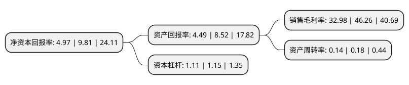

> 本页面由自动化程序生成于 2022年5月20日 01:21
> 内容可能存在错误，如有bug请提交issue至：https://github.com/Eroleice/doc-pi/issues
{.is-warning}

# 上市公司基本情况

## 基本资料

江西日月明测控科技股份有限公司（以下简称“日月明”）成立于2006年03月17日，南昌市。于2020年11月05日在深交所创业板上市。

日月明注册资本8,000万元，主营业务为轨道安全测控设备的研发，生产和销售以及轨道测控技术的研究与应用。以下是详细信息：

- 公司名称: 江西日月明测控科技股份有限公司
- 股票代码: 300906.SZ
- 所在地: 江西 - 南昌市
- 成立日期: 2006年03月17日
- 注册资本: 8,000万元
- 法定代表人: 陶捷
- 主营业务: 主营业务为轨道安全测控设备的研发，生产和销售以及轨道测控技术的研究与应用
- 公司官网: www.rym.com.cn
- 公司介绍: 公司是一家专业从事铁道测控产品的研发、生产、销售和服务的企业，也是中国第一家成功研制轨检小车和检定系统的企业。公司多年来致力于为铁路高速化与信息化提供完整的精密数字化检测方案和检测产品，是国内唯一一家拥有全系列轨道数字化测控技术的制造企业，并主、参编了多项行业标准的起草。公司连续三年被南昌高新区评为创新企业及先进企业，并通过国家高新技术企业认定、铁道技术认证和部行政许可和ISO9001：2008认证,2010年被评为国家火炬重点高新企业。其中，公司“相对测量”系列产品中的轨道检查仪曾荣获江西省自主创新产品1项；“绝对测量”系列产品中的轨道测量仪曾荣获江西省自主创新产品1项、重点新产品计划1项及南昌市优秀新产品二等奖1项；“相对+绝对”系列产品中的三维一体及三位约束轨检仪曾荣获国家重点新产品1项，江西省重点新产品计划2项、重点优秀新产品一等奖2项。

## 股东及高管情况

上市公司第一大股东为江西日月明实业有限公司，持股31,485,000股，占比39.36%，为上市公司实际控制人。

截至2022年03月31日，上市公司的前十大股东中，共有5名自然人股东，3名机构股东，2个产品账户，其中5%以上大股东共有3名。上市公司前十大股东明细如下：

> 截至2022年03月31日，上市公司前十大股东信息如下：

| 股东名称 | 持股数量（股） | 持股比例 |
| --- | --- | --- |
| 江西日月明实业有限公司 | 31,485,000 | 39.36% |
| 陶捷 | 9,967,000 | 12.46% |
| 中车资本(天津)股权投资基金管理有限公司-华舆正心(天津)股权投资基金合伙企业(有限合伙) | 5,115,200 | 6.39% |
| 南昌市国金工业投资有限公司 | 3,000,000 | 3.75% |
| 谭晓云 | 2,317,000 | 2.9% |
| 江西裕润立达股权投资管理有限公司-北京立达高新创业投资中心(有限合伙) | 1,400,000 | 1.75% |
| 上海招银股权投资基金管理有限公司-深圳市招银财富展翼成长投资合伙企业(有限合伙) | 500,000 | 0.63% |
| 朱洪涛 | 451,250 | 0.56% |
| 孟利民 | 363,750 | 0.45% |
| 付梓满 | 304,400 | 0.38% |

## 利润表分析

上市公司2021年总收入为1.23亿元，净利润为0.4亿元，实现盈利。

## 杜邦分析

> 数据列示周期：2021年 | 2020年 | 2019年
{.is-info}

上市公司的净资产收益率在近一年有所下降，下降幅度为-49.34%，其变化情况分解如下：
- 上市公司的销售毛利率在近一年下降了-28.71%，可能是生产效率的下降、商品原材料价格上涨或商品价格的下跌所致。
- 上市公司的资产周转率在近一年下降了-22.22%，可能是源自于更慢的销售回款或库存管理效果下降。
- 上市公司的财务杠杆比率在近一年下降了-3.48%，可能是减少负债降低财务费用。

