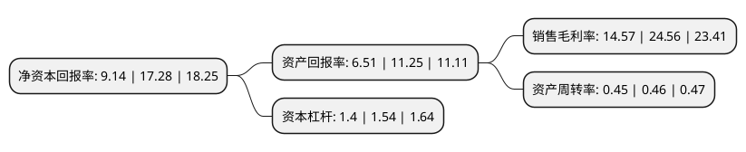

> 本页面由自动化程序生成于 2022年5月20日 01:21
> 内容可能存在错误，如有bug请提交issue至：https://github.com/Eroleice/doc-pi/issues
{.is-warning}

# 上市公司基本情况

## 基本资料

青岛德固特节能装备股份有限公司（以下简称“德固特”）成立于2004年04月05日，青岛市。于2021年03月03日在深交所创业板上市。

德固特注册资本10,000万元，德固特主营业务为节能环保装备及专用定制装备的设计，制造和销售。公司主营产品可以分为节能换热装备，粉体及其他环保装备和专用定制装备。以下是详细信息：

- 公司名称: 青岛德固特节能装备股份有限公司
- 股票代码: 300950.SZ
- 所在地: 山东 - 青岛市
- 成立日期: 2004年04月05日
- 注册资本: 10,000万元
- 法定代表人: 魏振文
- 主营业务: 德固特主营业务为节能环保装备及专用定制装备的设计，制造和销售公司主营产品可以分为节能换热装备，粉体及其他环保装备和专用定制装备
- 公司官网: www.doright.biz
- 公司介绍: 德固特是一家高科技节能环保装备制造商。公司集设计、研发、制造、检验、销售、服务于一体，面向化工、能源、冶金、固废处理等领域，为全球客户提供清洁燃烧与传热节能解决方案，同时接受专用装备定制。公司通过自主研发和技术创新，已取得发明专利21项、实用新型专利41项、国内或山东省首台(套)重大技术装备项目产品6项；在节能环保领域填补多项国内空白，实现替代国家进口重大技术装备。通过多年努力，公司产品远销亚洲、欧洲、美洲、大洋洲、非洲，为国际行业龙头客户提供优质产品。

## 股东及高管情况

上市公司第一大股东为魏振文，持股53,880,000股，占比53.88%，为上市公司实际控制人。

截至2022年03月31日，上市公司的前十大股东中，共有3名自然人股东，6名机构股东，1个产品账户，其中5%以上大股东共有2名。上市公司前十大股东明细如下：

> 截至2022年03月31日，上市公司前十大股东信息如下：

| 股东名称 | 持股数量（股） | 持股比例 |
| --- | --- | --- |
| 魏振文 | 53,880,000 | 53.88% |
| 青岛德沣投资企业(有限合伙) | 6,120,000 | 6.12% |
| 青岛常春藤创业投资中心(有限合伙) | 4,285,714 | 4.29% |
| 上海可可空间投资管理有限公司-上海青望创业投资合伙企业(有限合伙) | 3,500,000 | 3.5% |
| 青岛科创金奕投资管理有限公司-青岛清控金奕创业投资中心(有限合伙) | 2,750,000 | 2.75% |
| 常春藤(昆山)产业投资中心(有限合伙) | 2,142,857 | 2.14% |
| 青岛静远创业投资有限公司 | 1,071,429 | 1.07% |
| 青岛清控高创投资管理有限公司-青岛高创清控股权投资基金企业(有限合伙) | 1,000,000 | 1% |
| 魏锋 | 250,000 | 0.25% |
| 皇甫永雪 | 249,451 | 0.25% |

## 利润表分析

上市公司2021年总收入为2.94亿元，净利润为0.42亿元，实现盈利。

## 杜邦分析

> 数据列示周期：2021年 | 2020年 | 2019年
{.is-info}

上市公司的净资产收益率在近一年有所下降，下降幅度为-47.11%，其变化情况分解如下：
- 上市公司的销售毛利率在近一年下降了-40.68%，可能是生产效率的下降、商品原材料价格上涨或商品价格的下跌所致。
- 上市公司的资产周转率在近一年下降了-2.17%，可能是源自于更慢的销售回款或库存管理效果下降。
- 上市公司的财务杠杆比率在近一年下降了-9.09%，可能是减少负债降低财务费用。

