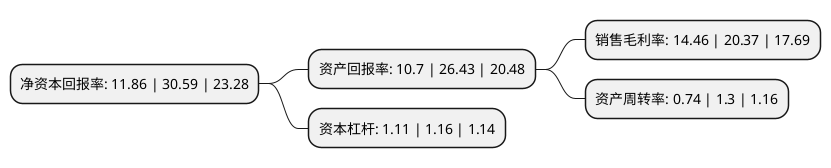

> 本页面由自动化程序生成于 2022年5月20日 01:22
> 内容可能存在错误，如有bug请提交issue至：https://github.com/Eroleice/doc-pi/issues
{.is-warning}

# 上市公司基本情况

## 基本资料

三河同飞制冷股份有限公司（以下简称“同飞股份”）成立于2001年01月11日，廊坊市。于2021年05月12日在深交所创业板上市。

同飞股份注册资本5,200万元，公司主营业务为工业制冷设备的研发，生产和销售。公司目前的主要产品可分为液体恒温设备，电气箱恒温装置，纯水冷却单元和特种换热器四大类。以下是详细信息：

- 公司名称: 三河同飞制冷股份有限公司
- 股票代码: 300990.SZ
- 所在地: 河北 - 廊坊市
- 成立日期: 2001年01月11日
- 注册资本: 5,200万元
- 法定代表人: 张国山
- 主营业务: 公司主营业务为工业制冷设备的研发，生产和销售公司目前的主要产品可分为液体恒温设备，电气箱恒温装置，纯水冷却单元和特种换热器四大类
- 公司官网: www.tfzl.com
- 公司介绍: 公司主营业务为工业制冷设备的研发、生产和销售。公司自成立以来，一直致力于工业制冷设备的研发。公司目前已主要形成了液体恒温设备、电气箱恒温装置、纯水冷却单元和特种换热器四大类产品，并成为目前以数控装备、电力电子装置制冷为核心应用领域的工业制冷解决方案服务商。公司生产的产品主要包括液体恒温设备、电气箱恒温装置、纯水冷却单元和特种换热器等四大类，上述产品应用涵盖多个工业制冷领域。液体恒温设备主要应用于数控装备(包括数控机床、激光设备等)，电气箱恒温装置主要应用于数控装备电气控制柜、激光器柜体、电力电子装置的电气控制箱制冷，纯水冷却单元主要应用于电力电子装置，特种换热器则主要应用于工业洗涤设备，相对于同行业竞争对手通常将业务定位于某一个应用市场而言，公司下游覆盖面较广。

## 股东及高管情况

上市公司第一大股东为张国山，持股17,250,000股，占比33.17%，为上市公司实际控制人。

截至2022年03月31日，上市公司的前十大股东中，共有5名自然人股东，1名机构股东，4个产品账户，其中5%以上大股东共有3名。上市公司前十大股东明细如下：

> 截至2022年03月31日，上市公司前十大股东信息如下：

| 股东名称 | 持股数量（股） | 持股比例 |
| --- | --- | --- |
| 张国山 | 17,250,000 | 33.17% |
| 张浩雷 | 15,525,000 | 29.86% |
| 李丽 | 3,300,000 | 6.35% |
| 王淑芬 | 1,725,000 | 3.32% |
| 三河众和盈企业管理中心(有限合伙) | 1,200,000 | 2.31% |
| 上海泉汐投资管理有限公司-泉汐名扬多策略组合投资私募证券基金6号 | 822,607 | 1.58% |
| 中国建设银行股份有限公司-广发科技创新混合型证券投资基金 | 683,300 | 1.31% |
| 兴业银行股份有限公司-天弘永利债券型证券投资基金 | 675,800 | 1.3% |
| 上海泉汐投资管理有限公司-泉汐名扬多策略组合投资私募基金1号 | 671,200 | 1.29% |
| 袁凤妹 | 524,324 | 1.01% |

## 利润表分析

上市公司2021年总收入为8.29亿元，净利润为1.19亿元，实现盈利。

## 杜邦分析

> 数据列示周期：2021年 | 2020年 | 2019年
{.is-info}

上市公司的净资产收益率在近一年有所下降，下降幅度为-61.23%，其变化情况分解如下：
- 上市公司的销售毛利率在近一年下降了-29.01%，可能是生产效率的下降、商品原材料价格上涨或商品价格的下跌所致。
- 上市公司的资产周转率在近一年下降了-43.08%，可能是源自于更慢的销售回款或库存管理效果下降。
- 上市公司的财务杠杆比率在近一年下降了-4.31%，可能是减少负债降低财务费用。

