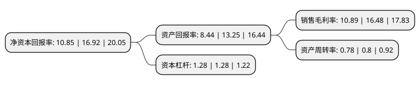

> 本页面由自动化程序生成于 2022年5月20日 01:22
> 内容可能存在错误，如有bug请提交issue至：https://github.com/Eroleice/doc-pi/issues
{.is-warning}

# 上市公司基本情况

## 基本资料

浙江泰福泵业股份有限公司（以下简称“泰福泵业”）成立于1993年05月21日，台州市。于2021年05月25日在深交所创业板上市。

泰福泵业注册资本9,080万元，主要从事民用水泵的研发，生产和销售，主要产品包括陆上泵，小型潜水泵，井用潜水泵，循环泵以及节能泵。以下是详细信息：

- 公司名称: 浙江泰福泵业股份有限公司
- 股票代码: 300992.SZ
- 所在地: 浙江 - 台州市
- 成立日期: 1993年05月21日
- 注册资本: 9,080万元
- 法定代表人: 陈宜文
- 主营业务: 主要从事民用水泵的研发，生产和销售，主要产品包括陆上泵，小型潜水泵，井用潜水泵，循环泵以及节能泵
- 公司官网: www.chinataifu.com
- 公司介绍: 公司主要从事民用水泵的研发、生产和销售，主要产品包括陆上泵、小型潜水泵、井用潜水泵、循环泵以及节能泵，目前公司产品有5大类700多个型号产品。民用水泵应用领域广泛，可应用于农业灌溉、生活用水、深井提水、畜牧用水和热水循环等领域，市场需求较大。公司自成立以来，深耕民用水泵行业，通过长期的研发投入和技术积累，掌握了民用水泵生产的核心技术。此外，公司拥有十余年的节能泵研发经验，是业内较早从事节能泵的研发并实现产业化销售的企业之一。报告期内，公司先后被评定为浙江省“隐形冠军”培育企业、台州市专利示范企业。截至本招股说明书签署日，公司拥有62项专利，其中1项发明专利、37项实用新型专利。

## 股东及高管情况

上市公司第一大股东为陈宜文，持股18,150,000股，占比19.99%，**疑似为**上市公司实际控制人。

截至2022年03月31日，上市公司的前十大股东中，共有8名自然人股东，2名机构股东，其中5%以上大股东共有3名。上市公司前十大股东明细如下：

> 未能通过持股比例判定出上市公司实际控制人（持股30%以上）
> 可能存在通过间接持股、联合持股、协议控制等方式拥有实际控制权的主体，具体请参考上市公司定期公告！
{.is-warning}

> 截至2022年03月31日，上市公司前十大股东信息如下：

| 股东名称 | 持股数量（股） | 持股比例 |
| --- | --- | --- |
| 陈宜文 | 18,150,000 | 19.99% |
| 温岭市地久电子科技有限公司 | 18,000,000 | 19.82% |
| 邵雨田 | 6,714,600 | 7.39% |
| 林慧 | 4,000,000 | 4.41% |
| 李勇 | 3,876,600 | 4.27% |
| 毛世良 | 3,683,200 | 4.06% |
| 毛世俊 | 3,500,600 | 3.86% |
| 潘军平 | 3,189,000 | 3.51% |
| 赵林森 | 2,630,800 | 2.9% |
| 温岭市宏泰投资合伙企业(有限合伙) | 2,000,000 | 2.2% |

## 利润表分析

上市公司2021年总收入为5.61亿元，净利润为0.61亿元，实现盈利。

## 杜邦分析

> 数据列示周期：2021年 | 2020年 | 2019年
{.is-info}

上市公司的净资产收益率在近一年有所下降，下降幅度为-35.87%，其变化情况分解如下：
- 上市公司的销售毛利率在近一年下降了-33.92%，可能是生产效率的下降、商品原材料价格上涨或商品价格的下跌所致。
- 上市公司的资产周转率在近一年下降了-2.5%，可能是源自于更慢的销售回款或库存管理效果下降。
- 上市公司的财务杠杆比率在近一年下降了0%，可能是减少负债降低财务费用。

