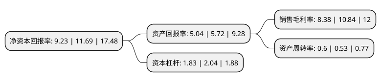

> 本页面由自动化程序生成于 2022年5月20日 01:22
> 内容可能存在错误，如有bug请提交issue至：https://github.com/Eroleice/doc-pi/issues
{.is-warning}

# 上市公司基本情况

## 基本资料

广州华立科技股份有限公司（以下简称“华立科技”）成立于2010年08月20日，广州市。于2021年06月17日在深交所创业板上市。

华立科技注册资本8,680万元，公司主要从事游戏游艺设备的设计，研发，生产，销售和运营。公司产品销售包括游戏游艺设备和动漫IP衍生产品销售，满足用户娱乐，亲子，动漫文化，儿童益智，体育健身等需求。以下是详细信息：

- 公司名称: 广州华立科技股份有限公司
- 股票代码: 301011.SZ
- 所在地: 广东 - 广州市
- 成立日期: 2010年08月20日
- 注册资本: 8,680万元
- 法定代表人: 苏本立
- 主营业务: 公司主要从事游戏游艺设备的设计，研发，生产，销售和运营公司产品销售包括游戏游艺设备和动漫IP衍生产品销售，满足用户娱乐，亲子，动漫文化，儿童益智，体育健身等需求
- 公司官网: www.wahlap.com
- 公司介绍: 公司以“为用户创造快乐”为宗旨，秉承“绿色文化、创意科技、用科技享受生活”的发展理念，以建立全球一流的文化游乐企业为战略目标，持续实施模式创新、管理创新、技术创新，完善业务结构，提高设计、研发能力，拓展销售渠道，完善运营模式，涵盖游戏游艺设备设计、研发、生产、销售、运营等环节，形成完整产业链。公司主要从事游戏游艺设备的设计、研发、生产、销售和运营。公司产品销售包括游戏游艺设备和动漫IP衍生产品销售，满足用户娱乐、亲子、动漫文化、儿童益智、体育健身等需求。公司坚持以向消费者提供健康、优质的休闲娱乐体验为导向。设备合作运营、游乐场运营能够为公司及时提供消费者需求信息，使得公司能够更好以消费者需求为导向，不断推陈出新，开发出更多更好的产品投向市场。公司自成立以来，不断整合全球文化游乐资源，坚持实施科技创新，根据消费者需求，推进AI、VR、AR、5G、大数据等新技术的应用，持续提升产品设计、研发能力，优化生产制造工艺，打造智能游戏游艺设备，成为国内少数具有游戏游艺设备自主开发能力的企业，公司目前已拥有101项专利、115项软件著作权。

## 股东及高管情况

上市公司第一大股东为香港华立国际控股有限公司，持股38,220,000股，占比44.03%，为上市公司实际控制人。

截至2022年03月31日，上市公司的前十大股东中，共有3名自然人股东，6名机构股东，1个产品账户，其中5%以上大股东共有2名。上市公司前十大股东明细如下：

> 截至2022年03月31日，上市公司前十大股东信息如下：

| 股东名称 | 持股数量（股） | 持股比例 |
| --- | --- | --- |
| 香港华立国际控股有限公司 | 38,220,000 | 44.03% |
| 广州阳优科技投资有限公司 | 5,060,000 | 5.83% |
| 深圳市盛讯达科技股份有限公司 | 4,020,000 | 4.63% |
| 广州致远一号科技投资合伙企业(有限合伙) | 2,850,000 | 3.28% |
| 鈊象电子股份有限公司 | 2,530,000 | 2.91% |
| 苏本立 | 2,260,000 | 2.6% |
| 富诚海富资管-海通证券-富诚海富通华立科技员工参与创业板战略配售集合资产管理计划 | 2,170,000 | 2.5% |
| 陈应洪 | 2,000,000 | 2.3% |
| 广东粤科新鹤创业投资有限公司 | 1,550,000 | 1.79% |
| 周斌 | 1,349,000 | 1.55% |

## 利润表分析

上市公司2021年总收入为6.27亿元，净利润为0.52亿元，实现盈利。

## 杜邦分析

> 数据列示周期：2021年 | 2020年 | 2019年
{.is-info}

上市公司的净资产收益率在近一年有所下降，下降幅度为-21.04%，其变化情况分解如下：
- 上市公司的销售毛利率在近一年下降了-22.69%，可能是生产效率的下降、商品原材料价格上涨或商品价格的下跌所致。
- 上市公司的资产周转率在近一年上升了13.21%，可能是源自于更快的销售回款或库存管理效果提升。
- 上市公司的财务杠杆比率在近一年下降了-10.29%，可能是减少负债降低财务费用。

