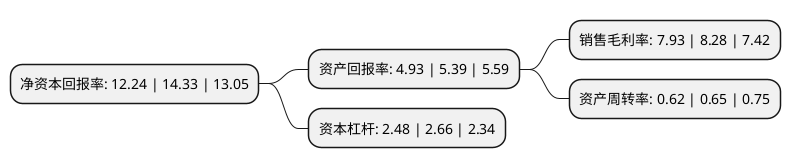

> 本页面由自动化程序生成于 2022年5月20日 01:22
> 内容可能存在错误，如有bug请提交issue至：https://github.com/Eroleice/doc-pi/issues
{.is-warning}

# 上市公司基本情况

## 基本资料

广东申菱环境系统股份有限公司（以下简称“申菱环境”）成立于2000年07月03日，佛山市。于2021年07月07日在深交所创业板上市。

申菱环境注册资本24,001万元，公司主营业务围绕专用性空调为代表的空气环境调节设备开展，集研发设计，生产制造，营销服务，工程安装，运营维护于一体以下是详细信息：

- 公司名称: 广东申菱环境系统股份有限公司
- 股票代码: 301018.SZ
- 所在地: 广东 - 佛山市
- 成立日期: 2000年07月03日
- 注册资本: 24,001万元
- 法定代表人: 崔颖琦
- 主营业务: 公司主营业务围绕专用性空调为代表的空气环境调节设备开展，集研发设计，生产制造，营销服务，工程安装，运营维护于一体
- 公司官网: www.shenling.com
- 公司介绍: 公司以人工环境调节、污染治理、能源利用为服务方向，致力于为数据服务产业环境、工业工艺产研环境、专业特种应用环境、公共建筑室内环境等应用场景提供人工环境调控整体解决方案的现代化企业。公司主营业务围绕专用性空调为代表的空气环境调节设备开展，集研发设计、生产制造、营销服务、工程安装、运营维护于一体，是目前国内专用性空调领域规模较大、技术先进、产品齐全的主要企业之一。公司提供之产品与服务涉及行业较多，细分领域技术要求较高，潜在市场广大。下游应用场景所属行业包括通信、信息技术、电力、化工、交通、能源、军工与航天等，涵盖多种对使用环境有特殊要求的应用场景，并服务于“新基建”中5G基建、特高压、城际高速铁路和城际轨道交通、大数据中心等多个板块。公司拥有超高能效、环保绿色工程、智能控制、极端环境保障、防爆防腐、抗震抗冲击六大核心技术体系，整体技术水平先进，其中在水电、轨道交通、信息通信、核电领域的技术达到了国际领先或国际先进水平。

## 股东及高管情况

上市公司第一大股东为崔颖琦，持股55,080,000股，占比22.95%，**疑似为**上市公司实际控制人。

截至2022年03月31日，上市公司的前十大股东中，共有4名自然人股东，3名机构股东，3个产品账户，其中5%以上大股东共有6名。上市公司前十大股东明细如下：

> 未能通过持股比例判定出上市公司实际控制人（持股30%以上）
> 可能存在通过间接持股、联合持股、协议控制等方式拥有实际控制权的主体，具体请参考上市公司定期公告！
{.is-warning}

> 截至2022年03月31日，上市公司前十大股东信息如下：

| 股东名称 | 持股数量（股） | 持股比例 |
| --- | --- | --- |
| 崔颖琦 | 55,080,000 | 22.95% |
| 广东申菱投资有限公司 | 36,000,000 | 15% |
| 谭炳文 | 31,320,000 | 13.05% |
| 广东众承投资合伙企业(有限合伙) | 23,220,000 | 9.67% |
| 苏翠霞 | 16,200,000 | 6.75% |
| 广东众贤投资合伙企业(有限合伙) | 12,780,000 | 5.32% |
| 欧兆铭 | 5,400,000 | 2.25% |
| 中信建投证券-招商银行-中信建投申菱环境1号战略配售集合资产管理计划 | 4,379,461 | 1.82% |
| 中信建投证券-招商银行-中信建投申菱环境2号战略配售集合资产管理计划 | 1,621,539 | 0.68% |
| 中国建设银行股份有限公司-信诚优胜精选混合型证券投资基金 | 1,000,000 | 0.42% |

## 利润表分析

上市公司2021年总收入为17.98亿元，净利润为1.42亿元，实现盈利。

## 杜邦分析

> 数据列示周期：2021年 | 2020年 | 2019年
{.is-info}

上市公司的净资产收益率在近一年有所下降，下降幅度为-14.58%，其变化情况分解如下：
- 上市公司的销售毛利率在近一年下降了-4.23%，可能是生产效率的下降、商品原材料价格上涨或商品价格的下跌所致。
- 上市公司的资产周转率在近一年下降了-4.62%，可能是源自于更慢的销售回款或库存管理效果下降。
- 上市公司的财务杠杆比率在近一年下降了-6.77%，可能是减少负债降低财务费用。

