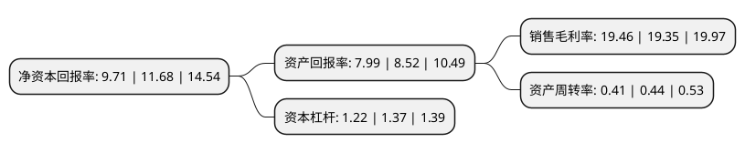

> 本页面由自动化程序生成于 2022年5月20日 01:22
> 内容可能存在错误，如有bug请提交issue至：https://github.com/Eroleice/doc-pi/issues
{.is-warning}

# 上市公司基本情况

## 基本资料

英诺激光科技股份有限公司（以下简称“英诺激光”）成立于2011年11月30日，深圳市。于2021年07月06日在深交所创业板上市。

英诺激光注册资本15,164.508万元，公司主营业务为研发，生产和销售微加工激光器和定制激光模组，产品包括DPSS调Q纳秒激光器，超短脉冲激光器(皮秒，飞秒级)和MOPA纳秒/亚纳秒激光器。以下是详细信息：

- 公司名称: 英诺激光科技股份有限公司
- 股票代码: 301021.SZ
- 所在地: 广东 - 深圳市
- 成立日期: 2011年11月30日
- 注册资本: 15,164.508万元
- 法定代表人: 赵晓杰
- 主营业务: 公司主营业务为研发，生产和销售微加工激光器和定制激光模组，产品包括DPSS调Q纳秒激光器，超短脉冲激光器(皮秒，飞秒级)和MOPA纳秒/亚纳秒激光器
- 公司官网: www.inno-laser.com
- 公司介绍: 公司主营业务为研发、生产和销售微加工激光器和定制激光模组，是国内领先的专注于微加工领域的激光器生产商和解决方案提供商。公司激光器产品包括DPSS调Q纳秒激光器(纳秒固体激光器)、超短脉冲激光器(超快激光器，包括皮秒、飞秒级)和MOPA纳秒/亚纳秒激光器(MOPA光纤激光器)，覆盖从红外到深紫外的不同波段，从纳秒到飞秒的多种脉宽。同时，公司在精密光学设计、视觉图像处理、运动控制、光-材料作用机理等方面，拥有多项自主研发的核心技术，以激光模组形式为客户提供定制化激光微加工解决方案。公司是国家高新技术企业，拥有高水平的国际化研发团队、健全的研发体系和自主研发的核心技术。公司在国内和美国设立了优势互补的研发中心，能够准确把握行业技术前沿，贴近市场应用，保持技术先进性，提升技术产业化效率。公司核心技术团队是广东省“珠江人才计划”和深圳市“孔雀计划”重点引进的创新创业团队。截至本招股说明书签署日，公司拥有专利103项，其中发明专利30项。

## 股东及高管情况

上市公司第一大股东为德泰国际投资集团有限公司，持股42,580,000股，占比28.08%，**疑似为**上市公司实际控制人。

截至2022年05月16日，上市公司的前十大股东中，共有8名机构股东，2个产品账户，其中5%以上大股东共有4名。上市公司前十大股东明细如下：

> 未能通过持股比例判定出上市公司实际控制人（持股30%以上）
> 可能存在通过间接持股、联合持股、协议控制等方式拥有实际控制权的主体，具体请参考上市公司定期公告！
{.is-warning}

> 截至2022年05月16日，上市公司前十大股东信息如下：

| 股东名称 | 持股数量（股） | 持股比例 |
| --- | --- | --- |
| 德泰国际投资集团有限公司 | 42,580,000 | 28.08% |
| 深圳红粹投资企业(有限合伙) | 38,970,000 | 25.7% |
| 深圳荟商投资企业(有限合伙) | 10,030,000 | 6.61% |
| 深圳市艾泰投资企业(有限合伙) | 9,470,000 | 6.24% |
| 长城证券-建设银行-长城诺创未来战略配售集合资产管理计划 | 3,800,000 | 2.51% |
| 鹰潭市君悦圣廷产业发展合伙企业(有限合伙) | 3,592,400 | 2.37% |
| 鹰潭市道勤投资管理合伙企业(有限合伙) | 2,667,725 | 1.76% |
| 珠海人合春天投资合伙企业(有限合伙) | 1,707,344 | 1.13% |
| 深圳市国隆资本股权投资管理有限公司-深圳市启赋国隆中小微企业股权投资基金合伙企业(有限合伙) | 1,600,632 | 1.06% |
| 新余人合厚信投资合伙企业(有限合伙) | 1,056,600 | 0.7% |

## 利润表分析

上市公司2021年总收入为3.9亿元，净利润为0.76亿元，实现盈利。

## 杜邦分析

> 数据列示周期：2021年 | 2020年 | 2019年
{.is-info}

上市公司的净资产收益率在近一年有所下降，下降幅度为-16.87%，其变化情况分解如下：
- 上市公司的销售毛利率在近一年上升了0.57%，可能是生产效率的提升、商品原材料价格下跌或商品价格的上涨所致。
- 上市公司的资产周转率在近一年下降了-6.82%，可能是源自于更慢的销售回款或库存管理效果下降。
- 上市公司的财务杠杆比率在近一年下降了-10.95%，可能是减少负债降低财务费用。

