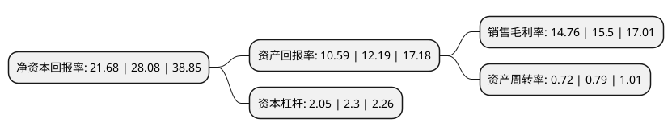

> 本页面由自动化程序生成于 2022年5月20日 01:22
> 内容可能存在错误，如有bug请提交issue至：https://github.com/Eroleice/doc-pi/issues
{.is-warning}

# 上市公司基本情况

## 基本资料

远信工业股份有限公司（以下简称“远信工业”）成立于2010年06月04日，绍兴市。于2021年09月01日在深交所创业板上市。

远信工业注册资本8,175.25万元，公司主营业务为新型节能环保拉幅定形机等纺织相关设备的研发，生产和销售。公司的主要产品为拉幅定形机，定形机改造及自动缝头机。以下是详细信息：

- 公司名称: 远信工业股份有限公司
- 股票代码: 301053.SZ
- 所在地: 浙江 - 绍兴市
- 成立日期: 2010年06月04日
- 注册资本: 8,175.25万元
- 法定代表人: 陈少军
- 主营业务: 公司主营业务为新型节能环保拉幅定形机等纺织相关设备的研发，生产和销售公司的主要产品为拉幅定形机，定形机改造及自动缝头机
- 公司官网: www.yoantion.com
- 公司介绍: 公司是国内拉幅定形机领域的领先企业。据中国纺织机械协会统计显示，2017年至2019年，公司拉幅定形机的产销量均位居全国同类产品第二位。公司深耕拉幅定形机市场，产品实现进口替代并出口海外。公司注重科技创新体系的建设和完善，经过多年的创新和积累，形成了较强的产品研发和设计能力。公司是国家重点扶持的高新技术企业；公司研发中心被浙江省科技厅认定为省级高新技术企业研究开发中心，被浙江省人民政府评为重点企业研究院。公司拥有专利132项，其中发明专利9项；获取软件著作权7项；荣获浙江省装备制造业首台(套)产品2项；取得浙江省优秀工业新产品1项；承担浙江省重大科技专项2项。公司主营业务为新型节能环保拉幅定形机的研发、生产和销售。公司的主要产品为拉幅定形机及定形机改造。

## 股东及高管情况

上市公司第一大股东为新昌县远威科技有限公司，持股45,316,225股，占比55.43%，为上市公司实际控制人。

截至2022年03月31日，上市公司的前十大股东中，共有7名自然人股东，2名机构股东，1个产品账户，其中5%以上大股东共有2名。上市公司前十大股东明细如下：

> 截至2022年03月31日，上市公司前十大股东信息如下：

| 股东名称 | 持股数量（股） | 持股比例 |
| --- | --- | --- |
| 新昌县远威科技有限公司 | 45,316,225 | 55.43% |
| 新昌县远琪投资管理合伙企业(有限合伙) | 5,004,583 | 6.12% |
| 张鑫霞 | 3,574,702 | 4.37% |
| 陈少军 | 2,199,817 | 2.69% |
| 中信证券-招商银行-中信证券远信工业员工参与创业板战略配售集合资产管理计划 | 1,833,300 | 2.24% |
| 陈学均 | 1,759,853 | 2.15% |
| 吕佳琦 | 1,125,000 | 1.38% |
| 冯伟明 | 714,940 | 0.87% |
| 张雪芳 | 714,940 | 0.87% |
| 求金英 | 714,940 | 0.87% |

## 利润表分析

上市公司2021年总收入为5.77亿元，净利润为0.85亿元，实现盈利。

## 杜邦分析

> 数据列示周期：2021年 | 2020年 | 2019年
{.is-info}

上市公司的净资产收益率在近一年有所下降，下降幅度为-22.79%，其变化情况分解如下：
- 上市公司的销售毛利率在近一年下降了-4.77%，可能是生产效率的下降、商品原材料价格上涨或商品价格的下跌所致。
- 上市公司的资产周转率在近一年下降了-8.86%，可能是源自于更慢的销售回款或库存管理效果下降。
- 上市公司的财务杠杆比率在近一年下降了-10.87%，可能是减少负债降低财务费用。

