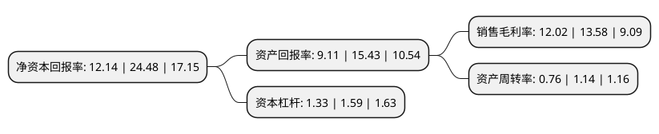

> 本页面由自动化程序生成于 2022年5月20日 01:22
> 内容可能存在错误，如有bug请提交issue至：https://github.com/Eroleice/doc-pi/issues
{.is-warning}

# 上市公司基本情况

## 基本资料

江西百胜智能科技股份有限公司（以下简称“百胜智能”）成立于1999年01月20日，南昌市。于2021年10月21日在深交所创业板上市。

百胜智能注册资本17,786.667万元，主要从事各种出入口控制与管理设备的研发，生产和销售，并能够针对客户需求提供出入口控制与管理整体解决方案。以下是详细信息：

- 公司名称: 江西百胜智能科技股份有限公司
- 股票代码: 301083.SZ
- 所在地: 江西 - 南昌市
- 成立日期: 1999年01月20日
- 注册资本: 17,786.667万元
- 法定代表人: 刘润根
- 主营业务: 主要从事各种出入口控制与管理设备的研发，生产和销售，并能够针对客户需求提供出入口控制与管理整体解决方案
- 公司官网: www.bisensa.com
- 公司介绍: 公司主要从事各种出入口控制与管理设备的研发、生产和销售，并能够针对客户需求提供出入口控制与管理整体解决方案。在技术创新体系方面，公司一直专注于出入口控制与管理领域相关的产品设计、生产工艺提升和系统开发，并形成了具有独立知识产权的核心技术储备。公司已在国内外取得188项专利(其中9项发明专利、115项实用新型专利、64项外观设计专利)，33项软件著作权。在生产体系方面，公司引入了钣金全自动化柔性生产线、机器人折弯工作站、机器人焊接工作站和全自动化立体仓库等先进智能制造设施，在保证产品质量、优化生产工艺的同时，提升了规模制造能力和交付能力。在产品体系方面，凭借充足的技术储备，公司能够根据应用场景对设备性能、环境适用性和尺寸大小的要求，快速设计开发出符合客户需求的产品，并已形成道闸、开门机、升降地柱、车牌识别管理设备和通道门五大产品体系。

## 股东及高管情况

上市公司第一大股东为刘润根，持股68,808,000股，占比38.69%，为上市公司实际控制人。

截至2022年03月31日，上市公司的前十大股东中，共有3名自然人股东，6名机构股东，1个产品账户，其中5%以上大股东共有3名。上市公司前十大股东明细如下：

> 截至2022年03月31日，上市公司前十大股东信息如下：

| 股东名称 | 持股数量（股） | 持股比例 |
| --- | --- | --- |
| 刘润根 | 68,808,000 | 38.69% |
| 刘子尧 | 28,032,000 | 15.76% |
| 龚卫宁 | 26,160,000 | 14.71% |
| 南昌市国金工业投资有限公司 | 6,300,000 | 3.54% |
| 新余一棵树投资管理合伙企业(有限合伙) | 2,400,000 | 1.35% |
| 新余大森林投资合伙企业(有限合伙) | 1,500,000 | 0.84% |
| 招商证券资管-招商银行-招商资管百胜智能员工参与创业板战略配售集合资产管理计划 | 938,290 | 0.53% |
| 招商证券投资有限公司 | 901,733 | 0.51% |
| 中信建投证券股份有限公司 | 589,900 | 0.33% |
| 中信证券股份有限公司 | 579,000 | 0.33% |

## 利润表分析

上市公司2021年总收入为5.25亿元，净利润为0.63亿元，实现盈利。

## 杜邦分析

> 数据列示周期：2021年 | 2020年 | 2019年
{.is-info}

上市公司的净资产收益率在近一年有所下降，下降幅度为-50.41%，其变化情况分解如下：
- 上市公司的销售毛利率在近一年下降了-11.49%，可能是生产效率的下降、商品原材料价格上涨或商品价格的下跌所致。
- 上市公司的资产周转率在近一年下降了-33.33%，可能是源自于更慢的销售回款或库存管理效果下降。
- 上市公司的财务杠杆比率在近一年下降了-16.35%，可能是减少负债降低财务费用。

