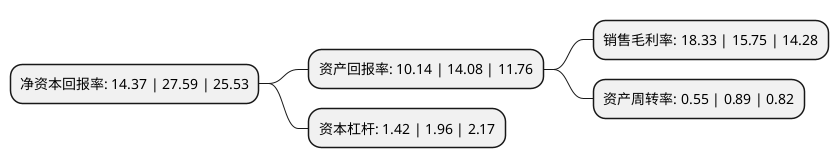

> 本页面由自动化程序生成于 2022年5月20日 01:23
> 内容可能存在错误，如有bug请提交issue至：https://github.com/Eroleice/doc-pi/issues
{.is-warning}

# 上市公司基本情况

## 基本资料

广州华研精密机械股份有限公司（以下简称“华研精机”）成立于2002年05月13日，广州市。于2021年12月15日在深交所创业板上市。

华研精机注册资本12,000万元，主要从事瓶坯智能成型系统和瓶坯模具的设计，研发，生产和销售，同时可提供模具翻新和维修，装备升级改造，瓶坯瓶样设计，生产线规划等一系列定制瓶坯成型解决方案，公司的主要产品为瓶坯智能成型系统，瓶坯模具。以下是详细信息：

- 公司名称: 广州华研精密机械股份有限公司
- 股票代码: 301138.SZ
- 所在地: 广东 - 广州市
- 成立日期: 2002年05月13日
- 注册资本: 12,000万元
- 法定代表人: 包贺林
- 主营业务: 主要从事瓶坯智能成型系统和瓶坯模具的设计，研发，生产和销售，同时可提供模具翻新和维修，装备升级改造，瓶坯瓶样设计，生产线规划等一系列定制瓶坯成型解决方案，公司的主要产品为瓶坯智能成型系统，瓶坯模具
- 公司官网: www.gzhuayan.com
- 公司介绍: 公司是一家主要从事瓶坯智能成型系统和瓶坯模具的设计、研发、生产和销售，同时可提供模具翻新和维修、装备升级改造、瓶坯瓶样设计、生产线规划等一系列定制瓶坯成型解决方案的高新技术企业，为下游厂商打造瓶坯制造智能工厂。所在行业属于国家鼓励和扶持的高端装备制造业。公司产品具有智能高效、高精度、低能耗的特点，可大批量、高质量地制造塑料材质瓶坯，经过后续的吹瓶工序即成为塑料瓶。在发行人擅长的PET注塑成型领域，PET凭借其良好的成型效率、透明度、经济性和环保回收特性，已广泛应用于饮用水、饮料、食用油、日化等快消品包装领域，并逐步扩展至奶制品、酒类、医药等包装领域，主要客户包括今麦郎、达利、娃哈哈、怡宝、景田、润田、伊利、中粮可乐、统一、雀巢、益海嘉里、中粮油脂、中富、信联智通、和旺、辉煌、中粮包装、纳爱斯等。

## 股东及高管情况

上市公司第一大股东为包贺林，持股34,293,240股，占比28.58%，**疑似为**上市公司实际控制人。

截至2022年03月31日，上市公司的前十大股东中，共有6名自然人股东，4名机构股东，其中5%以上大股东共有4名。上市公司前十大股东明细如下：

> 未能通过持股比例判定出上市公司实际控制人（持股30%以上）
> 可能存在通过间接持股、联合持股、协议控制等方式拥有实际控制权的主体，具体请参考上市公司定期公告！
{.is-warning}

> 截至2022年03月31日，上市公司前十大股东信息如下：

| 股东名称 | 持股数量（股） | 持股比例 |
| --- | --- | --- |
| 包贺林 | 34,293,240 | 28.58% |
| 温世旭 | 34,293,240 | 28.58% |
| 广州市葆莱投资有限公司 | 8,573,310 | 7.14% |
| 广州旭扬投资咨询有限公司 | 8,573,310 | 7.14% |
| 广州市葆创投资中心(有限合伙) | 4,266,900 | 3.56% |
| 潘秀生 | 409,500 | 0.34% |
| 中国国际金融香港资产管理有限公司-客户资金2 | 212,869 | 0.18% |
| 马啸 | 191,500 | 0.16% |
| 傅刚 | 157,264 | 0.13% |
| 庞建伟 | 126,000 | 0.11% |

## 利润表分析

上市公司2021年总收入为5.58亿元，净利润为1.02亿元，实现盈利。

## 杜邦分析

> 数据列示周期：2021年 | 2020年 | 2019年
{.is-info}

上市公司的净资产收益率在近一年有所下降，下降幅度为-47.92%，其变化情况分解如下：
- 上市公司的销售毛利率在近一年上升了16.38%，可能是生产效率的提升、商品原材料价格下跌或商品价格的上涨所致。
- 上市公司的资产周转率在近一年下降了-38.2%，可能是源自于更慢的销售回款或库存管理效果下降。
- 上市公司的财务杠杆比率在近一年下降了-27.55%，可能是减少负债降低财务费用。

