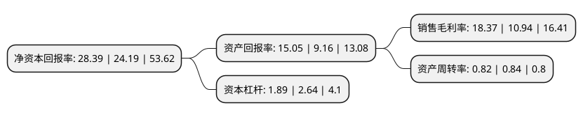

> 本页面由自动化程序生成于 2022年5月20日 01:23
> 内容可能存在错误，如有bug请提交issue至：https://github.com/Eroleice/doc-pi/issues
{.is-warning}

# 上市公司基本情况

## 基本资料

上海冠龙阀门节能设备股份有限公司（以下简称“冠龙节能”）成立于1991年07月29日，上海市。于2022年04月11日在深交所创业板上市。

冠龙节能注册资本12,567.429万元，主要从事节水阀门的研发，设计，生产和销售，主要产品包括蝶阀，闸阀，控制阀，止回阀等阀门产品及其他配套产品，为城镇给排水，水利和工业等下游应用领域提供产品及综合解决方案。以下是详细信息：

- 公司名称: 上海冠龙阀门节能设备股份有限公司
- 股票代码: 301151.SZ
- 所在地: 上海 - 上海市
- 成立日期: 1991年07月29日
- 注册资本: 12,567.429万元
- 法定代表人: 李政宏
- 主营业务: 主要从事节水阀门的研发，设计，生产和销售，主要产品包括蝶阀，闸阀，控制阀，止回阀等阀门产品及其他配套产品，为城镇给排水，水利和工业等下游应用领域提供产品及综合解决方案
- 公司官网: www.karon-valve.com
- 公司介绍: 公司是我国领先的节水阀门供应商，主要从事节水阀门的研发、设计、生产和销售，主要产品包括蝶阀、闸阀、控制阀、止回阀等阀门产品及其他配套产品，为城镇给排水、水利和工业等下游应用领域提供产品及综合解决方案。公司经过多年持续研发投入，凭借领先的技术研发实力、先进的生产工艺、严格稳定的质量管控和完善的产品体系，在行业内已建立了较高的品牌知名度，形成了以阀门软密封技术、阀门硬密封技术、阀门和管道防护技术、阀门高效控制技术和阀门性能模拟测试技术为主的核心技术体系，产品成功应用于三峡工程、南水北调配套工程、水立方、北京首都国际机场、东方明珠、北京地铁六号线、上海世博园、上海迪士尼、中央电视台总部大楼、深圳福田污水处理厂、港珠澳大桥、北京大兴国际机场和火神山医院等知名工程项目。公司通过了ISO9001质量管理体系认证、ISO14001环境管理体系认证、ISO45001职业健康安全管理体系认证和CNAS实验室认可。

## 股东及高管情况

上市公司第一大股东为Karon Holding Company Limited，持股113,106,861股，占比67.46%，为上市公司实际控制人。

截至2022年04月11日，上市公司的前十大股东中，共有2名机构股东，7个产品账户，1个海外主体，其中5%以上大股东共有2名。上市公司前十大股东明细如下：

> 截至2022年04月11日，上市公司前十大股东信息如下：

| 股东名称 | 持股数量（股） | 持股比例 |
| --- | --- | --- |
| Karon Holding Company Limited | 113,106,861 | 67.46% |
| 富拉凯咨询(上海)有限公司 | 12,567,429 | 7.5% |
| 长江证券承销保荐有限公司 | 183,698 | 0.11% |
| 中国铁路沈阳局集团有限公司企业年金计划-中国建设银行股份有限公司 | 56,200 | 0.03% |
| 广东省贰号职业年金计划-工商银行 | 56,200 | 0.03% |
| 中国建设银行股份有限公司企业年金计划-中国工商银行股份有限公司 | 56,200 | 0.03% |
| 中国铁路成都局集团有限公司企业年金计划-中国建设银行股份有限公司 | 49,175 | 0.03% |
| 中国石油天然气集团公司企业年金计划-中国工商银行股份有限公司 | 49,175 | 0.03% |
| 中国铁路北京局集团有限公司企业年金计划-中国建设银行股份有限公司 | 49,175 | 0.03% |
| 中国工商银行股份有限公司企业年金计划-中国建设银行股份有限公司 | 42,150 | 0.03% |

## 利润表分析

上市公司2021年总收入为10.46亿元，净利润为1.92亿元，实现盈利。

## 杜邦分析

> 数据列示周期：2021年 | 2020年 | 2019年
{.is-info}

上市公司的净资产收益率在近一年有所上升，上升幅度为17.36%，其变化情况分解如下：
- 上市公司的销售毛利率在近一年上升了67.92%，可能是生产效率的提升、商品原材料价格下跌或商品价格的上涨所致。
- 上市公司的资产周转率在近一年下降了-2.38%，可能是源自于更慢的销售回款或库存管理效果下降。
- 上市公司的财务杠杆比率在近一年下降了-28.41%，可能是减少负债降低财务费用。

