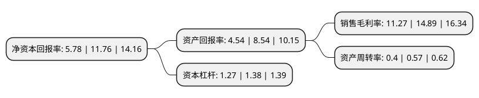

> 本页面由自动化程序生成于 2022年5月20日 01:23
> 内容可能存在错误，如有bug请提交issue至：https://github.com/Eroleice/doc-pi/issues
{.is-warning}

# 上市公司基本情况

## 基本资料

南通超达装备股份有限公司（以下简称“超达装备”）成立于2005年05月19日，南通市。于2021年12月23日在深交所创业板上市。

超达装备注册资本7,275.882万元，公司主营业务以模具为核心，以汽车检具和自动化工装设备及零部件为延伸。公司主要产品包括:①模具;②汽车检具;③自动化工装设备及零部件。以下是详细信息：

- 公司名称: 南通超达装备股份有限公司
- 股票代码: 301186.SZ
- 所在地: 江苏 - 南通市
- 成立日期: 2005年05月19日
- 注册资本: 7,275.882万元
- 法定代表人: 冯建军
- 主营业务: 公司主营业务以模具为核心，以汽车检具和自动化工装设备及零部件为延伸公司主要产品包括:①模具;②汽车检具;③自动化工装设备及零部件
- 公司官网: www.chaodamould.com
- 公司介绍: 公司系国内领先的汽车内外饰模具供应商,主要从事模具,汽车检具,自动化工装设备及零部件的研发,生产与销售.公司主营业务以模具为核心,其中汽车内外饰模具是模具产品最主要的构成部分.公司是中国模具工业协会授予的中国重点骨干模具企业，江苏省模具行业协会认定的江苏省重点骨干模具企业，拥有“江苏省企业技术中心”和“江苏省大型复杂模具工艺及制造工程技术研究中心”。公司主持制定了EPS(可发性聚苯乙烯)、EPP(发泡聚丙烯)发泡模具行业标准《EPS、EPP发泡模技术条件》(JB/T11662-2013)，并被江苏省经济和信息化委员会评为“2016年江苏省互联网与工业融合创新试点企业”。公司具备原始创新能力并拥有自主知识产权，至报告期末已获得30项发明专利、45项实用新型专利、1项外观设计专利，多项产品获得南通市人民政府、如皋市人民政府颁发的科技进步奖；2016年9月，公司“剪切式主地毯冲切模具”获得中国模具工业协会颁发的“精模奖”。公司于2009年通过高新技术企业认定，2012年通过高新技术企业复审，2015年再次通过高新技术企业认定。

## 股东及高管情况

上市公司第一大股东为冯建军，持股45,000,000股，占比61.85%，为上市公司实际控制人。

截至2022年03月31日，上市公司的前十大股东中，共有8名自然人股东，1名机构股东，1个海外主体，其中5%以上大股东共有2名。上市公司前十大股东明细如下：

> 截至2022年03月31日，上市公司前十大股东信息如下：

| 股东名称 | 持股数量（股） | 持股比例 |
| --- | --- | --- |
| 冯建军 | 45,000,000 | 61.85% |
| 冯峰 | 5,000,000 | 6.87% |
| 南通市众达投资管理中心(有限合伙) | 3,014,705 | 4.14% |
| 冯丽丽 | 735,294 | 1.01% |
| 郭巍巍 | 490,196 | 0.67% |
| 王荣铭 | 383,900 | 0.53% |
| 徐炜 | 245,098 | 0.34% |
| 杨岳峰 | 151,100 | 0.21% |
| 孙莹 | 150,017 | 0.21% |
| UBS AG | 149,643 | 0.21% |

## 利润表分析

上市公司2021年总收入为4.37亿元，净利润为0.49亿元，实现盈利。

## 杜邦分析

> 数据列示周期：2021年 | 2020年 | 2019年
{.is-info}

上市公司的净资产收益率在近一年有所下降，下降幅度为-50.85%，其变化情况分解如下：
- 上市公司的销售毛利率在近一年下降了-24.31%，可能是生产效率的下降、商品原材料价格上涨或商品价格的下跌所致。
- 上市公司的资产周转率在近一年下降了-29.82%，可能是源自于更慢的销售回款或库存管理效果下降。
- 上市公司的财务杠杆比率在近一年下降了-7.97%，可能是减少负债降低财务费用。

