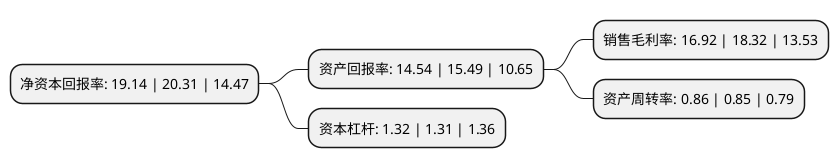

> 本页面由自动化程序生成于 2022年5月20日 01:23
> 内容可能存在错误，如有bug请提交issue至：https://github.com/Eroleice/doc-pi/issues
{.is-warning}

# 上市公司基本情况

## 基本资料

厦门唯科模塑科技股份有限公司（以下简称“唯科科技”）成立于2005年04月04日，厦门市。于2022年01月11日在深交所创业板上市。

唯科科技注册资本12,480万元，主要从事精密注塑模具，注塑件以及健康产品的研发，设计，制造和销售业务。公司核心业务为精密注塑模具业务以下是详细信息：

- 公司名称: 厦门唯科模塑科技股份有限公司
- 股票代码: 301196.SZ
- 所在地: 福建 - 厦门市
- 成立日期: 2005年04月04日
- 注册资本: 12,480万元
- 法定代表人: 庄辉阳
- 主营业务: 主要从事精密注塑模具，注塑件以及健康产品的研发，设计，制造和销售业务公司核心业务为精密注塑模具业务
- 公司官网: www.ctmold.com
- 公司介绍: 发行人主要从事精密注塑模具、注塑件以及健康产品的研发、设计、制造和销售业务。公司核心业务为精密注塑模具业务，并依托核心业务的技术和经验积累积极向下游延伸，逐步将业务拓展至注塑件以及健康家电产品的生产和销售，是行业内比较典型的“模塑一体化”企业，能够为电子、汽车、家居、健康家电等下游行业客户提供“一站式”产品和服务。公司是中国模具工业协会认定的“中国精密注塑模具重点骨干企业”之一，被认定为福建省“省级工业设计中心”、“省级企业技术中心”，目前正在申请国家级企业技术中心。公司拥有330项授权专利，其中包括19项发明专利。

## 股东及高管情况

上市公司第一大股东为庄辉阳，持股54,000,000股，占比43.27%，为上市公司实际控制人。

截至2022年03月31日，上市公司的前十大股东中，共有7名自然人股东，3名机构股东，其中5%以上大股东共有3名。上市公司前十大股东明细如下：

> 截至2022年03月31日，上市公司前十大股东信息如下：

| 股东名称 | 持股数量（股） | 持股比例 |
| --- | --- | --- |
| 庄辉阳 | 54,000,000 | 43.27% |
| 厦门市科普特投资合伙企业(有限合伙) | 16,879,000 | 13.52% |
| 厦门领唯创富管理咨询合伙企业(有限合伙) | 6,860,000 | 5.5% |
| 张侃 | 3,500,000 | 2.8% |
| 王燕 | 2,900,000 | 2.32% |
| 庄朝阳 | 1,164,000 | 0.93% |
| 厦门立唯昇管理咨询合伙企业(有限合伙) | 1,147,000 | 0.92% |
| 周燕华 | 830,000 | 0.67% |
| 郭锦川 | 775,000 | 0.62% |
| 王志军 | 775,000 | 0.62% |

## 利润表分析

上市公司2021年总收入为11.59亿元，净利润为1.96亿元，实现盈利。

## 杜邦分析

> 数据列示周期：2021年 | 2020年 | 2019年
{.is-info}

上市公司的净资产收益率在近一年有所下降，下降幅度为-5.76%，其变化情况分解如下：
- 上市公司的销售毛利率在近一年下降了-7.64%，可能是生产效率的下降、商品原材料价格上涨或商品价格的下跌所致。
- 上市公司的资产周转率在近一年上升了1.18%，可能是源自于更快的销售回款或库存管理效果提升。
- 上市公司的财务杠杆比率在近一年上升了0.76%，可能是增加负债扩大生产规模。

