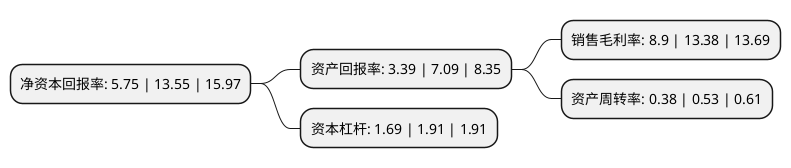

> 本页面由自动化程序生成于 2022年5月20日 01:23
> 内容可能存在错误，如有bug请提交issue至：https://github.com/Eroleice/doc-pi/issues
{.is-warning}

# 上市公司基本情况

## 基本资料

迈赫机器人自动化股份有限公司（以下简称“迈赫股份”）成立于2010年01月23日，潍坊市。于2021年12月07日在深交所创业板上市。

迈赫股份注册资本13,334万元，主营业务是以机器人和物联网技术为依托向客户提供高端智能装备系统，公用动力及装备能源供应系统的研发，制造与集成以及规划设计服务，产品及服务主要应用于汽车，农业装备，工程机械及其零部件等行业领域。以下是详细信息：

- 公司名称: 迈赫机器人自动化股份有限公司
- 股票代码: 301199.SZ
- 所在地: 山东 - 潍坊市
- 成立日期: 2010年01月23日
- 注册资本: 13,334万元
- 法定代表人: 王金平
- 主营业务: 主营业务是以机器人和物联网技术为依托向客户提供高端智能装备系统，公用动力及装备能源供应系统的研发，制造与集成以及规划设计服务，产品及服务主要应用于汽车，农业装备，工程机械及其零部件等行业领域
- 公司官网: www.mhauto.cn
- 公司介绍: 公司为智能制造整体解决方案提供商，主营业务是以机器人和物联网技术为依托向客户提供高端智能装备系统、公用动力及装备能源供应系统的研发、制造与集成以及规划设计服务，产品及服务主要应用于汽车、农业装备、工程机械及其零部件等行业领域。公司成立至今，主营业务发展紧紧围绕着智能制造这一中心，以智能装备制造为起点，以解放低端劳动力为导向，以行业个性化方案定制为核心，以自主研发先进技术为支撑，形成了为汽车制造、工程机械、农业、环保等行业提供智能工厂的总图规划咨询、工厂公用动力和能源供应的设计安装，以及智能装备系统的生产制造等业务体系；随着自身技术水平的不断提高、项目成功经验的积累、对行业认知的不断深入以及对下游客户需求的持续挖掘，公司正逐步完成自身产业链由智能装备制造商向智能制造整体解决方案提供商的延伸。

## 股东及高管情况

上市公司第一大股东为山东迈赫投资有限公司，持股76,500,000股，占比57.37%，为上市公司实际控制人。

截至2022年03月31日，上市公司的前十大股东中，共有7名自然人股东，3名机构股东，其中5%以上大股东共有3名。上市公司前十大股东明细如下：

> 截至2022年03月31日，上市公司前十大股东信息如下：

| 股东名称 | 持股数量（股） | 持股比例 |
| --- | --- | --- |
| 山东迈赫投资有限公司 | 76,500,000 | 57.37% |
| 潍坊赫力投资中心(有限合伙) | 10,000,000 | 7.5% |
| 徐烟田 | 7,500,000 | 5.62% |
| 王绪平 | 4,500,000 | 3.37% |
| 张韶辉 | 1,500,000 | 1.12% |
| 华泰证券股份有限公司 | 121,117 | 0.09% |
| 葛永辉 | 112,000 | 0.08% |
| 林建勋 | 102,200 | 0.08% |
| 郑春华 | 85,600 | 0.06% |
| 张志利 | 84,400 | 0.06% |

## 利润表分析

上市公司2021年总收入为8.11亿元，净利润为0.72亿元，实现盈利。

## 杜邦分析

> 数据列示周期：2021年 | 2020年 | 2019年
{.is-info}

上市公司的净资产收益率在近一年有所下降，下降幅度为-57.56%，其变化情况分解如下：
- 上市公司的销售毛利率在近一年下降了-33.48%，可能是生产效率的下降、商品原材料价格上涨或商品价格的下跌所致。
- 上市公司的资产周转率在近一年下降了-28.3%，可能是源自于更慢的销售回款或库存管理效果下降。
- 上市公司的财务杠杆比率在近一年下降了-11.52%，可能是减少负债降低财务费用。

