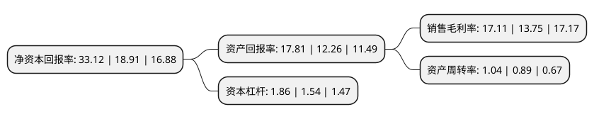

> 本页面由自动化程序生成于 2022年5月20日 01:23
> 内容可能存在错误，如有bug请提交issue至：https://github.com/Eroleice/doc-pi/issues
{.is-warning}

# 上市公司基本情况

## 基本资料

深圳市大族数控科技股份有限公司（以下简称“大族数控”）成立于2002年04月22日，深圳市。于2022年02月28日在深交所创业板上市。

大族数控注册资本42,000万元，主营业务为PCB专用设备的研发，生产和销售，产品主要覆盖钻孔，曝光，成型，检测等PCB关键工序以下是详细信息：

- 公司名称: 深圳市大族数控科技股份有限公司
- 股票代码: 301200.SZ
- 所在地: 广东 - 深圳市
- 成立日期: 2002年04月22日
- 注册资本: 42,000万元
- 法定代表人: 杨朝辉
- 主营业务: 主营业务为PCB专用设备的研发，生产和销售，产品主要覆盖钻孔，曝光，成型，检测等PCB关键工序
- 公司官网: www.hanscnc.cn
- 公司介绍: 公司主营业务为PCB专用设备的研发、生产和销售，报告期内产品主要覆盖钻孔、曝光、成型、检测等PCB关键工序，是全球PCB专用设备企业中产品线最广泛的企业之一。公司连续十一年位列CPCA发布的中国电子电路行业百强排行榜(专用仪器和设备类)第一名，子公司麦逊电子连续六年位列第四名，主要产品销量在行业内保持领先地位。公司凭借近二十年在高速高精运动控制、精密机械、电气工程、软件算法、先进光学系统、激光技术、图像处理、电子测试等方面的技术沉淀，为PCB行业打造了具备竞争优势的工序解决方案，如多类型机械钻孔设备、多光源激光钻孔设备，针对不同感光材料的激光直接成像设备，机械及激光成型设备，通用、专用及专用高精架构的多规格测试设备等，主要产品在性能、可靠性上已达到了行业先进水平，满足国内外龙头客户的技术要求，不断加速对进口设备的国产替代。

## 股东及高管情况

上市公司第一大股东为大族激光科技产业集团股份有限公司，持股355,868,100股，占比84.73%，为上市公司实际控制人。

截至2022年03月31日，上市公司的前十大股东中，共有1名自然人股东，4名机构股东，5个产品账户，其中5%以上大股东共有1名。上市公司前十大股东明细如下：

> 截至2022年03月31日，上市公司前十大股东信息如下：

| 股东名称 | 持股数量（股） | 持股比例 |
| --- | --- | --- |
| 大族激光科技产业集团股份有限公司 | 355,868,100 | 84.73% |
| 深圳市族鑫聚贤投资企业(有限合伙) | 8,571,167 | 2.04% |
| 深圳市族芯聚贤投资企业(有限合伙) | 6,652,549 | 1.58% |
| 大族控股集团有限公司 | 3,231,900 | 0.77% |
| 杨朝辉 | 2,586,217 | 0.62% |
| 全国社保基金五零三组合 | 1,399,948 | 0.33% |
| 中国建设银行股份有限公司-南方信息创新混合型证券投资基金 | 1,003,396 | 0.24% |
| 中国农业银行股份有限公司-大成创业板两年定期开放混合型证券投资基金 | 933,478 | 0.22% |
| 中国农业银行股份有限公司-大成企业能力驱动混合型证券投资基金 | 661,366 | 0.16% |
| 中国农业银行股份有限公司-大成积极成长混合型证券投资基金 | 551,795 | 0.13% |

## 利润表分析

上市公司2021年总收入为40.8亿元，净利润为6.98亿元，实现盈利。

## 杜邦分析

> 数据列示周期：2021年 | 2020年 | 2019年
{.is-info}

上市公司的净资产收益率在近一年有所上升，上升幅度为75.15%，其变化情况分解如下：
- 上市公司的销售毛利率在近一年上升了24.44%，可能是生产效率的提升、商品原材料价格下跌或商品价格的上涨所致。
- 上市公司的资产周转率在近一年上升了16.85%，可能是源自于更快的销售回款或库存管理效果提升。
- 上市公司的财务杠杆比率在近一年上升了20.78%，可能是增加负债扩大生产规模。

