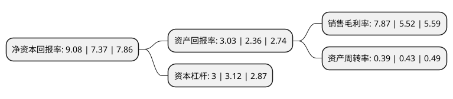

> 本页面由自动化程序生成于 2022年5月20日 01:25
> 内容可能存在错误，如有bug请提交issue至：https://github.com/Eroleice/doc-pi/issues
{.is-warning}

# 上市公司基本情况

## 基本资料

哈尔滨空调股份有限公司（以下简称“哈空调”）成立于1993年06月25日，哈尔滨市。于1999年06月03日在上交所主板上市。

哈空调注册资本38,334.067万元，主要产品:石化空冷器，电站空冷器，核电站空气处理机组。以下是详细信息：

- 公司名称: 哈尔滨空调股份有限公司
- 股票代码: 600202.SH
- 所在地: 黑龙江 - 哈尔滨市
- 成立日期: 1993年06月25日
- 注册资本: 38,334.067万元
- 法定代表人: 田大鹏
- 主营业务: 主要产品:石化空冷器，电站空冷器，核电站空气处理机组
- 公司官网: www.hac.com.cn
- 公司介绍: 公司致力于设计、制造石化空冷器、电站空冷器和空调暖通设备等节能、环保产品。产品广泛应用在石油化工、电力能源、钢铁冶金等行业。凭借雄厚的技术研发能力和制造水平，公司为中国空冷换热行业填补了52项空白，产品多次荣获相关部委的表彰和奖励，被誉为“中国空冷器的摇篮”。公司是行业排头兵企业，在国内同行业中第一个通过了ISO9001国际质量体系认证和ASME/ASME(U2)认证；并有进出口自营权和利用出口信贷出口大型成套设备的资格。公司产品完全拥有自主知识产权，广泛被中国三大石化公司、五大发电集团所采用，并远销意大利、新加坡等国家。目前，公司拥有多家子/分公司，在哈尔滨、上海等地建有生产基地，并在北京、上海、广州、武汉、西安、呼和浩特、太原、乌鲁木齐等地设有办事处。

## 股东及高管情况

上市公司第一大股东为哈尔滨工业投资集团有限公司，持股130,449,385股，占比34.03%，为上市公司实际控制人。

截至2022年03月31日，上市公司的前十大股东中，共有8名自然人股东，1名机构股东，1个产品账户，其中5%以上大股东共有1名。上市公司前十大股东明细如下：

> 截至2022年03月31日，上市公司前十大股东信息如下：

| 股东名称 | 持股数量（股） | 持股比例 |
| --- | --- | --- |
| 哈尔滨工业投资集团有限公司 | 130,449,385 | 34.03% |
| 刘锦英 | 5,463,400 | 1.43% |
| 张寿清 | 5,350,000 | 1.4% |
| 张鑫 | 3,608,100 | 0.94% |
| 曾强 | 2,381,292 | 0.62% |
| 阳光资产-工商银行-主动量化1号资产管理产品 | 2,000,000 | 0.52% |
| 张远航 | 1,898,600 | 0.5% |
| 蒋欣菊 | 1,880,000 | 0.49% |
| 冯锡芬 | 1,358,400 | 0.35% |
| 金盛威 | 1,286,800 | 0.34% |

## 利润表分析

上市公司2021年总收入为8.52亿元，净利润为0.67亿元，实现盈利。

## 杜邦分析

> 数据列示周期：2021年 | 2020年 | 2019年
{.is-info}

上市公司的净资产收益率在近一年有所上升，上升幅度为23.2%，其变化情况分解如下：
- 上市公司的销售毛利率在近一年上升了42.57%，可能是生产效率的提升、商品原材料价格下跌或商品价格的上涨所致。
- 上市公司的资产周转率在近一年下降了-9.3%，可能是源自于更慢的销售回款或库存管理效果下降。
- 上市公司的财务杠杆比率在近一年下降了-3.85%，可能是减少负债降低财务费用。

