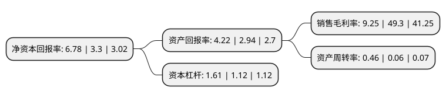

> 本页面由自动化程序生成于 2022年5月20日 01:25
> 内容可能存在错误，如有bug请提交issue至：https://github.com/Eroleice/doc-pi/issues
{.is-warning}

# 上市公司基本情况

## 基本资料

派斯林数字科技股份有限公司（以下简称“派斯林”）成立于1993年06月26日，长春市。于1999年09月09日在上交所主板上市。

派斯林注册资本46,503.288万元，主要业务:基础设施承建，租赁，建筑安装，土地成片开发转让。以下是详细信息：

- 公司名称: 派斯林数字科技股份有限公司
- 股票代码: 600215.SH
- 所在地: 吉林 - 长春市
- 成立日期: 1993年06月26日
- 注册资本: 46,503.288万元
- 法定代表人: 吴锦华
- 主营业务: 基础设施承建，租赁，建筑安装，土地成片开发转让
- 公司官网: www.ccjk600215.com
- 公司介绍: 公司创立于1993年，1999年9月9日在上海证券交易所挂牌上市，是一家快速发展的企业。公司经营范围包括公用设施投资、开发、建设、租赁、经营、管理；实业与科技投资。历经多年的艰苦创业，依托国家级长春经济技术开发区的高速发展，公司从小到大，稳健经营，已经形成了良好的经营基础。在工业化引领的城市化进程中，公司房地产开发、基础设施建设两大主营业务将取得快速的发展。公司按照建立现代企业制度的要求和上市公司的治理准则，不断完善公司治理结构，规范企业运行机制，加大产业结构调整，强化内部控制和管理，努力使公司综合效益不断提升。公司充分发挥股东大会权力机构、董事会决策机构和经营层执行机构三个层面的积极作用，在提升公司治理水平方面取得了显著成效，为公司的可持续发展奠定了扎实的基础。

## 股东及高管情况

上市公司第一大股东为万丰锦源控股集团有限公司，持股101,736,960股，占比21.88%，**疑似为**上市公司实际控制人。

截至2022年03月31日，上市公司的前十大股东中，共有6名自然人股东，3名机构股东，1个产品账户，其中5%以上大股东共有4名。上市公司前十大股东明细如下：

> 未能通过持股比例判定出上市公司实际控制人（持股30%以上）
> 可能存在通过间接持股、联合持股、协议控制等方式拥有实际控制权的主体，具体请参考上市公司定期公告！
{.is-warning}

> 截至2022年03月31日，上市公司前十大股东信息如下：

| 股东名称 | 持股数量（股） | 持股比例 |
| --- | --- | --- |
| 万丰锦源控股集团有限公司 | 101,736,960 | 21.88% |
| 派斯林数字科技股份有限公司回购专用证券账户 | 26,465,677 | 5.69% |
| 长春经开国资控股集团有限公司 | 25,764,105 | 5.54% |
| 万丰锦源投资有限公司 | 24,188,361 | 5.2% |
| 阎占表 | 18,500,000 | 3.98% |
| 吴锦华 | 8,153,486 | 1.75% |
| 严荣飞 | 6,429,695 | 1.38% |
| 王之建 | 3,659,408 | 0.79% |
| 柴煜英 | 3,112,800 | 0.67% |
| 徐春华 | 2,200,000 | 0.47% |

## 利润表分析

上市公司2021年总收入为14.21亿元，净利润为1.31亿元，实现盈利。

## 杜邦分析

> 数据列示周期：2021年 | 2020年 | 2019年
{.is-info}

上市公司的净资产收益率在近一年有所上升，上升幅度为105.45%，其变化情况分解如下：
- 上市公司的销售毛利率在近一年下降了-81.24%，可能是生产效率的下降、商品原材料价格上涨或商品价格的下跌所致。
- 上市公司的资产周转率在近一年上升了666.67%，可能是源自于更快的销售回款或库存管理效果提升。
- 上市公司的财务杠杆比率在近一年上升了43.75%，可能是增加负债扩大生产规模。

