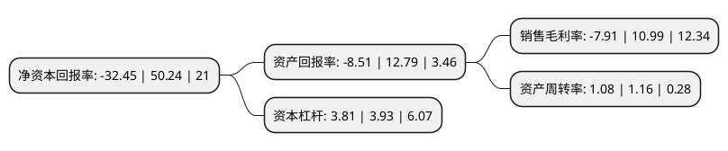

> 本页面由自动化程序生成于 2022年5月20日 01:26
> 内容可能存在错误，如有bug请提交issue至：https://github.com/Eroleice/doc-pi/issues
{.is-warning}

# 上市公司基本情况

## 基本资料

湖北华嵘控股股份有限公司（以下简称“华嵘控股”）成立于1997年11月20日，武汉市。于2004年06月07日在上交所主板上市。

华嵘控股注册资本19,560万元，墓地销售代理，殡葬服务以下是详细信息：

- 公司名称: 湖北华嵘控股股份有限公司
- 股票代码: 600421.SH
- 所在地: 湖北 - 武汉市
- 成立日期: 1997年11月20日
- 注册资本: 19,560万元
- 法定代表人: 周梁辉
- 主营业务: 墓地销售代理，殡葬服务
- 公司官网: null
- 公司介绍: 公司原有正常经营业务的子公司上海奥柏内燃机配件有限公司停产，2018年11月，公司注册成立了福泽园(北京)文化发展有限公司，尝试从事墓地代理销售以及殡葬服务业务。公司成立时间较短、经营规模较小，未来将在规范经营、风险控制等方面加强管理，积极探索和积累经验，实现业务的稳步发展，实现可持续经营。

## 股东及高管情况

上市公司第一大股东为浙江恒顺投资有限公司，持股38,136,775股，占比19.5%，**疑似为**上市公司实际控制人。

截至2022年03月31日，上市公司的前十大股东中，共有7名自然人股东，3名机构股东，其中5%以上大股东共有3名。上市公司前十大股东明细如下：

> 未能通过持股比例判定出上市公司实际控制人（持股30%以上）
> 可能存在通过间接持股、联合持股、协议控制等方式拥有实际控制权的主体，具体请参考上市公司定期公告！
{.is-warning}

> 截至2022年03月31日，上市公司前十大股东信息如下：

| 股东名称 | 持股数量（股） | 持股比例 |
| --- | --- | --- |
| 浙江恒顺投资有限公司 | 38,136,775 | 19.5% |
| 武汉新一代科技有限公司 | 34,234,261 | 17.5% |
| 上海天纪投资有限公司 | 24,381,487 | 12.46% |
| 蔡守平 | 7,994,729 | 4.09% |
| 李焕云 | 4,977,300 | 2.54% |
| 曹颖杰 | 2,668,606 | 1.36% |
| 黄幼凤 | 1,591,855 | 0.81% |
| 王爱香 | 1,571,140 | 0.8% |
| 孙国钢 | 1,509,202 | 0.77% |
| 王坚宏 | 1,391,384 | 0.71% |

## 利润表分析

上市公司2021年总收入为1.3亿元，净利润为-0.11亿元，**未实现盈利**。

## 杜邦分析

> 数据列示周期：2021年 | 2020年 | 2019年
{.is-info}

上市公司的净资产收益率在近一年有所下降，下降幅度为-164.59%，其变化情况分解如下：
- 上市公司的销售毛利率在近一年下降了-171.97%，可能是生产效率的下降、商品原材料价格上涨或商品价格的下跌所致。
- 上市公司的资产周转率在近一年下降了-6.9%，可能是源自于更慢的销售回款或库存管理效果下降。
- 上市公司的财务杠杆比率在近一年下降了-3.05%，可能是减少负债降低财务费用。

