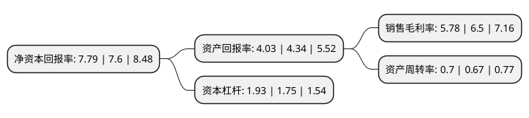

> 本页面由自动化程序生成于 2022年5月20日 01:26
> 内容可能存在错误，如有bug请提交issue至：https://github.com/Eroleice/doc-pi/issues
{.is-warning}

# 上市公司基本情况

## 基本资料

国机通用机械科技股份有限公司（以下简称“国机通用”）成立于1993年12月30日，合肥市。于2004年02月19日在上交所主板上市。

国机通用注册资本14,642.193万元，主要产品:UPVC双壁波纹管，PE双壁波纹管。以下是详细信息：

- 公司名称: 国机通用机械科技股份有限公司
- 股票代码: 600444.SH
- 所在地: 安徽 - 合肥市
- 成立日期: 1993年12月30日
- 注册资本: 14,642.193万元
- 法定代表人: 窦万波
- 主营业务: 主要产品:UPVC双壁波纹管，PE双壁波纹管
- 公司官网: www.guotone.com
- 公司介绍: 公司业务涵盖流体机械和管材两大领域。流体机械业务主要产品包括制冷实验装置、污水处理设备以及其他各种非标流体机械设备等，业务涵盖流体机械相关产品的研发制造、技术服务、技术咨询、工程设计及设备成套服务等业务。管材业务主营“国通”牌UPVC双壁波纹管、HDPE双壁波纹管、HDPE给水管、HDPE燃气管、HDPE牵引管、HDPE地源热泵管、HDPE塑钢缠绕管、HDPE钢带波纹管、UPVC加筋管、PPR冷热水管、UPVC建筑排水管、线管、内肋管、结构壁管，以及其它多种新型塑料管材、管件产品。年生产能力10万吨以上，在国内同行业中具有较强的综合实力和品牌优势。公司依托控股股东合肥通用机械研究院在技术及科研方面的优势，并与北京化工大学、上海同济大学、安徽大学、合肥工业大学等高等学府保持长期的技术合作关系，使企业获得了持续的科技创新能力，核心竞争优势明显。公司技术中心是安徽省省级企业技术中心，公司测试中心通过国家级实验室认可。公司拥有数十项国家技术专利和企业专有技术，先后荣获“全国质量管理先进单位”、“中国名牌企业”、“国家火炬计划重点高新技术企业”、“安徽省优秀高新技术企业”、“安徽省著名商标”等荣誉称号，产品被评为“国家重点新产品”、“中国市场名牌塑料建材行业十佳品牌”、建设部“住宅建设推荐产品”、“安徽省名牌产品”等，并顺利通过“质量(QMS)、环境(EMS)、职业健康安全(OHSAS)”三标一体管理体系认证。

## 股东及高管情况

上市公司第一大股东为合肥通用机械研究院有限公司，持股53,907,212股，占比36.82%，为上市公司实际控制人。

截至2022年03月31日，上市公司的前十大股东中，共有3名自然人股东，3名机构股东，4个产品账户，其中5%以上大股东共有2名。上市公司前十大股东明细如下：

> 截至2022年03月31日，上市公司前十大股东信息如下：

| 股东名称 | 持股数量（股） | 持股比例 |
| --- | --- | --- |
| 合肥通用机械研究院有限公司 | 53,907,212 | 36.82% |
| 合肥市产业投资控股(集团)有限公司 | 11,497,360 | 7.85% |
| 山东京博控股集团有限公司 | 4,800,000 | 3.28% |
| 黄泽坚 | 2,000,000 | 1.37% |
| 珠海市聚隆投资管理有限公司-聚隆定增1号私募证券投资基金 | 1,940,900 | 1.33% |
| 曹卫宏 | 1,683,000 | 1.15% |
| 珠海市聚隆投资管理有限公司-聚隆定增2号私募证券投资基金 | 1,403,001 | 0.96% |
| 珠海市聚隆投资管理有限公司-聚隆新能源私募证券投资基金 | 1,066,255 | 0.73% |
| 珠海市聚隆投资管理有限公司-聚隆多策略2号私募证券投资基金 | 958,000 | 0.65% |
| 潘晴 | 922,800 | 0.63% |

## 利润表分析

上市公司2021年总收入为8.41亿元，净利润为0.48亿元，实现盈利。

## 杜邦分析

> 数据列示周期：2021年 | 2020年 | 2019年
{.is-info}

上市公司的净资产收益率在近一年有所上升，上升幅度为2.5%，其变化情况分解如下：
- 上市公司的销售毛利率在近一年下降了-11.08%，可能是生产效率的下降、商品原材料价格上涨或商品价格的下跌所致。
- 上市公司的资产周转率在近一年上升了4.48%，可能是源自于更快的销售回款或库存管理效果提升。
- 上市公司的财务杠杆比率在近一年上升了10.29%，可能是增加负债扩大生产规模。

