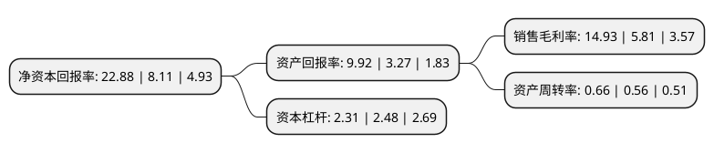

> 本页面由自动化程序生成于 2022年5月20日 01:26
> 内容可能存在错误，如有bug请提交issue至：https://github.com/Eroleice/doc-pi/issues
{.is-warning}

# 上市公司基本情况

## 基本资料

科达制造股份有限公司（以下简称“科达制造”）成立于1996年12月11日，佛山市。于2002年10月10日在上交所主板上市。

科达制造注册资本188,841.993万元，主要产品:机械产品，中药产品，自制配件及其他。以下是详细信息：

- 公司名称: 科达制造股份有限公司
- 股票代码: 600499.SH
- 所在地: 广东 - 佛山市
- 成立日期: 1996年12月11日
- 注册资本: 188,841.993万元
- 法定代表人: 边程
- 主营业务: 主要产品:机械产品，中药产品，自制配件及其他
- 公司官网: www.kedachina.com.cn
- 公司介绍: 公司以建材机械、锂电材料为两大核心业务，清洁煤气化技术与装备、烟气治理技术与装备、液压泵、虎渡风机为四大种子业务。公司秉承“创新永无止境”的核心经营理念，坚持“以科技进步推动企业兴旺发达”、由“科”而“达”的创新发展道路，高度重视具有前瞻性及可持续性的技术、产品研发。公司设有“研发院”，拥有“国家认定企业技术中心”、“国家工程技术中心”、“博士后科研工作站”、“院士工作室”等多层次研发与合作平台，为公司产品研发积累了大量技术储备。公司曾获中国机械500强、国家级高新技术企业、国家知识产权优势企业、广东省政府质量奖等殊荣。

## 股东及高管情况

上市公司第一大股东为梁桐灿，持股357,142,779股，占比18.91%，**疑似为**上市公司实际控制人。

截至2022年03月31日，上市公司的前十大股东中，共有7名自然人股东，2名机构股东，1个产品账户，其中5%以上大股东共有4名。上市公司前十大股东明细如下：

> 未能通过持股比例判定出上市公司实际控制人（持股30%以上）
> 可能存在通过间接持股、联合持股、协议控制等方式拥有实际控制权的主体，具体请参考上市公司定期公告！
{.is-warning}

> 截至2022年03月31日，上市公司前十大股东信息如下：

| 股东名称 | 持股数量（股） | 持股比例 |
| --- | --- | --- |
| 梁桐灿 | 357,142,779 | 18.91% |
| 卢勤 | 125,983,334 | 6.67% |
| 新华联控股有限公司 | 124,919,652 | 6.62% |
| 边程 | 98,699,598 | 5.23% |
| 石庭波 | 57,671,000 | 3.05% |
| 佛山市新明珠企业集团有限公司 | 52,994,111 | 2.81% |
| 科达制造股份有限公司-2020年员工持股计划 | 43,113,440 | 2.28% |
| 谢悦增 | 42,395,289 | 2.25% |
| 石丽云 | 40,465,600 | 2.14% |
| 张映发 | 15,611,861 | 0.83% |

## 利润表分析

上市公司2021年总收入为97.96亿元，净利润为14.63亿元，实现盈利。

## 杜邦分析

> 数据列示周期：2021年 | 2020年 | 2019年
{.is-info}

上市公司的净资产收益率在近一年有所上升，上升幅度为182.12%，其变化情况分解如下：
- 上市公司的销售毛利率在近一年上升了156.97%，可能是生产效率的提升、商品原材料价格下跌或商品价格的上涨所致。
- 上市公司的资产周转率在近一年上升了17.86%，可能是源自于更快的销售回款或库存管理效果提升。
- 上市公司的财务杠杆比率在近一年下降了-6.85%，可能是减少负债降低财务费用。

