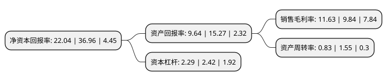

> 本页面由自动化程序生成于 2022年5月20日 01:29
> 内容可能存在错误，如有bug请提交issue至：https://github.com/Eroleice/doc-pi/issues
{.is-warning}

# 上市公司基本情况

## 基本资料

宇通重工股份有限公司（以下简称“宇通重工”）成立于1992年06月06日，郑州市。于1994年01月28日在上交所主板上市。

宇通重工注册资本53,937.337万元，集成电路产品，家电产品以下是详细信息：

- 公司名称: 宇通重工股份有限公司
- 股票代码: 600817.SH
- 所在地: 河南 - 郑州市
- 成立日期: 1992年06月06日
- 注册资本: 53,937.337万元
- 法定代表人: 戴领梅
- 主营业务: 集成电路产品，家电产品
- 公司官网: www.yutongzg.com
- 公司介绍: 公司原是一家专业从事光电产品和集成电路产品设计、制造及销售的高科技企业。2016年公司通过重大资产重组,置出莱茵达租赁45%股权,收购旭恒置业70.00%股权.公司下属子公司旭恒置业将其位于北京市亦庄经济技术开发区天宝南街4号“上海沙龙邻里中心地下底商”及地下车库出租给美廉美连锁作为商业经营及停车场使用，并与其签订了期限至2025年的租赁合同，租金收入稳定可靠。此外，旭恒置业亦计划开展物业服务、房地产服务等业务，进一步拓展收入来源，提高盈利能力。公司出租的房屋所处地理位置优越、商业活动发达、人流量大、承租需求量大、出租率高，在所处区域具有较强的市场竞争力。

## 股东及高管情况

上市公司第一大股东为郑州宇通集团有限公司，持股294,756,351股，占比54.65%，为上市公司实际控制人。

截至2022年03月31日，上市公司的前十大股东中，共有1名自然人股东，5名机构股东，4个产品账户，其中5%以上大股东共有3名。上市公司前十大股东明细如下：

> 截至2022年03月31日，上市公司前十大股东信息如下：

| 股东名称 | 持股数量（股） | 持股比例 |
| --- | --- | --- |
| 郑州宇通集团有限公司 | 294,756,351 | 54.65% |
| 西藏德恒企业管理有限责任公司 | 41,639,968 | 7.72% |
| 拉萨德宇新创实业有限公司 | 38,072,695 | 7.06% |
| 上海浦东发展银行股份有限公司-易方达裕祥回报债券型证券投资基金 | 8,879,384 | 1.65% |
| 通用技术集团投资管理有限公司 | 5,309,876 | 0.98% |
| 上海宏普实业投资有限公司 | 5,231,016 | 0.97% |
| 戴领梅 | 5,000,000 | 0.93% |
| 上海浦东发展银行股份有限公司-易方达瑞程灵活配置混合型证券投资基金 | 4,112,174 | 0.76% |
| 中国工商银行股份有限公司-易方达安心回馈混合型证券投资基金 | 4,036,675 | 0.75% |
| 芜湖长元股权投资基金(有限合伙) | 4,015,548 | 0.74% |

## 利润表分析

上市公司2021年总收入为37.56亿元，净利润为4.36亿元，实现盈利。

## 杜邦分析

> 数据列示周期：2021年 | 2020年 | 2019年
{.is-info}

上市公司的净资产收益率在近一年有所下降，下降幅度为-40.37%，其变化情况分解如下：
- 上市公司的销售毛利率在近一年上升了18.19%，可能是生产效率的提升、商品原材料价格下跌或商品价格的上涨所致。
- 上市公司的资产周转率在近一年下降了-46.45%，可能是源自于更慢的销售回款或库存管理效果下降。
- 上市公司的财务杠杆比率在近一年下降了-5.37%，可能是减少负债降低财务费用。

