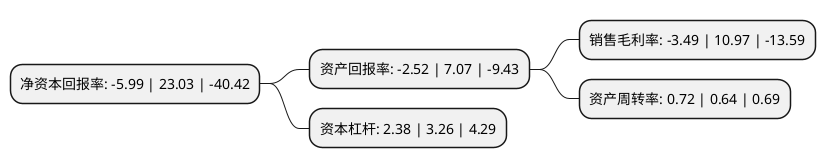

> 本页面由自动化程序生成于 2022年5月20日 01:29
> 内容可能存在错误，如有bug请提交issue至：https://github.com/Eroleice/doc-pi/issues
{.is-warning}

# 上市公司基本情况

## 基本资料

北京京城机电股份有限公司（以下简称“京城股份”）成立于1993年07月13日，北京市。于1994年05月06日在上交所主板上市。

京城股份注册资本48,500万元，气体储运装备业务以下是详细信息：

- 公司名称: 北京京城机电股份有限公司
- 股票代码: 600860.SH
- 所在地: 北京 - 北京市
- 成立日期: 1993年07月13日
- 注册资本: 48,500万元
- 法定代表人: 王军
- 主营业务: 气体储运装备业务
- 公司官网: www.jingchenggf.com.cn
- 公司介绍: 公司主要产品有车用液化天然气(LNG)气瓶，车用压缩天然气(CNG)气瓶，钢质无缝气瓶，钢质焊接气瓶，焊接绝热气瓶，碳纤维全缠绕复合气瓶，板冲式无石棉填料乙炔瓶ISO罐式集装箱，氢燃料电池用铝内胆碳纤维全缠绕复合气瓶以及低温储罐、LNG加气站设备等。公司凭借对清洁能源市场的准确把握，通过对车用LNG气瓶、低温贮罐、低温液体运输车、天然气汽车加气站等多方位的技术整合，可为客户提供LNG/CNG系统解决方案。公司先后取得了美国DOT、加拿大TC等国际认证、ISO9001:2008、ISO/TS16949:2009质量管理体系、ISO14001:2004环境管理体系、OHSAS18001:1999职业健康安全管理体系认证，先后荣获中国百强企业、北京市十佳外商投资企业、北京市高新技术企业，中国金属压力容器制造行业排头兵企业和全国“五一”劳动奖状等荣誉称号。

## 股东及高管情况

上市公司第一大股东为北京京城机电控股有限责任公司，持股245,735,052股，占比50.67%，为上市公司实际控制人。

截至2022年03月31日，上市公司的前十大股东中，共有2名自然人股东，5名机构股东，1个产品账户，2个海外主体，其中5%以上大股东共有2名。上市公司前十大股东明细如下：

> 截至2022年03月31日，上市公司前十大股东信息如下：

| 股东名称 | 持股数量（股） | 持股比例 |
| --- | --- | --- |
| 北京京城机电控股有限责任公司 | 245,735,052 | 50.67% |
| 香港中央结算(代理人)有限公司 | 99,419,027 | 20.5% |
| 香港中央结算有限公司(陆股通) | 6,944,591 | 1.43% |
| 海通证券股份有限公司 | 2,740,500 | 0.57% |
| 华泰证券股份有限公司 | 2,372,095 | 0.49% |
| 华泰金融控股(香港)有限公司-自有资金 | 845,078 | 0.17% |
| 中国工商银行股份有限公司-诺安创新驱动灵活配置混合型证券投资基金 | 709,400 | 0.15% |
| 中国国际金融香港资产管理有限公司-CICCFT7(QFII) | 692,277 | 0.14% |
| 刘宇飞 | 578,400 | 0.12% |
| 肖剑平 | 569,900 | 0.12% |

## 利润表分析

上市公司2021年总收入为11.82亿元，净利润为-0.42亿元，**未实现盈利**。

## 杜邦分析

> 数据列示周期：2021年 | 2020年 | 2019年
{.is-info}

上市公司的净资产收益率在近一年有所下降，下降幅度为-126.01%，其变化情况分解如下：
- 上市公司的销售毛利率在近一年下降了-131.81%，可能是生产效率的下降、商品原材料价格上涨或商品价格的下跌所致。
- 上市公司的资产周转率在近一年上升了12.5%，可能是源自于更快的销售回款或库存管理效果提升。
- 上市公司的财务杠杆比率在近一年下降了-26.99%，可能是减少负债降低财务费用。

