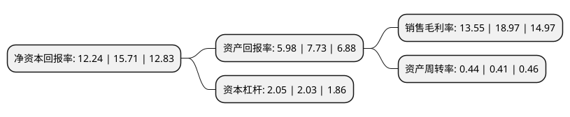

> 本页面由自动化程序生成于 2022年5月20日 01:32
> 内容可能存在错误，如有bug请提交issue至：https://github.com/Eroleice/doc-pi/issues
{.is-warning}

# 上市公司基本情况

## 基本资料

上海创力集团股份有限公司（以下简称“创力集团”）成立于2003年09月27日，上海市。于2015年03月20日在上交所主板上市。

创力集团注册资本63,656万元，主营业务为煤炭综合采掘机械设备，煤矿自动化控制系统及矿用电气设备的设计，研发，制造，销售以及技术服务，并为客户提供煤矿综采，综掘工作面成套设备的选型和方案设计。主要产品包括系列滚筒式采煤机，系列悬臂式掘进机及相关零配件。以下是详细信息：

- 公司名称: 上海创力集团股份有限公司
- 股票代码: 603012.SH
- 所在地: 上海 - 上海市
- 成立日期: 2003年09月27日
- 注册资本: 63,656万元
- 法定代表人: 石良希
- 主营业务: 主营业务为煤炭综合采掘机械设备，煤矿自动化控制系统及矿用电气设备的设计，研发，制造，销售以及技术服务，并为客户提供煤矿综采，综掘工作面成套设备的选型和方案设计主要产品包括系列滚筒式采煤机，系列悬臂式掘进机及相关零配件
- 公司官网: www.shclkj.com
- 公司介绍: 公司是国内领先的以煤矿综合采掘机械设备为主的高端煤机装备供应商，主营业务为煤炭综合采掘机械设备、煤矿自动化控制系统及矿用电气设备的设计、研发、制造、销售以及技术服务，并为客户提供煤矿综采、综掘工作面成套设备的选型和方案设计。主导产品为煤炭综合采掘机械设备，主要包括系列滚筒式采煤机、系列悬臂式掘进机及相关零配件。公司技术力量雄厚，汇集了行业内众多优秀人才，技术水平高，实践经验丰富，响应客户需求迅捷。公司与高等院校、科研院所建立了长期技术合作关系，共同建立“产、学、研”基地，就进一步提高产品的先进性、可靠性及智能化等开展多项专题研究。公司高度重视质量控制，以高可靠性为设计原则，从产品的源头控制质量，使用高品质配置的外购件、利用先进的工艺和设备，按照国际标准组织生产。通过ISO9001-2008质量体系认证，建立了一套完善的质量管理体系。

## 股东及高管情况

上市公司第一大股东为上海巨圣投资有限公司，持股66,345,866股，占比10.42%，**疑似为**上市公司实际控制人。

截至2022年03月31日，上市公司的前十大股东中，共有6名自然人股东，2名机构股东，1个产品账户，1个海外主体，其中5%以上大股东共有3名。上市公司前十大股东明细如下：

> 未能通过持股比例判定出上市公司实际控制人（持股30%以上）
> 可能存在通过间接持股、联合持股、协议控制等方式拥有实际控制权的主体，具体请参考上市公司定期公告！
{.is-warning}

> 截至2022年03月31日，上市公司前十大股东信息如下：

| 股东名称 | 持股数量（股） | 持股比例 |
| --- | --- | --- |
| 上海巨圣投资有限公司 | 66,345,866 | 10.42% |
| 中煤机械集团有限公司 | 50,956,407 | 8% |
| 中煤机械集团-财通证券-19中02EB担保及信托财产专户 | 42,000,000 | 6.6% |
| 耿卫东 | 17,988,056 | 2.83% |
| 芮国洪 | 16,036,224 | 2.52% |
| 石华辉 | 14,024,836 | 2.2% |
| 管亚平 | 13,410,030 | 2.11% |
| 王凤林 | 12,024,927 | 1.89% |
| 上海迎水投资管理有限公司-迎水日新4号私募证券投资基金 | 10,466,500 | 1.64% |
| 郭武 | 8,161,464 | 1.28% |

## 利润表分析

上市公司2021年总收入为26.14亿元，净利润为3.54亿元，实现盈利。

## 杜邦分析

> 数据列示周期：2021年 | 2020年 | 2019年
{.is-info}

上市公司的净资产收益率在近一年有所下降，下降幅度为-22.09%，其变化情况分解如下：
- 上市公司的销售毛利率在近一年下降了-28.57%，可能是生产效率的下降、商品原材料价格上涨或商品价格的下跌所致。
- 上市公司的资产周转率在近一年上升了7.32%，可能是源自于更快的销售回款或库存管理效果提升。
- 上市公司的财务杠杆比率在近一年上升了0.99%，可能是增加负债扩大生产规模。

