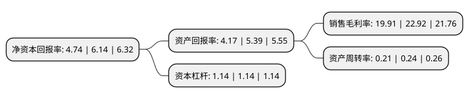

> 本页面由自动化程序生成于 2022年5月20日 01:32
> 内容可能存在错误，如有bug请提交issue至：https://github.com/Eroleice/doc-pi/issues
{.is-warning}

# 上市公司基本情况

## 基本资料

江苏如通石油机械股份有限公司（以下简称“如通股份”）成立于1989年10月12日，南通市。于2016年12月09日在上交所主板上市。

如通股份注册资本20,663.84万元，主要产品:提升设备，卡持设备和旋扣设备。主营业务:石油钻采井口装备的研发，生产与销售。以下是详细信息：

- 公司名称: 江苏如通石油机械股份有限公司
- 股票代码: 603036.SH
- 所在地: 江苏 - 南通市
- 成立日期: 1989年10月12日
- 注册资本: 20,663.84万元
- 法定代表人: 曹彩红
- 主营业务: 主要产品:提升设备，卡持设备和旋扣设备主营业务:石油钻采井口装备的研发，生产与销售
- 公司官网: www.rutong.com
- 公司介绍: 公司是国内最早从事石油钻采井口装备生产和销售的企业之一、中国石油石化装备制造业“五十强”企业、江苏省高新技术企业、江苏省创新型企业、江苏省企业院士工作站和省级企业技术中心。公司主要产品为提升设备、卡持设备和旋扣设备，客户涵盖了中石油集团、中石化集团、中海油三大石油公司下属的国内主要石油工程技术服务企业、国内大型石油设备厂商，产品广泛应用于国内陆上和海上主要油气田，并在中东、非洲、北美、中南美、俄罗斯等世界各主要产油区得到使用。公司大力实施科技兴企战略，建有江苏省企业技术中心、江苏省石油机械装备技术研究中心、江苏省企业研究生工作站和江苏省企业院士工作站等高规格的研发平台，已成为国内研发和制造石油钻采井口工具与设备实力较强的企业。同时，公司建立了完整的质量控制标准体系，先后通过ISO9001质量管理体系认证、ISO14001环境管理体系认证、中石油、中石化健康安全与环境管理体系认证、美国石油学会API(7K、8C)认证、德国GL劳氏船级社认证、英国LR劳氏船级社等多项认证。

## 股东及高管情况

上市公司第一大股东为曹彩红，持股30,069,752股，占比14.55%，**疑似为**上市公司实际控制人。

截至2022年03月31日，上市公司的前十大股东中，共有10名自然人股东，其中5%以上大股东共有2名。上市公司前十大股东明细如下：

> 未能通过持股比例判定出上市公司实际控制人（持股30%以上）
> 可能存在通过间接持股、联合持股、协议控制等方式拥有实际控制权的主体，具体请参考上市公司定期公告！
{.is-warning}

> 截至2022年03月31日，上市公司前十大股东信息如下：

| 股东名称 | 持股数量（股） | 持股比例 |
| --- | --- | --- |
| 曹彩红 | 30,069,752 | 14.55% |
| 许波兵 | 10,490,400 | 5.08% |
| 包银亮 | 7,440,000 | 3.6% |
| 施秀飞 | 7,440,000 | 3.6% |
| 姚忠 | 7,193,900 | 3.48% |
| 施建新 | 5,670,700 | 2.74% |
| 张友付 | 4,960,000 | 2.4% |
| 朱建华 | 4,960,000 | 2.4% |
| 管新 | 4,588,700 | 2.22% |
| 周晓峰 | 2,180,000 | 1.05% |

## 利润表分析

上市公司2021年总收入为2.69亿元，净利润为0.53亿元，实现盈利。

## 杜邦分析

> 数据列示周期：2021年 | 2020年 | 2019年
{.is-info}

上市公司的净资产收益率在近一年有所下降，下降幅度为-22.8%，其变化情况分解如下：
- 上市公司的销售毛利率在近一年下降了-13.13%，可能是生产效率的下降、商品原材料价格上涨或商品价格的下跌所致。
- 上市公司的资产周转率在近一年下降了-12.5%，可能是源自于更慢的销售回款或库存管理效果下降。
- 上市公司的财务杠杆比率在近一年下降了0%，可能是减少负债降低财务费用。

