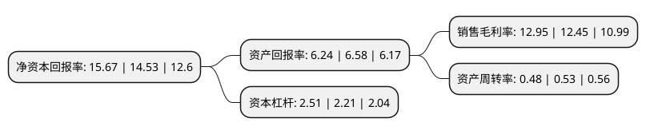

> 本页面由自动化程序生成于 2022年5月20日 01:32
> 内容可能存在错误，如有bug请提交issue至：https://github.com/Eroleice/doc-pi/issues
{.is-warning}

# 上市公司基本情况

## 基本资料

浙江大丰实业股份有限公司（以下简称“大丰实业”）成立于2002年03月08日，宁波市。于2017年04月20日在上交所主板上市。

大丰实业注册资本40,908.576万元，主要业务:智能舞台，建筑声学工程，公共装饰，座椅看台。以下是详细信息：

- 公司名称: 浙江大丰实业股份有限公司
- 股票代码: 603081.SH
- 所在地: 浙江 - 宁波市
- 成立日期: 2002年03月08日
- 注册资本: 40,908.576万元
- 法定代表人: 丰华
- 主营业务: 智能舞台，建筑声学工程，公共装饰，座椅看台
- 公司官网: www.chinadafeng.com
- 公司介绍: 经过多年的创新发展，公司已成为国内领先的科技创新型文体旅产业基础设施(科技、内容IP、服务)服务商，是文化体育旅游和科技融合的引领者、城市地标的建造者，新时代城市文明重要的推动者，是新时代文体旅产业新基建(行业物联网数字基础设施)的重要参与者之一。随着产业链逐渐完善，公司已打造了创意、科技、数字、运营四大业务平台，各平台业务横纵联合、高效融合，探索文体旅产业与数字经济相结合的创新型业务，进一步提升产业链高度。作为专业从事文体科技装备、数字艺术科技、轨道交通装备等业务的高科技企业，公司拥有行业领先的创意、研发、试制、生产和检测基地(或研究院)，综合实力雄厚。尤其在智能舞台领域，通过多年品牌服务积累和技术创新沉淀，公司已成为国内绝对龙头。

## 股东及高管情况

上市公司第一大股东为丰华，持股95,884,600股，占比23.44%，**疑似为**上市公司实际控制人。

截至2022年03月31日，上市公司的前十大股东中，共有6名自然人股东，1名机构股东，3个海外主体，其中5%以上大股东共有3名。上市公司前十大股东明细如下：

> 未能通过持股比例判定出上市公司实际控制人（持股30%以上）
> 可能存在通过间接持股、联合持股、协议控制等方式拥有实际控制权的主体，具体请参考上市公司定期公告！
{.is-warning}

> 截至2022年03月31日，上市公司前十大股东信息如下：

| 股东名称 | 持股数量（股） | 持股比例 |
| --- | --- | --- |
| 丰华 | 95,884,600 | 23.44% |
| 丰岳 | 55,822,200 | 13.65% |
| LOUISA W FENG | 20,507,550 | 5.01% |
| 宁波上丰盛世投资合伙企业(有限合伙) | 16,824,750 | 4.11% |
| 丰其云 | 13,157,950 | 3.22% |
| 傅哲尔 | 12,474,350 | 3.05% |
| 杨吉祥 | 10,989,650 | 2.69% |
| 徐吉传 | 10,699,750 | 2.62% |
| GAVIN JL FENG | 9,243,150 | 2.26% |
| JAMIN JM FENG | 9,243,150 | 2.26% |

## 利润表分析

上市公司2021年总收入为29.58亿元，净利润为3.83亿元，实现盈利。

## 杜邦分析

> 数据列示周期：2021年 | 2020年 | 2019年
{.is-info}

上市公司的净资产收益率在近一年有所上升，上升幅度为7.85%，其变化情况分解如下：
- 上市公司的销售毛利率在近一年上升了4.02%，可能是生产效率的提升、商品原材料价格下跌或商品价格的上涨所致。
- 上市公司的资产周转率在近一年下降了-9.43%，可能是源自于更慢的销售回款或库存管理效果下降。
- 上市公司的财务杠杆比率在近一年上升了13.57%，可能是增加负债扩大生产规模。

