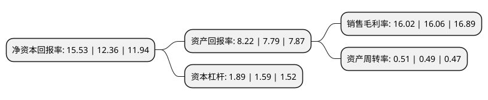

> 本页面由自动化程序生成于 2022年5月20日 01:32
> 内容可能存在错误，如有bug请提交issue至：https://github.com/Eroleice/doc-pi/issues
{.is-warning}

# 上市公司基本情况

## 基本资料

宁波精达成形装备股份有限公司（以下简称“宁波精达”）成立于2002年08月15日，宁波市。于2014年11月11日在上交所主板上市。

宁波精达注册资本30,732.8万元，主要产品:换热器装备和精密压力机。主要业务:换热器装备和精密压力机的研发，生产与销售。以下是详细信息：

- 公司名称: 宁波精达成形装备股份有限公司
- 股票代码: 603088.SH
- 所在地: 浙江 - 宁波市
- 成立日期: 2002年08月15日
- 注册资本: 30,732.8万元
- 法定代表人: 郑良才
- 主营业务: 主要产品:换热器装备和精密压力机换热器装备和精密压力机的研发，生产与销售
- 公司官网: www.nbjingda.com
- 公司介绍: 公司是高速冲床技术创新者、成套换热器装备供应商，国家重点高新技术企业。公司主要业务为换热器装备和精密压力机的研发、生产与销售，拥有数控加工机床及镗、铣、车、磨床等百多台套加工装备；拥有大型三坐标测量仪、LK三坐标测量仪、二维测高仪等先进检测设备，保证了关键零部件的加工周期与品质，有效提高了产品的精密度。公司一直致力于高速精密冲床和换热器设备的研发与创新，成功开发了具有自主知识产权、高精度、系列化的GC系列空调翅片高速冲床、全自动长U弯管机、数控三维弯管机等整套换热器生产设备。核心产品翅片高速精密压力机被列入国家火炬计划，获“浙江省加快发展装备制造业重点领域省内首台(套)产品证书”；定转子高速精密压力机被列入国家重点新产品计划和国家火炬计划。公司通过了ISO9000质量管理体系认证，主要产品具有CE证书。公司经过多年的经营与发展，积累了长期稳定的客户资源，尤其在空调领域，覆盖了绝大多数知名品牌，不仅在国内具有极高的美誉度，并远销欧美等各个国家和地区。

## 股东及高管情况

上市公司第一大股东为宁波成形控股有限公司，持股98,268,204股，占比31.98%，为上市公司实际控制人。

截至2022年03月31日，上市公司的前十大股东中，共有4名自然人股东，3名机构股东，3个产品账户，其中5%以上大股东共有4名。上市公司前十大股东明细如下：

> 截至2022年03月31日，上市公司前十大股东信息如下：

| 股东名称 | 持股数量（股） | 持股比例 |
| --- | --- | --- |
| 宁波成形控股有限公司 | 98,268,204 | 31.98% |
| 宁波广达投资有限公司 | 18,987,160 | 6.18% |
| 郑良才 | 17,671,360 | 5.75% |
| 宁波精微投资有限公司 | 16,684,200 | 5.43% |
| 浙江银万斯特投资管理有限公司-银万全盈11号私募证券投资基金 | 15,366,400 | 5% |
| 郑功 | 9,093,078 | 2.96% |
| 宁波金源嘉盛投资管理有限公司-金源卓越1号私募投资基金 | 5,058,100 | 1.65% |
| 狄文 | 2,538,100 | 0.83% |
| 徐国荣 | 2,100,000 | 0.68% |
| 光大证券资管-光大银行-光大阳光添利债券型集合资产管理计划 | 2,083,600 | 0.68% |

## 利润表分析

上市公司2021年总收入为5.33亿元，净利润为0.85亿元，实现盈利。

## 杜邦分析

> 数据列示周期：2021年 | 2020年 | 2019年
{.is-info}

上市公司的净资产收益率在近一年有所上升，上升幅度为25.65%，其变化情况分解如下：
- 上市公司的销售毛利率在近一年下降了-0.25%，可能是生产效率的下降、商品原材料价格上涨或商品价格的下跌所致。
- 上市公司的资产周转率在近一年上升了4.08%，可能是源自于更快的销售回款或库存管理效果提升。
- 上市公司的财务杠杆比率在近一年上升了18.87%，可能是增加负债扩大生产规模。

