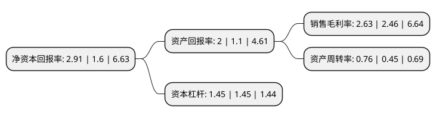

> 本页面由自动化程序生成于 2022年5月20日 01:32
> 内容可能存在错误，如有bug请提交issue至：https://github.com/Eroleice/doc-pi/issues
{.is-warning}

# 上市公司基本情况

## 基本资料

无锡宏盛换热器制造股份有限公司（以下简称“宏盛股份”）成立于2000年12月25日，无锡市。于2016年08月31日在上交所主板上市。

宏盛股份注册资本10,000万元，主营业务:铝制板翅式换热器及相关产品的研发，设计，生产和销售;主要产品:铝制板翅式换热器。以下是详细信息：

- 公司名称: 无锡宏盛换热器制造股份有限公司
- 股票代码: 603090.SH
- 所在地: 江苏 - 无锡市
- 成立日期: 2000年12月25日
- 注册资本: 10,000万元
- 法定代表人: 钮法清
- 主营业务: 主营业务:铝制板翅式换热器及相关产品的研发，设计，生产和销售;主要产品:铝制板翅式换热器
- 公司官网: www.hs-exchanger.com
- 公司介绍: 公司是由一批在热交换器行业有着20多年丰富的设计及制造经验的专家创建的民营企业。公司发展至今，产品广泛地应用于工业设备，铁路机车和汽车等领域，逐渐成为中国铝合金换热器行业的领导者之一。公司目前有80%的产品出口到20多个国家和地区(比利时，德国，美国，意大利，巴西，印度，日本，澳大利亚等)。公司是集设计、制造和测试于一体的换热器供应商,公司提供标准的系列产品,同时也为客户提供符合他们要求的完美的解决方案。

## 股东及高管情况

上市公司第一大股东为钮玉霞，持股54,675,000股，占比54.68%，为上市公司实际控制人。

截至2022年03月31日，上市公司的前十大股东中，共有4名自然人股东，3名机构股东，2个产品账户，1个海外主体，其中5%以上大股东共有2名。上市公司前十大股东明细如下：

> 截至2022年03月31日，上市公司前十大股东信息如下：

| 股东名称 | 持股数量（股） | 持股比例 |
| --- | --- | --- |
| 钮玉霞 | 54,675,000 | 54.68% |
| 钮玉霞 | 49,675,000 | 49.675% |
| 深圳市薰衣草企业管理合伙企业(有限合伙) | 5,000,000 | 5% |
| 中科招商投资管理集团股份有限公司-常州市中科江南股权投资中心(有限合伙) | 3,519,400 | 3.52% |
| 钮法清 | 2,643,700 | 2.64% |
| 中信里昂资产管理有限公司-客户资金 | 2,026,300 | 2.03% |
| 深圳市赛硕基金管理有限公司-赛硕扬帆二号私募证券投资基金 | 1,362,900 | 1.36% |
| 彭雁英 | 982,700 | 0.98% |
| JPMORGAN CHASE   BANK,NATIONAL ASSOCIATION | 808,588 | 0.81% |
| 深圳市前海融启基金管理有限公司-融启琅琊阁壹号私募证券投资基金 | 600,000 | 0.6% |

## 利润表分析

上市公司2021年总收入为5.59亿元，净利润为0.14亿元，实现盈利。

## 杜邦分析

> 数据列示周期：2021年 | 2020年 | 2019年
{.is-info}

上市公司的净资产收益率在近一年有所上升，上升幅度为81.88%，其变化情况分解如下：
- 上市公司的销售毛利率在近一年上升了6.91%，可能是生产效率的提升、商品原材料价格下跌或商品价格的上涨所致。
- 上市公司的资产周转率在近一年上升了68.89%，可能是源自于更快的销售回款或库存管理效果提升。
- 上市公司的财务杠杆比率在近一年下降了0%，可能是减少负债降低财务费用。

