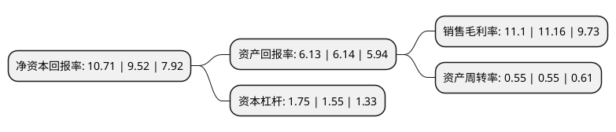

> 本页面由自动化程序生成于 2022年5月20日 01:32
> 内容可能存在错误，如有bug请提交issue至：https://github.com/Eroleice/doc-pi/issues
{.is-warning}

# 上市公司基本情况

## 基本资料

上海沪工焊接集团股份有限公司（以下简称“上海沪工”）成立于1995年12月06日，上海市。于2016年06月07日在上交所主板上市。

上海沪工注册资本31,798.25万元，公司主要从事焊接与切割设备的研发，生产及销售，主要产品包括手工弧焊机，气体保护焊机，氩弧焊机，埋弧焊机，等离子切割机等弧焊设备系列产品以及等离子(火焰)数控切割设备，焊接专机，焊接(切割)机器人等自动化焊接(切割)成套设备系列产品。以下是详细信息：

- 公司名称: 上海沪工焊接集团股份有限公司
- 股票代码: 603131.SH
- 所在地: 上海 - 上海市
- 成立日期: 1995年12月06日
- 注册资本: 31,798.25万元
- 法定代表人: 舒振宇
- 主营业务: 公司主要从事焊接与切割设备的研发，生产及销售，主要产品包括手工弧焊机，气体保护焊机，氩弧焊机，埋弧焊机，等离子切割机等弧焊设备系列产品以及等离子(火焰)数控切割设备，焊接专机，焊接(切割)机器人等自动化焊接(切割)成套设备系列产品
- 公司官网: www.hugong.com
- 公司介绍: 公司是焊接、切割行业的龙头企业之一，主营业务涵盖了研发、制造、商贸。公司在焊接、切割、自动化成套设备等方面掌握了核心技术，业务与服务覆盖了全球大多数国家和地区。公司产品年出口创汇量连续多年居行业前列。公司产品被广泛应用于工业生产的各行各业，包括航空航天器、大型装备、大型风力发电装置、机械和特种装备制造、大型锅炉、大型管道野外施工、石油天然气工程、化工领域和航海造船等多种领域。公司在行业内具有很高的声誉，是中国焊接协会焊接装备分会副理事长单位，中国电器工业协会焊机分会理事长单位，并先后荣获“中国焊接设备行业著名企业”、“焊接切割装备用户满意品牌”以及诸多荣誉。2018年，公司收购河北诚航，河北诚航是我国航空航天与国防装备零部件制造商，主营业务是航天飞行器结构件和直属件的生产加工、协助进行部分缩比导弹研制型号装配和试验测试服务。

## 股东及高管情况

上市公司第一大股东为舒宏瑞，持股96,249,252股，占比30.27%，为上市公司实际控制人。

截至2022年03月31日，上市公司的前十大股东中，共有6名自然人股东，1名机构股东，3个产品账户，其中5%以上大股东共有4名。上市公司前十大股东明细如下：

> 截至2022年03月31日，上市公司前十大股东信息如下：

| 股东名称 | 持股数量（股） | 持股比例 |
| --- | --- | --- |
| 舒宏瑞 | 96,249,252 | 30.27% |
| 舒振宇 | 58,613,600 | 18.43% |
| 缪莉萍 | 21,651,000 | 6.81% |
| 许宝瑞 | 18,575,635 | 5.84% |
| 永新县宇斯企业管理咨询有限公司 | 12,489,076 | 3.93% |
| 富诚海富资管-舒振宇-富诚海富通新逸六号单一资产管理计划 | 7,566,224 | 2.38% |
| 中国农业银行股份有限公司-中邮军民融合灵活配置混合型证券投资基金 | 2,644,980 | 0.83% |
| 任文波 | 2,457,852 | 0.77% |
| 冯立 | 1,833,511 | 0.58% |
| 中国建设银行股份有限公司-博时军工主题股票型证券投资基金 | 1,786,460 | 0.56% |

## 利润表分析

上市公司2021年总收入为13.11亿元，净利润为1.45亿元，实现盈利。

## 杜邦分析

> 数据列示周期：2021年 | 2020年 | 2019年
{.is-info}

上市公司的净资产收益率在近一年有所上升，上升幅度为12.5%，其变化情况分解如下：
- 上市公司的销售毛利率在近一年下降了-0.54%，可能是生产效率的下降、商品原材料价格上涨或商品价格的下跌所致。
- 上市公司的资产周转率在近一年下降了0%，可能是源自于更慢的销售回款或库存管理效果下降。
- 上市公司的财务杠杆比率在近一年上升了12.9%，可能是增加负债扩大生产规模。

