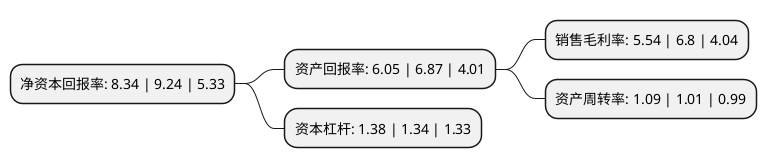

> 本页面由自动化程序生成于 2022年5月20日 01:33
> 内容可能存在错误，如有bug请提交issue至：https://github.com/Eroleice/doc-pi/issues
{.is-warning}

# 上市公司基本情况

## 基本资料

上海亚虹模具股份有限公司（以下简称“上海亚虹”）成立于1997年04月07日，上海市。于2016年08月12日在上交所主板上市。

上海亚虹注册资本14,000万元，主要产品:塑料模具及注塑件产品，SMT表面贴装产品，智能坐便盖产品。主要业务:精密塑料模具的研发，设计，制造，以及注塑产品的成型生产，部件组装服务。以下是详细信息：

- 公司名称: 上海亚虹模具股份有限公司
- 股票代码: 603159.SH
- 所在地: 上海 - 上海市
- 成立日期: 1997年04月07日
- 注册资本: 14,000万元
- 法定代表人: 孙林
- 主营业务: 主要产品:塑料模具及注塑件产品，SMT表面贴装产品，智能坐便盖产品精密塑料模具的研发，设计，制造，以及注塑产品的成型生产，部件组装服务
- 公司官网: www.yahong-mould.com
- 公司介绍: 公司是一家以精密注塑模具的设计和制造，注塑，表面喷涂，装配，电子产品的SMT生产为主营业务，伴随着中国民族工业的腾飞，致力于在全球塑料模具行业打上中国制造标签的企业。通过多年的经营，目前客户主要为世界著名汽车厂商的一级供应商和家用电器的生产厂家，包括松下微波炉、延锋伟世通、上实交通、大陆汽车、欧姆龙、延锋江森等。公司的注塑件产品和SMT表面贴装产品，具有品种规格繁多、交货周期短、品质要求严和数量大的特点，自成立以来就坚持明确的技术发展思路，拥有国内先进的精密塑料模具研发中心，并与国内理工类高校共建了产学研应用平台。公司为高新技术企业，中国模具工业协会常务理事单位、上海模具行业协会副会长单位。公司产品通过了ISO9001质量体系认证和汽车行业的ISO/TS16949质量体系认证，先后荣获财富百强、品牌产品、环境管理体系证书、守合同重信用企业、奉贤区企业技术中心等荣誉。

## 股东及高管情况

上市公司第一大股东为谢亚明，持股57,619,000股，占比41.16%，为上市公司实际控制人。

截至2022年03月31日，上市公司的前十大股东中，共有9名自然人股东，1名机构股东，其中5%以上大股东共有3名。上市公司前十大股东明细如下：

> 截至2022年03月31日，上市公司前十大股东信息如下：

| 股东名称 | 持股数量（股） | 持股比例 |
| --- | --- | --- |
| 谢亚明 | 57,619,000 | 41.16% |
| 海南宁生旅游集团有限公司 | 21,000,000 | 15% |
| 谢悦 | 7,880,000 | 5.63% |
| 严丽英 | 2,800,000 | 2% |
| 李建民 | 1,840,000 | 1.31% |
| 徐志刚 | 1,575,000 | 1.13% |
| 谢亚平 | 1,250,600 | 0.89% |
| 周英发 | 804,200 | 0.57% |
| 施侃 | 800,000 | 0.57% |
| 杨建伟 | 760,000 | 0.54% |

## 利润表分析

上市公司2021年总收入为6.78亿元，净利润为0.37亿元，实现盈利。

## 杜邦分析

> 数据列示周期：2021年 | 2020年 | 2019年
{.is-info}

上市公司的净资产收益率在近一年有所下降，下降幅度为-9.74%，其变化情况分解如下：
- 上市公司的销售毛利率在近一年下降了-18.53%，可能是生产效率的下降、商品原材料价格上涨或商品价格的下跌所致。
- 上市公司的资产周转率在近一年上升了7.92%，可能是源自于更快的销售回款或库存管理效果提升。
- 上市公司的财务杠杆比率在近一年上升了2.99%，可能是增加负债扩大生产规模。

