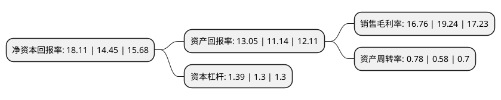

> 本页面由自动化程序生成于 2022年5月20日 01:33
> 内容可能存在错误，如有bug请提交issue至：https://github.com/Eroleice/doc-pi/issues
{.is-warning}

# 上市公司基本情况

## 基本资料

银都餐饮设备股份有限公司（以下简称“银都股份”）成立于2003年04月10日，杭州市。于2017年09月11日在上交所主板上市。

银都股份注册资本42,018.4万元，公司从事商用餐饮设备的研发，生产，销售和服务，主要产品包括商用餐饮制冷设备，自助餐设备和西厨设备。以下是详细信息：

- 公司名称: 银都餐饮设备股份有限公司
- 股票代码: 603277.SH
- 所在地: 浙江 - 杭州市
- 成立日期: 2003年04月10日
- 注册资本: 42,018.4万元
- 法定代表人: 周俊杰
- 主营业务: 公司从事商用餐饮设备的研发，生产，销售和服务，主要产品包括商用餐饮制冷设备，自助餐设备和西厨设备
- 公司官网: www.yinduchina.com
- 公司介绍: 公司是一家专业生产商用厨房设备的高新技术企业，成立于2003年4月10日，公司从事商用餐饮设备的研发、生产、销售和服务，主要产品包括商用餐饮制冷设备、自助餐设备和西厨设备等。通过十多年的技术摸索、积累与创新，公司商用餐饮设备生产技术已达到国内先进水平，部分达到国际先进水平。目前公司产品已获得各种国内和国际认证(ETL、CE、CB、ROHS、GEMS、CCC等)。　作为专业的商用餐饮设备制造商，本着为人类提供饮食健康保障的理念，为客户提供高性价比的产品是公司一贯的行为准则。优秀的品质，良好的服务，确保银都在商用厨房设备行业领跑。

## 股东及高管情况

上市公司第一大股东为周俊杰，持股210,924,000股，占比50.2%，为上市公司实际控制人。

截至2022年03月31日，上市公司的前十大股东中，共有5名自然人股东，2名机构股东，2个产品账户，1个海外主体，其中5%以上大股东共有5名。上市公司前十大股东明细如下：

> 截至2022年03月31日，上市公司前十大股东信息如下：

| 股东名称 | 持股数量（股） | 持股比例 |
| --- | --- | --- |
| 周俊杰 | 210,924,000 | 50.2% |
| 朱智毅 | 30,132,000 | 7.17% |
| 吕威 | 30,132,000 | 7.17% |
| 蒋小林 | 30,132,000 | 7.17% |
| 杭州俊毅投资管理有限公司 | 25,110,000 | 5.98% |
| 杭州银博投资合伙企业(有限合伙) | 8,370,000 | 1.99% |
| UBS AG | 6,246,619 | 1.49% |
| 范明熙 | 3,717,300 | 0.88% |
| 中国银行股份有限公司-富国红利混合型证券投资基金 | 2,500,000 | 0.59% |
| 浙江宁聚投资管理有限公司-宁聚开阳8号私募证券投资基金 | 2,000,034 | 0.48% |

## 利润表分析

上市公司2021年总收入为24.58亿元，净利润为4.12亿元，实现盈利。

## 杜邦分析

> 数据列示周期：2021年 | 2020年 | 2019年
{.is-info}

上市公司的净资产收益率在近一年有所上升，上升幅度为25.33%，其变化情况分解如下：
- 上市公司的销售毛利率在近一年下降了-12.89%，可能是生产效率的下降、商品原材料价格上涨或商品价格的下跌所致。
- 上市公司的资产周转率在近一年上升了34.48%，可能是源自于更快的销售回款或库存管理效果提升。
- 上市公司的财务杠杆比率在近一年上升了6.92%，可能是增加负债扩大生产规模。

