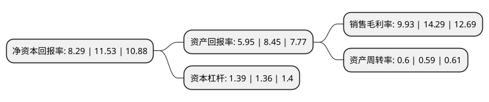

> 本页面由自动化程序生成于 2022年5月20日 01:33
> 内容可能存在错误，如有bug请提交issue至：https://github.com/Eroleice/doc-pi/issues
{.is-warning}

# 上市公司基本情况

## 基本资料

泰瑞机器股份有限公司（以下简称“泰瑞机器”）成立于2006年08月08日，杭州市。于2017年10月31日在上交所主板上市。

泰瑞机器注册资本29,572.12万元，主要产品:梦想Dream系列注塑机，包括D(T)系列，DH二板系列和DE全电系列。主要业务:注塑机的研发，设计，生产，销售，并提供下游应用领域的注塑成型解决方案服务。以下是详细信息：

- 公司名称: 泰瑞机器股份有限公司
- 股票代码: 603289.SH
- 所在地: 浙江 - 杭州市
- 成立日期: 2006年08月08日
- 注册资本: 29,572.12万元
- 法定代表人: 郑建国
- 主营业务: 主要产品:梦想Dream系列注塑机，包括D(T)系列，DH二板系列和DE全电系列注塑机的研发，设计，生产，销售，并提供下游应用领域的注塑成型解决方案服务
- 公司官网: cn.tedericglobal.com
- 公司介绍: 公司是塑料注射成型设备的制造商和方案解决服务商，专业从事注塑机的研发、设计、生产、销售和服务，并为下游应用领域提供注塑成型解决方案。公司的主要产品为注塑机，属于塑料机械行业中的一个重要细分行业，也属于国家鼓励和扶持的高端装备制造业，拥有包括DT肘杆式，DH二板式，DE全电动，D-M快速机以及双色(多组份)注塑机在内的梦想系列注塑产品，产品线涵盖物流、药品&食品包装、地下管廊&地上管件、汽配&家电、工民业用品、电子产品&办公自动化六大领域，为客户量身定制高效、节能、稳定的专业生产解决方案，产品远销近百个国家，深受全球用户喜爱。公司目前的注塑机产品自动化程度较高，再配合智能诊断和远程监控等软件，就能实现以公司注塑机产品为主机的智能化工厂的生产方式，从而为公司的广大用户创造更大的价值。公司品牌先后被评为驰名商标、浙江省著名商标、浙江出口名牌、浙江省知名商号。

## 股东及高管情况

上市公司第一大股东为TEDERIC   TECHNOLOGY LIMITED，持股41,768,801股，占比14.12%，**疑似为**上市公司实际控制人。

截至2022年03月31日，上市公司的前十大股东中，共有4名自然人股东，3名机构股东，3个海外主体，其中5%以上大股东共有2名。上市公司前十大股东明细如下：

> 未能通过持股比例判定出上市公司实际控制人（持股30%以上）
> 可能存在通过间接持股、联合持股、协议控制等方式拥有实际控制权的主体，具体请参考上市公司定期公告！
{.is-warning}

> 截至2022年03月31日，上市公司前十大股东信息如下：

| 股东名称 | 持股数量（股） | 持股比例 |
| --- | --- | --- |
| TEDERIC   TECHNOLOGY LIMITED | 41,768,801 | 14.12% |
| 郑建国 | 30,000,000 | 10.14% |
| 海通开元投资有限公司 | 5,119,957 | 1.73% |
| Green Seed Capital Ltd | 2,416,136 | 0.82% |
| Green Seed   Capital Ltd | 2,416,136 | 0.82% |
| 舟山悦海伟祺投资合伙企业(有限合伙) | 1,800,000 | 0.61% |
| 华泰证券股份有限公司 | 898,980 | 0.3% |
| 何忠意 | 834,700 | 0.28% |
| 乐春华 | 800,000 | 0.27% |
| 虞廷田 | 646,344 | 0.22% |

## 利润表分析

上市公司2021年总收入为10.97亿元，净利润为1.42亿元，实现盈利。

## 杜邦分析

> 数据列示周期：2020年 | 2019年 | 2018年
{.is-info}

上市公司的净资产收益率在近一年有所下降，下降幅度为-28.1%，其变化情况分解如下：
- 上市公司的销售毛利率在近一年下降了-30.51%，可能是生产效率的下降、商品原材料价格上涨或商品价格的下跌所致。
- 上市公司的资产周转率在近一年上升了1.69%，可能是源自于更快的销售回款或库存管理效果提升。
- 上市公司的财务杠杆比率在近一年上升了2.21%，可能是增加负债扩大生产规模。

